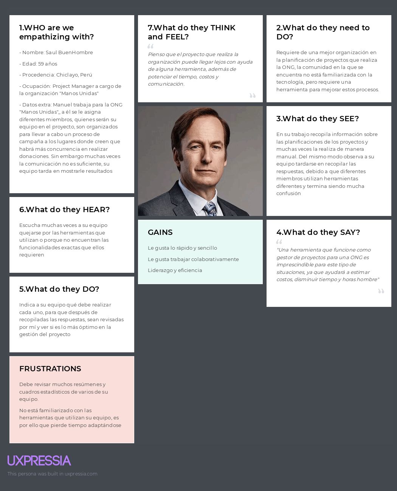
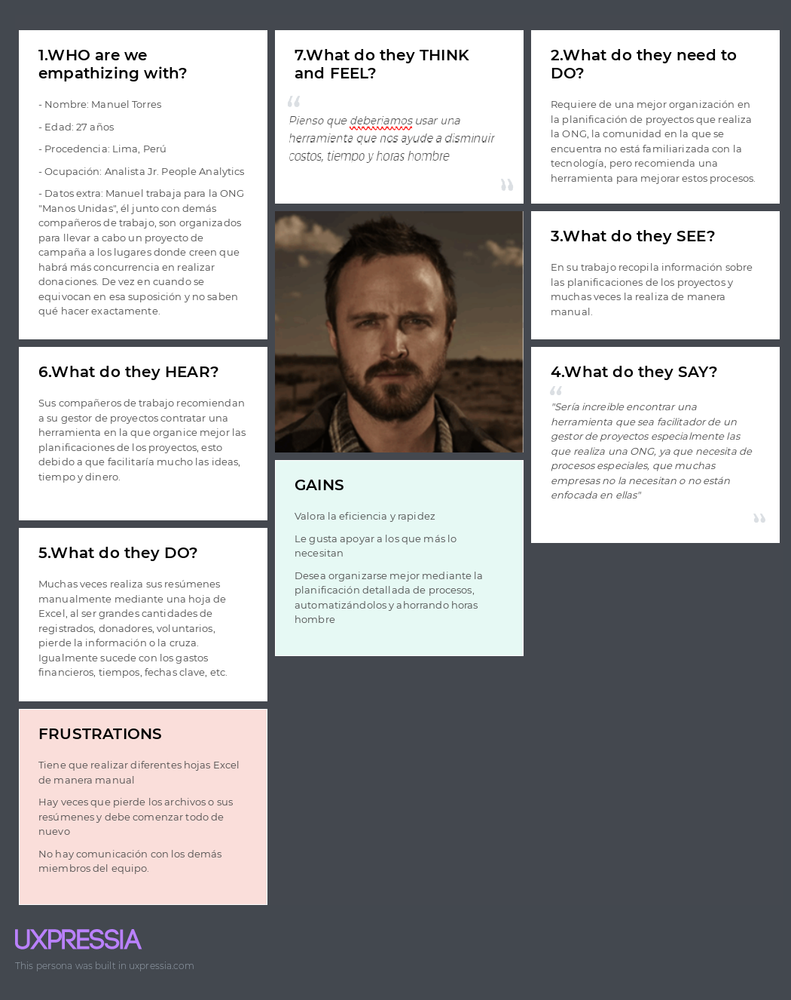

---

---
---
# UPC
# INGENIERÍA DE SISTEMAS DE SOFTWARE
## CURSO: SI730 Aplicaciones Web | SECCIÓN WX54 
 Profesor: Alex Humberto Sánchez Ponce
# Informe de TB1
"Startup"
"Producto"
### Integrantes:
- Peña Rivera, Manuel Sebastian - U202210138
- Ramírez Hoffmann, Sebastián - U202211894
- Rodriguez Vargas, Arian Martin - U202212096
- Esteban Garcia, Nicolas Sebastián - U202217485
- Herrera Aguirre, Fabia Alejandra - U202219422   

---
# Registro de Versiones del Informe
| Version | Fecha | Autor | Descripcion de Modificacion |
| ----------- | ----------- | ----------- | ----------- |
| 0.0 | 19/03/2024 |Grupo 1 |Se crea el documento |

# Project Report Collaboration Insights
[URL del repositorio](https://github.com/AplicacionesWeb-WX54/si730-WX54-Grupo1-Repository.git)

(Imagenes de los commits cada entrega)


# Student Outcome
|Criterio Especifico|Acciones Realizadas|Conclusiones|
|-|-|-|
|Participa en equipos multidisciplinarios con eficacia, eficiencia y objetividad, en el marco de un proyecto en soluciones de ingeniería de software.|Compañero1:<br> *TB1:*  Su texto *TB2:* texto etc.. |Su texto de conclusion|
|Conoce al menos un sector empresarial o dominio de aplicación de soluciones de software.|Compañero1:<br> *TB1:*  Su texto<br> *TB2:* texto etc.. |Su texto de conclusion|
# Capítulo I: Introducción
## 1.1. Startup Profile
### 1.1.1. Descripción de la Startup
Nuestra startup [nombre] se basa en un servicio enfocado en proporcionar estadisticas analiticas respecto a los participantes en eventos o donaciones de una ONG, esto se hara al recibir informacion de la misma ONG y por medio de nosotros se hara un analisis intensivo en oportunidades de mejora y datos relevantes segun la informacion proporcionada. Adicionalmente se contara con un sistema de conexion entre ONG y usuario proporcionandole informacion relevante de como participar de eventos de ayuda social. Este proyecto se hace con el objetivo de facilitar el proceso general de gestionar y generar actividades de ayuda social proporcionandole al usuario comun una forma mas facil de informarse y a la ONG formas mas efectivas de llevar al cabo sus proyectos.

#### 1.1.2. Perfiles de integrantes del equipo
|Miembros del equipo | Codigo Estudiante | Carrera | Conocimientos / Habilidades |
|-|-|-|-| 
|Ramírez Hoffmann, Sebastián  |U20221894|Ingenieria de software|C++, Python, Js, Reactjs, NodeJs, expressjs, MongoDB, SQL.  Paciencia, Liderazgo, Logico|
|Rodriguez Vargas, Arian Martin |U202212096|Ingenieria de software|C++, Python, persistente y amigable|
|Esteban Garcia, Nicolas Sebastian |U202217485|Ingenieria de software|HTML, CSS Y JS. Sociable.|
|Herrera Aguirre, Fabia Alejandra 	|U202219422|Ingenieria de software|C++, Python. Creativa.|
|Peña Rivera, Manuel Sebastian	|U202210138|Ingenieria de software|C++, Python, MongoDB, SQL, Assembler. Responsabilidad y Buena Comunicación| 

## 1.2. Solution Profile
### 1.2.1 Antecedentes y problemática

Segun la Oficina de Naciones Unidas para la Coordinación de Asuntos Humanitarios (OCHA) en 2023 se reportaron 801,425 personas en necesidades de alimentacion, servicios de agua, saneamiento e higiene.
En el Peru existen 978 Organizaciones privadas sin fines de lucro de las cuales principalmente 428 se han categorizado como de salud, 19 de educacion y 35 de vivienda (SIGCTI, 2024), esto nos demuestra que existe un alto rango de organizaciones privadas sin fines de lucro. No obstante cuando buscamos organizaciones ONDG(Organizaciones No Gubernamentales de Desarollo) encontramos un total de 1835 (SIGCTI, 2024). Aun con muchas instituciones el alcance que se logra resulta ser preocupante, en la encuesta que se realizo por equillibrium CenDE en 2023 de entre casi 1,200 personas un 80% de estas reconocia que es una ONG no obstante 71% o no sabia o no conocia iniciativas realizadas por las ONGs en ese año, en esta misma encuesta solo un 7% no tenia interes alguno en participar en el abordamiento de problemas publicos ni socialmente es decir un 93% de las 1,200 estaban dispuestas a apoyar sin embargo tambien se menciono que la principal causa que mencionan que limita esta participacion eran el tiempo, la desconfianza, limitaciones economicas y desconocimiento sobre como participar, siendo asi que un 72% de las personas encuestadas no han participado en estas actividades (CenDE, 2023). Adicionalmente cuando estas mismas ONG reciben grandes cantidades de datos normalmente solo son para obtener una cifra que represente los asistentes a algun evento o cuanto se logro de un objetivo de donacion omitiendo lo enriquecedor de esta data recolectada, como se menciona en el articulo "Data Analytics for Nonprofits" (DigitalForNonprofits, 2023), en el mundo de hoy para realizar acciones estrategicas y maximisar recursos distintas empresas utilizan lo llamado analisis de datos, esta practica se puede aplicar a un modelo de negocios sin fines de lucro como las ONG donde se consiguen los mismos beneficios que brindan los analisis de datos.

Es aqui donde nosotros ideamos la propuesta de [NOMBRE], una aplicacion web que proporcionara un servicio tanto para los usuarios interesados en la participacion en una ONG donde se tendra toda la libertad de buscar alguna ONG especifica como para las ONG que busquen mejorar el impacto de sus actividades haciendo uso de su informacion recopilada por medio de nosotros quienes por nuestro servicio de analisis de datos y gestion de proyectos le proporcionaremos oportunidades de mejora, graficas relevantes respecto a la data y recomendaciones en como pueden implementar una recolecion de datos mas efectiva para amplificar el impacto deseado. 

What (¿Que se está haciendo?): Se facilita el proceso de accion para actividades orientadas al apoyo social y donacion de bienes. Asimismo se proporciona un servicio de gestion avanzado para las ONG con el objetivo de aumentar el impacto de estas.

Why (¿Porque se está haciendo?): Se hace esta aplicacion web con el objetivo de darle una herramienta a las ONG para aumentar la eficiencia de sus proyectos de ayuda social proporcionando adicionalmente una plataforma donde personas interesadas en las ONG puedan conseguir informacion de estas de una manera rapida y facil.

When (¿Cuándo se usa?): Se usa cuando la ONG tiene los datos recopilados de su proyecto mas reciente y desea ver las oportunidades de mejora e ideas para la eficacia de su siguiente proyecto en un formato visual que sea facil de entender. Mientras que para el usuario se usa cuando este tenga la necesidad o curiosidad de saber como o donde puede asisitir a actividades de ayuda sociales ya sea un evento o saber donde puede entregar distintos donativos de manera simple y rapida.

Where (¿Dónde se usa?): El uso esta diseñado para Perú ya que se recompilara informacion de ONG's que esten actuando en este pais, de esta manera se podran hacer recomendaciones mas locales. Asimismo esta App Web se puede usar facilmente desde el telefono o escritorio.

Who (¿Quién lo usa?): El usuario principal para nosotros son las ONG ya que son estas mismas las que nos proporcionaran los datos recopilados para mejorar su impacto y darnos una idea de la mejor recomendacion para estas, mientras que nuestro segmento secundario serian las personas interesadas en realizar donaciones a organizaciones No Gubernamentales o en participar en sus actividades de ayuda social.

How Much (¿Cuánto costaría?): La aplicacion web tendra sus funcionalidades core a medio de pago es decir el proceso de gestion recopilacion y refinamiento de datos junto con las mejores oportunidades de mejora para estas. No obstante, la funcion secundaria que vendria siendo el sistema de busqueda de ONG sera completamente gratuita con una subscripcion de pago opcional para el usuario que este interesado en notificaciones de los eventos mas recientes. Tanto el core de la app web como la subscripcion se tendran que renovar cada cierto tiempo donde en el caso de las organizaciones se tendra que escoger un plan anual o mensual.

How (¿Cómo se lleva al cabo?)

En el caso de la primera funcionalidad se hara un proceso de inscripcion y se tendra que tambien hacer un proceso de validacion mostrando evidencia de que sean una ong legitima, seguidamente se les solicitara los datos recopilados de su ultimo proyecto o del que quieran conseguir un analisis completo, de estos datos se mostraran graficos, explicaciones, recomendaciones y oportunidades de mejora en base a la demografica, los objetos mas comunes en sus donaciones o los proyectos donde hubo un flujo de participantes mas alto. Asimismo se proporcionara la herramienta para gestionar futuros proyectos la cual se podra usar de manera opcional para poder estructurar mejor los encargados y objetivos del siguiente proyecto, si la ONG no proporciona estos datos se le daran recomendaciones de que informacion deberia solicitar para que el impacto sea efectivo en futuros proyectos.

En el caso de la segunda funcionalidad, la aplicacion web tendra un sistema de filtos para tener un display de opciones que se visualizaran segun quiera el usuario o este mismo puede buscarla por su nombre, una vez este seleccione que desea donar o si desea participar entonces se le proporcionara toda la informacion que este necesite para saber el proceso de donacion junto a una redireccion hacia la pagina oficial de la ONG junto con informacion general esta misma.


### 1.2.2 Lean UX Process.
#### 1.2.2.1. Lean UX Problem Statements.
Se identifica una falta de conexion por parte de las ONG donde existen muchas oportunidades de mejora segun la informacion recopilada de estas, no obstante muchas organizaciones no tienen conocimiento del potencial que se puede obtener de esta informacion o no cuentan con un equipo dedicado al analisis de datos a niveles de Big Data. Asimismo hemos identificado que existen diferentes factores los cuales llevan a un usuario interesado en una ONG a no tener motivos suficientes para participar de actividades sociales o de hacer donativos a estas mismas, una de estas siendo la falta de informacion y la carencia de visibilidad que estan tienen siendo que aun asi habiendo mas de 1000 ONG's en el Perú no se conocen muchas de estas ni de como poder ayudarlas. Frente a esta problematica nos planteamos la siguiente pregunta:
¿Como facilitamos el proceso de gestion de un proyecto de ayuda social y paralelamente informamos y les facilitamos la participacion en las actividades que ofrecen las distintas ONG's a la poblacion de nuestro país de manera eficiente?
#### 1.2.2.2. Lean UX Assumptions.

Después de analizar la problemática y los factores que la ocasionan, podemos tener un panorama de cómo solucionar la necesidad del usuario declarando supuestos, lo cual corresponde al siguiente paso de la Lean UX. Por ello, es necesario tener un conocimiento previo de las empresas que tienen características similares a las nuestras y cómo estas se han desarrollado con el paso del tiempo. 

Se mencionan a dos potenciales competidores:

CauseVox:
Plataforma que facilita el crowdfunding no solo de bienes monetarios, sino también de recursos como víveres y vestimenta. Plataforma de recaudación de fondos que brinda herramientas necesarias para crear campañas llamativas para cumplir su meta de donación. su diversificacion de bienes junto con sus campañas muestran su capacidad para ser competidores.

Donadora:
Es una plataforma mexicana en la que se pueden financiar proyectos de caridad, así como proyectos de tipo artístico, científico, entre otros. Al entrar en la financiacion para diferentes proyectos fuera de la caridad presenta una aptidud para ser competidor.

Logalto:
Es un Programa web colaborativo para el monitoreo y la evaluación de proyectos de desarrollo internacional la cual proporciona una alta gama de herramientas de gestion de proyectos.

|Business Assumptions|User Assumptions|
|-|-|
|Creemos que nuestros usuarios tienen la necesidad de saber gestionar sus datos y proyectos. adicionalmente tambien creemos que tienen la necesidad de saber como realizar donaciones o participar en actividades de caridad. |Los usuarios de este producto son Organizaciones no gubernamentales que requieran de un sistema efectivo de gestion y analisis de datos. Asimismo como distintas personas las cuales tengan interes en participar, conocer mas de o realizar donaciones a una ONG |
|Este problema se puede solucionar con una plataforma donde se genere un analisis de datos con recomendaciones y oportunidedes de mejora con infromacion proporcionada. Ademas de que se presente toda la informacion necesaria para un proceso de inscripcion o donacion |Nuestro producto encajaría en la vida cotidiana debido a que sera accesible, economicamente viable y sera facil de utilizar tanto para las personas que quieran participar como para las ONG como para las mismas Organizaciones que requieren una interfaz de graficos faciles de entender |
|Los usuarios iniciales Organizaciones no gubernamentales sin fines de lucro que deseen mejorar su impacto y alcance.  |Este producto resolverá la necesidad de analizar informacion de manera efectiva y simple para tener mayores oportunidades de mejora y tambien se resolvera la necesidd de saber los procesos de inscripcion o donacion de diferentes ONG. |
|El valor #1 de nuestro servicio es el analisis de datos visualmente comprensible, la filtracion de informacion relevante segun el usuario y ONG, y la interfaz amigable y simple de usar. |El producto se utilizará en el momento que una ONG decida que quiere aumentar su impacto, alcance cantidad de donantes/participantes y cuente con las capacidades para recopilar informacion. Asimismo tambien se hace uso del producto cuando el usuario comun tenga la disponibilidad de realizar una donacion o desee participar de alguna actividad de ayuda social por medio de la web app este podra filtrar segun sus intereses o zona y finalmente sera proporcionado con la informacion necesaria.|
|El aplicativo adicionalmente presentara una subscripcion a un newsletter donde se notificara a este mismo de diferentes actividades u objetivos de donacion recientes segun sus datos y tambien contara con paquetes para ONG que sean mas amplias. |Las funciones mas importantes son la capacidad de presentar informacion y recomendaciones en graficos coherentes para el analisis y ejecucion de proyectos a futuro. Y el filtrado de ONG segun los intereses del usuario|
|Se conseguirán la mayoría de los usuarios por medio de marketing digital (como las redes sociales) y Noticieros. |Nuestro producto debe verse como una herramienta de gestion y analisis de datos. Asimismo siendo un intermediario entre el usuario y las ONG como un filtro de preferencias elegidas por el mismo usuario |
|Conseguiremos ingresos de la aplicación por medio de la compra del servicio para las ONG y las suscripciones al newsletter.||
|Nuestros competidores principales serán CauseVox, Donadora y Logalto. ||
|Los venceremos al tener una mayor int0eractividad con los usuarios, una herramienta de gestion con funciones concretas y simples de entender y la facil busqueda de ONG. ||
|El mayor riesgo del producto es la falta de alcance inicial, la capacidad de datos, la competencia. ||
|Solucionaremos esto por medio de campañas de publicidad, contactar a las ONG y haciendo un analisis de almacenamiento.||
|Pensamos que un assumption que si se prueba falso puede causar que el proyecto falle es la demanda actual de nuestro producto y la necesidad estimada.||

#### 1.2.2.3. Lean UX Hypothesis Statements.
- Creemos que, al brindar una interfaz poco compleja de usar para nuestros usuarios, podrán tener una mejor experiencia al gestionar sus datos y amplificar su impacto y generar mas proyectos de ayuda social.
  Sabremos que hemos tenido éxito cuando se incremente la cantidad de proyectos efectivos por parte de las ONG y tambien el número de personas que esten dispuestas a apoyar a distintas ONG por medio de nuestra plataforma. 

- Creemos que la aplicación facilitara la gestion y creacion de proyectos de ayuda social proporcionando mas visibilidad a la ONG. Adicionalmente tambien ayudará a las personas que no tienen conocimientos de como apoyar a las ONG.  
  Sabremos que tuvimos exito cuando mas personas esten informadas de como participar en los eventos de la ONG y tambien cuando ONG no muy populares tambien ganen relevancia.

- Creemos que ayudar a las ONG a tener una mejor gestion y planeamiento en sus proyectos ayudara a mejorar la visibilidad y aumentar la cantidad de personas motivadas a ayudar.
- 
  Sabremos que hemos tenido éxito, cuando a nivel nacional se empiece a notar un incremento en la ayuda social proporcionada. 

#### 1.2.2.4. Lean UX Canvas.
|-|-|-|
|-|-|-|
| Business Problem <br>¿Qué problema has identificado que necesitas resolver? Las ONG estan perdiendo conexion y requieren optimizar su alcance para mejorar su impacto. Asimismo existe una necesidad de participación en tiempos de emergencia y una falta de conocimiento en como ayudar. <br>Según CenDe de 1200 personas 72% de estas no han participado en alguna actividad de actividad de ayuda social.<br> Segun "Digital for non Profits" 78% de organizaciones nonprofit con capacidades analiticas tienen mejoras tales como mejora de reclutamiento, mejoras en el alcance y hacer seguimiento de presupuestos| Solution ideas <br>Conexión entre personas interesadas en donar y participar en actividades de ayuda social con las ONG que ofrecen este tipo de eventos.<br><br>Ofrecer un servicio de gestion de datos y recomendacion de accion.<br><br>Ofrecer planes de pago que proporcionan notificaciones de los eventos mas recientes y promueven el servicio para ONG de diferentes tamaños.<br><br>Mejorar y optimizar los procesos de generacion de proyectos de ayuda social. | Business Outcomes <br>(Cambios en el comportamiento del usuario) <br>¿Qué cambios en el comportamiento del usuario indicarán que has solucionado un problema real de manera que añada valor a tus clientes? <br> El comportamiento que refleje que se ha solucionado un problema real sera cuando las actividades de ayuda social consigan ser mas efectivas y que los participantes de estas aumenten.|
| User & Customers <br>¿En qué tipo de usuarios y clientes tienes que centrarte primero? <br>Usuario: <br>ONG que tengan la necesidad de mejorar su impacto. <br>Cliente: Personas con la necesidad de saber fechas de eventos de ayuda social. <br> ONG que deseen ser más percibidas.  <br> |  UX Canvas| User benefits <br>¿Cuáles son los objetivos que los usuarios intentan obtener? <br> \- Se busca gestionar un proyecto de manera que se pueda entender las oportunidades de mejora. <br> ¿Qué les motiva a buscar tu solución? <br> \- Los usuarios están motivados a buscar esta solución debido a lo poco complicada que llega a ser para la ONG, se muestran los graficos y recomendaciones junto con las oportunidades de mejora. <br>La interfaz amigable resulta fácil de manejar y le facilita al usuario todo el proceso. <br> |
| Hyphotheses:<br> - Creemos que, al brindar una interfaz poco compleja de usar para nuestros usuarios, podrán tener una mejor experiencia al gestionar sus datos y amplificar su impacto y generar mas proyectos de ayuda social. <br> <br> Sabremos que hemos tenido éxito cuando se incremente la cantidad de proyectos efectivos por parte de las ONG y tambien el número de personas que esten dispuestas a apoyar a distintas ONG por medio de nuestra plataforma. <br> <br> - Creemos que la aplicación facilitara la gestion y creacion de proyectos de ayuda social proporcionando mas visibilidad a la ONG. Adicionalmente tambien ayudará a las personas que no tienen conocimientos de como apoyar a las ONG. <br> <br>  - Creemos que ayudar a las ONG a tener una mejor gestion y planeamiento en sus proyectos ayudara a mejorar la visibilidad y aumentar la cantidad de personas motivadas a ayudar. <br> <br>  Sabremos que hemos tenido éxito, cuando a nivel nacional se empiece a notar un incremento en la ayuda social proporcionada. | ¿Qué es la cosa más importante que nosotros necesitamos aprender primero? <br> Lo principal que necesitamos aprender es conectar la base de datos con la pagina web y adicionalmente un repaso en lo que viene siendo la gestión del proyecto| <br> ¿Cuál es la mínima cantidad de trabajo que nosotros necesitamos hacer para aprender la siguiente cosa más importante? <br> Asistir a las clases y solicitar que se nos revise los avances del proyecto para poder hacer un seguimiento saludable del proyecto|


## 1.3. Segmentos objetivo.
| |Segmento 1 | Segmento 2  |
| - | - |-|
| Variables                 |  Usuarios interesados en participar de actividades de ayuda social o en donar | ONG |
| Geográfica                | En el Perú, de entre 1,200 personas el 93% de estas estan interesadas en participar en actividades de ayuda social (CenDE, 2023) | Existen más de 1000 ONG en el Perú (SIGCTI,2024), no obstante solo se reconocen de 10 principalmente (CenDE ,2023) |
| Demográfica               | Edades de entre 17 a 50+ años <br> Genero: Masculino y Femenino | Organizaciones registradas como ONG |
| Psicológica               | Piensa en participar de actividades sociales o de donaciones en algun momento mas las limitaciones como el tiempo, la disponibilidad economica, la fiabilidad de las ONG que busca o el proceso de inscripcion terminan desanimandolo | Estas Organizaciones requieren de mas donaciones o participantes para sus campañas u eventos y buscan formas de aumentar el impacto general de estos mismos. |
| Función de comportamiento | Actitudes: Tiene una idea de que es una ONG pero en su mayoria no sabe como puede participar o no sabe de los eventos actuales en los cuales puede formar parte, algunos no conocen otras ONG y otros tienen la motivacion pero no saben si las ONG que encuentren haran correcto uso de lo donado <br> Conocimientos: Sabe que es una ONG, tiene entendido que existen organizaciones fraudulentas que se hacen pasar por ONG, normalmente no sabe si se cumplio el objetivo despues de participar| Actitudes: Hacen todo lo posible para que las donaciones lleguen en su mayor porcentaje a los más necesitados, hacen proyectos de ayuda social sin hacer mucho uso de data analitics<br> Conoce: Saben quienes requieren de ayuda, un estimado de cuanto se necesita o que se necesita para considerar donaciones, organizan eventos para concientizar y poder apoyar. |

---

# Capítulo II: Requirements Elicitation & Analysis
## 2.1. Competidores.
### 2.1.1. Análisis competitivo.

| Competitive Analysis Landscape                          |  |
| ------------------------------------------------------- | -|
| ¿Por qué llevar a cabo este análisis?                   | Realizamos este análisis a fin de poder conocer el mercado al que nos enfrentamos en un inicio, para de esta manera poder evaluar las estrategias adoptadas por plataformas ya existentes, y así aprender de sus aciertos y errores. |


| |  | (Nosotros)| CauseVox|  Bloomerang | Logalto |
|-|-|-|-|-|-|
| PERFIL| Overview | Plataforma que facilita el proceso de gestionar proyectos y recolectar datos de estos mismos proporcionando asi una herramienta versatil para un objetivo concreto.  | Plataforma de recaudación de fondos que brinda herramientas necesarias para crear campañas llamativas para cumplir su meta de donación. | Cuenta con distintas herramientas de gestion, es de alcance global y tiene mas de una forma de apoyar a las ONG. |Es un Programa web colaborativo para el monitoreo y la evaluación de proyectos de desarrollo internacional la cual proporciona una alta gama de herramientas de gestion de proyectos.|
|| Ventaja competitiva ¿Qué valor ofrece a los clientes? | Mientras que facilita el proceso de gestion de proyectos y ofrece oportunidades de mejora. Tambien facilita y optimiza la recolecion de datos. | Cuenta con herramientas que le permiten al usuario personalizar su propia campaña para recaudar fondos con su logo e imágenes con las que atraer potenciales donantes. |Permite categorizar los proyectos en 9 categorías, por lo que le facilita al usuario la búsqueda de iniciativas afines a este.| Cuenta con distintas herramientas de gestion, es de alcance global y tiene mas de una forma de apoyar a las ONG.
|| Mercado Objetivo                                        | ONG peruanas, de estas mismas mas especificamente sus gestores y ayudantes del proyecto. | Organizaciones sin fines de lucro, grupos comunitarios y empresas, e individuos que deseen financiar dichas iniciativas. | Personas de México que quieran apoyo para financiar un proyecto, organizaciones sin fines de lucro, e individuos que deseen financiar dichas iniciativas. | proyectos de desarrollo, ONG y fundaciones, ministerios, instituciones de gobierno y proveedores de fondos.|
| Perfil de marketing                                     | Estrategia de Marketing | Se hacen uso de redes sociales y de publicidad en línea | Publicidad por redes y publicidad en línea | Marketing por influencia, publicidad por redes |Publicidad por redes sociales.|
| Perfil del producto                                    | Productos y servicios | Aplicación web orientada a la gestion de proyectos de Organizaciones sin fines de lucro haciendo anlisis de datos, ofreciendo sugerencias y oportunidades de mejora, al mismo tiempo que facilita y agiliza el proceso de recoleccion de datos.| CauseVox es una plataforma de recaudación de fondos que facilita la creación y gestión de campañas de recaudación de fondos en línea. | Bloomerang ayuda a organizaciones sin fines de lucro a mejorar la experiencia de donación, ahorrar tiempo y a recaudar más fondos.| Loaglto es programa web colaborativo para el monitoreo y la evaluación de proyectos de desarrollo
 || Precios y costos                                        | Para las ONG se implementa un modelo estrictamente de pago el cual debe variar segun la cantidad de participantes en el proyecto o por el tamaño de la ONG | De pago | Gratuito | De pago|
|| Canales de distribución (Web y/o Móvil)                 | Web y Móvil Web | Móvil Web | Web y móvil Web ||
### 2.1.2. Estrategias y tácticas frente a competidores.


|Competidores |  | Nosotros | CauseVox| Bloomerang | Logalto |
|-|-|-|-|-| - |
| Análisis SWOT | Fortalezas |- La aplicación cuenta con una función de gestion efectiva.<br>- Se presenta un modelo de organizacion facil de entender.<br>- Facil recolecion de datos y analisis.| - Permite la personalización completa del aspecto de las páginas de campaña.<br>- Herramientas para la promoción en redes sociales. | - Cuenta con servicio al cliente en tiempo real.<br>- La plataforma es accesible y fácil de usar para crear y gestionar campañas, y realizar estrategias de marketing por correo. | - Diferentes Funcionalidades para gestion de proyectos <br> -Multiples herramientas de seguimiento y planificacion <br> -Mas tiempo en el mercado. |
|| Debilidades   | - Limitación de recursos para el financiamiento de la promoción de la aplicación.<br>- Competencia con plataformas similares. | - Limitaciones en su alcance de mercado. | - Los precios de su servicio es elevado. | - Saturacion de herramientas. <br> - Proceso agobiante <br> - No es muy intuitivo. | 
|| Oportunidades | - Crear alianzas con ONGs o empresas podría mejorar el alcance de la aplicación.<br>- El aumento de conciencia social y de la disposición para apoyar a ONGs.<br>- La expansión de la aplicación a regiones extranjeras. | Desarrollar nuevas funcionalidades para mejorar la experiencia de usuario. |  La expansión de la aplicación a un público más amplio al ofrecer tipos de suscripción alternos y a menor precio.| - Separar las herramientas por paquetes que necesite el usuario. | 
|| Amenazas      | - La existencia de competidores establecidos.<br>- Preocupaciones sobre la seguridad de datos y las transacciones de las donaciones. | - Al ser un servicio de pago, potenciales organizaciones podrían optar por opciones accesibles. | - La aparición de competencia emergente.<br>- La desconfianza hacia algunas organizaciones benéficas por la percepción del mal manejo de fondos. | - La necesidad de una herramienta facil de usar que no requiera gran cantidad de funciones para lograr un solo objetivo. |

## 2.2. Entrevistas.
### 2.2.1. Diseño de entrevistas.
**Preguntas generales:**

1. ¿Cuál es su nombre? 
2. ¿Qué edad tiene? 
3. ¿A qué se dedica? 
4. ¿Que navegadores y dispositivos usa? 

**Entrevistas usuario segmento 1**
1. ¿Cuando piensa en gestionar un proyecto en que piensa principalmente?
2. ¿Que metodos utiliza para organizar a sus ayudantes y como les asigna tareas?
3. ¿Que herramientas usa para gestionar o planificar proyectos?
4. ¿Como analiza sus datos, que herramientas/metodos usa?  
   
**Entrevistas usuario segmento 2**
1. ¿Que actividades son las principales en los eventos y como se las asignan? 
2. ¿Como recolectan informacion de los participantes, que herramientas?
3. ¿Como hacen llegar esta informacion a los gestores de proyecto?
4. ¿Si sucede un inconveniente el cual se debe de notificar al gestor del proyecto como se comunica con este, cree que la comunicacion con el gestor de proyecto es efectiva? 
### 2.2.2. Registro de entrevistas.
**Segmento 1**  
Nombre: Maria Jose Melendez
Edad: 53 años 
Ocupación: Directora de Hogar (CAEF)
  
[Seg1 - Entrevista - 1](https://upcedupe-my.sharepoint.com/:v:/g/personal/u202211894_upc_edu_pe/ERgJ0_AWCqVErNukgws7eiIBIgGIeuzeYyiSeb76MeGP9w?e=f7I1Pt&nav=eyJyZWZlcnJhbEluZm8iOnsicmVmZXJyYWxBcHAiOiJTdHJlYW1XZWJBcHAiLCJyZWZlcnJhbFZpZXciOiJTaGFyZURpYWxvZy1MaW5rIiwicmVmZXJyYWxBcHBQbGF0Zm9ybSI6IldlYiIsInJlZmVycmFsTW9kZSI6InZpZXcifX0%3D)

Nombre: Cesar Alva Posada
Edad: 57 años 
Ocupación: Sociologo encargado de Gestion de Proyectos  
  
[Seg1 -Entrevista - 2](https://upcedupe-my.sharepoint.com/:v:/g/personal/u202211894_upc_edu_pe/ESDqRfzRGHFMsuxKkO5AzPgB5n2DN_YAREAKth0-NdKi-A?e=2FxzuN&nav=eyJyZWZlcnJhbEluZm8iOnsicmVmZXJyYWxBcHAiOiJTdHJlYW1XZWJBcHAiLCJyZWZlcnJhbFZpZXciOiJTaGFyZURpYWxvZy1MaW5rIiwicmVmZXJyYWxBcHBQbGF0Zm9ybSI6IldlYiIsInJlZmVycmFsTW9kZSI6InZpZXcifX0%3D)

Nombre: Guilder Quiñones Aldean
Edad: 54 años 
Ocupación: Jefe de Proyectos  
  
[Seg1 - Entrevista - 3](https://upcedupe-my.sharepoint.com/:v:/g/personal/u202211894_upc_edu_pe/ESDqRfzRGHFMsuxKkO5AzPgB5n2DN_YAREAKth0-NdKi-A?e=2FxzuN&nav=eyJyZWZlcnJhbEluZm8iOnsicmVmZXJyYWxBcHAiOiJTdHJlYW1XZWJBcHAiLCJyZWZlcnJhbFZpZXciOiJTaGFyZURpYWxvZy1MaW5rIiwicmVmZXJyYWxBcHBQbGF0Zm9ybSI6IldlYiIsInJlZmVycmFsTW9kZSI6InZpZXcifX0%3D)
{texto mucho}

**Segmento 2**  
Nombre: Luis Herrera Gonzales
Edad: 19 años 
Ocupación: Estudiante - Ayudante 
  
[Seg2 - Entrevista - 1](https://upcedupe-my.sharepoint.com/:v:/g/personal/u202211894_upc_edu_pe/ESesnqbIKNBIj2P7j6CMxpsBuPL5ecH8TMAAxZh29afhHw?e=pCWved&nav=eyJyZWZlcnJhbEluZm8iOnsicmVmZXJyYWxBcHAiOiJTdHJlYW1XZWJBcHAiLCJyZWZlcnJhbFZpZXciOiJTaGFyZURpYWxvZy1MaW5rIiwicmVmZXJyYWxBcHBQbGF0Zm9ybSI6IldlYiIsInJlZmVycmFsTW9kZSI6InZpZXcifX0%3D)

Nombre: _____
Edad: _ años 
Ocupación: _____  
  
{texto mucho}

Nombre: _____
Edad: _ años 
Ocupación: _____  
  
{texto mucho}

### 2.2.3. Análisis de entrevistas.
**Segmento 1:**
{texto}
**Segmento 2:**
{texto}
## 2.3. Needfinding.
### 2.3.1. User Personas.
**Segmento 1:**  

**Segmento 2:**


### 2.3.2. User Task Matrix.
| ‎ | ‎  | Segmento 1  | Saul BuenHombre | Segmento 2  | Manuel Torres |
| --- | ------ | ----------- | ------------ | ----------- | ---------- |
| ID  | Titulo | Importancia | Frecuencia   | Importancia | Frecuencia |
| HU01 | Listado de proyectos a realizar | Alta | Alta | Media | Baja |
| HU02 | Actualizaciones de nuevos proyectos | Media | Media | Alta | Media |
| HU03 | Asignación de tareas del proyecto | Alta | Alta | Alta | Alta |
| HU04 | Calendario con fechas importantes | Media | Media | Alta | Alta |
| HU05 | Dashboard estadístico simple | Alta | Media | Media | Baja |
| HU06 | Lista de tareas completadas | Alta | Media | Alta | Media |
| HU07 | Generación de resúmenes | Alta | Alta | Media | Baja |
| HU08 | Status automático del proyecto | Media | Baja | Media | Media |
| HU09 | Registro de detalles en el proyecto | Alta | Baja | Alta | Media |
| HU10 | Solicitud de recursos | Alta | Media | Media | Media |
| HU11 | Fechas a expirar | Baja | Baja | Media | Baja |
| HU12 | Estimación de gastos  | Alta | Alta | Alta | Media |
| HU13 | Límite máximo de presupuesto | Alta | Media | Alta | Media |
| HU14 | Registro de gastos | Alta | Alta | Alta | Media |
| HU15 | Directorio de contactos | Media | Alta | Media | Alta |
| HU16 | Recomendaciones sobre el buen manejo de proyectos | Alta | Media | Alta | Alta |
| HU17 | Picos de riesgo | Alta | Alta | Alta | Media |
| HU18 | Documentos legales | Alta | Media | Media | Baja |
| HU19 | Gestión de donaciones | Alta | Media | Alta | Media |
| HU20 | Promoción y seguimiento | Media | Media | Baja | Baja |
### 2.3.3. User Journey Mapping.
**Registration:**
Why would they trust us?

Good

- Herramienta multi usos
- Devuelve un analisis completo
- Mantiene Comunicacion entre segmentos
  
Bad

- Concepto de codigo probablemente complicado la primera vez
- Acostrumbrarse al workflow
- Innovacion

**Onboarding and first use:**

Good

How can they feel successful?
- Se reduce el tiempo de planificacion
- Se asignan tareas facilmente
- Se pueden gestionar multiples proyectos

Bad  

- Multiples proyectos al mismo tiempo
- Falta de conocimiento en la gestion del software

**Sharing:**

Good

Why would they invite others?
- Organizacion con mejores resultados.
- Resultados que se pueden demostrar por estadisticas.
- Servicio economicamente accesible.

Bad

- Nuevo para las ONG mas antiguas
- Requerimiento de data para funcionar al 100%

### 2.3.4. Empathy Mapping.
**Segmento 1:**


**Segmento 2:**


### 2.3.5. As-is Scenario Mapping.

**Segmento 1**  
Escenario: Gestor de proyecto realiza su labor sin una herramienta que lo beneficie

As Is:
| Fases|        |       |      |     |
|----------|---------------|----------|--------------|-------------|
| Doing          | Realizando tareas de gestión de proyectos manualmente | Investigando posibles beneficiarios de donaciones | Contactando a los ayudantes que van a participar | Realizando seguimiento de datos en hojas de cálculo o documentos físicos |
| Thinking       | Considerando la eficacia de los procesos manuales actuales | Evaluando la credibilidad de las fuentes de información sobre beneficiarios | Reflexionando sobre la necesidad de una conexion mas profesional y continua con sus compañeros | Pensando en la necesidad de herramientas digitales para mejorar la gestión de proyectos |
| Feeling        | Preocupado por la eficiencia y precisión de los métodos manuales | Inquieto por la falta de garantías en la calidad de la información recopilada | Preocupado por la posibilidad de que suceda algo y no pueda contactarse | Frustrado por la falta de herramientas digitales que agilicen y optimicen el proceso de gestión de proyectos |


**Segmento 2**  
Escenario: Ayudante del proyecto es enviado a manejar el proyecto de manera presencial

As Is:
| Fases     |       |       |        |    |
|----------|----------------|------|---------|-----|
| Doing          | Realizando entrevistas en persona con posibles beneficiarios de donaciones | Implementando métodos manuales para la recolección de datos en el terreno | Colaborando activamente con el segmento objetivo 1 para entender las necesidades de información específicas | Explorando opciones de recolección de datos |
| Thinking       | Reflexionando sobre la relevancia de los datos recopilados en el contexto local | Evaluando la eficacia de los métodos manuales utilizados en el terreno | Considerando estrategias para mejorar la comunicación y colaboración con el segmento objetivo 1 de manera presencial | Evaluando la utilidad y seguridad de las herramientas de recolección de datos |
| Feeling        | Comprometido con la precisión y relevancia de los datos recopilados de manera presencial | Optimista sobre la efectividad de los métodos de recolección de datos en terreno | Satisfecho al contribuir de manera activa al proceso de gestión de proyectos en el lugar | Esperanzado por encontrar herramientas eficaces para la recolección de datos en entornos presenciales |


## 2.4. Ubiquitous Language.
```
Texto ubiquo: Se trata de un glosario de términos 
del dominio para mantenernos comunicados y actualizados, 
tanto el equipo como los stakeholders, relacionados al sector 
en el que se especializa la startup.
```

**1. Organización benéfica:** Una entidad sin fines de lucro que busca apoyar causas sociales, humanitarias o ambientales a través de donaciones.

**2. Necesidades benéficas:** Los artículos, suministros o recursos específicos que una organización benéfica requiere para llevar a cabo sus actividades o programas.

**3. Gestor de Proyecto:** Segmento Objetivo que representa a los gestores o supervisores del proyecto los cuales son encargados por las ONG en realizar un proyecto estos pueden trabajar solos o en grupos dependiendo de los objetivos de la ONG, finitamente estos son los que deberan revisar y analisar los datos recolectados.

**4. Lista de necesidades:** Una lista detallada de los artículos o suministros específicos que una organización benéfica necesita recibir como donación.

**5. Proyecto:** El proyecto se define como la idea de crear un evento ya sea de accion social o de donacion como lo que puede ser una recolecta de basura en la playa o un evento de donacion de polos. En nuestra aplicacion web se debera definir si se hace un evento de donacion o de accion social.

**6. Registro de costos:** Un registro de los costos asociados con la realización de un proyecto o evento benéfico.

**7. Ayudante de proyecto:** Segmento objetivo que representa a los ayudantes reclutados por la ONG para que esten en el evento para que se mantenga el orden y se siga lo planeado segun el proyecto, estos seran asignados de recolectar los datos.

**8. Usuario receptor:** Una organización benéfica que está registrada en la plataforma y que busca aumentar su impacto.

**9. Registro de asistentes:** Un registro de los participantes de los proyectos realizados por los usuarios, que puede incluir información demografica, geografica o incluso encuestas de opinion.

**9. Asignación de tareas:** La distribución de tareas específicas a los miembros del equipo de la ONG para llevar a cabo un proyecto o evento benéfico.

**10. Registro de costos:** Un registro de los costos asociados con la realización de un proyecto o evento benéfico.

---

# Capítulo III: Requirements Specification
## 3.1. To-Be Scenario Mapping.
 
Escenario 1: Usuario necesita una interfaz cómoda donde pueda visualizar el registro de los bienes que ha donado y eventos próximos realizados por organizaciones

| Fases    |  El usuario desea tener una sección donde pueda visualizar la cantidad de productos que dono de forma detallada | El usuario desea tener un registro de los productos que dono, así como las fechas de entrega en la que se realizó| El usuario desea tener un seguimiento acerca de los próximos eventos de caridad que ofrecen las organizaciones| El usuario desea tener un apartado donde se visualice la información de los eventos, además de la organización que lo brinda. |
| -------- | ---- | ------ | ----- | ------------- |
| Doing    | El usuario hace un registro manual de los productos y bienes donados a aquellas organizaciones. | El usuario anota con las fechas en su calendario para llevar un registro de las donaciones que realizo | El usuario anota las fechas de su calendario los eventos próximos de las organizaciones que ha donado. | El usuario registra la información para los eventos próximos que se realizarán, además de informarlo a la comunidad. |
| Thinking | El usuario piensa que seria ideal tener un apartado especial para tener un registro de los productos donados | El usuario piensa que la aplicación debería permitir registrar las fechas de entrega, así como su información. | El usuario piensa que se debería implementar un sistema de registro de fechas para los eventos próximos. | El usuario piensa que cada evento debería contar detalles de la misma dentro de la aplicación para facilitar la información. |
| Feeling  | El usuario siente que es trabajoso tener que registrar esta información manualmente. | El usuario se siente agobiado debido a que no se cuenta con un registro de fechas de entrega. | El usuario se siente esperanzado en que se implemente la funcionalidad. | El usuario se siente confundido al no encontrar las fechas o información a dichos eventos. |

Escenario 2: Organización sin fines de lucro desea realizar y programar un evento donde se solicite ciertos bienes en específico a los usuarios a través de la aplicación.

| Fases    | La organización tiene pensado organizar un evento en la que se solicite productos específicos. | La organización desea llegar al publico objetivo que desee donar dichos productos. | La organización desea programar un evento próximamente que será publicado en la aplicación | La organización desea mostrar la información acerca de dicho evento llegando a la mayor cantidad de usuarios donantes |
| -------- | ---- | ------ | ----- | ------------- |
| Doing    | La organización publica un comunicado para informar al usuario de la aplicación | La organización hace una encuesta a los usuarios donantes para tener más información | La organización programa una fecha por medio de la aplicación y es publicada. | La organización registra todos los datos del evento que se realizará a través de la aplicación.         |
| Thinking | La organización piensa que esta forma de comunicación es muy cómoda. | La organización piensa que la forma de llegar al público es muy eficaz. | La organización piensa que esta dinámica es bastante rápido y eficiente. | La organización piensa que registrar un evento dentro de la aplicación es bastante intuitiva y cómoda |
| Feeling  | La organización se siente cómoda ya que puede comunicarse rápidamente a sus usuarios. | La organización se siente satisfecho ya que conecta rápidamente con su público. | La organización se siente entusiasmado ya que la interfaz permite programar un evento fácilmente  | La organización se siente optimista ya que la interfaz de la aplicación permite registrar los datos del evento rápidamente. |

## 3.2. User Stories.
 
| HU0X | Historia Usuario | "Descripcion"  |
|-|-|-|
| HU01 | Listado de organizaciones benéficas | Como usuario donante, quiero poder ver una lista de organizaciones benéficas registradas en la plataforma, para poder seleccionar a quién quiero donar.  |
| HU02 | Lista de necesidades en recursos | Como usuario donante, quiero poder ver una lista de necesidades específicas de cada organización benéfica, para poder donar artículos que realmente necesitan.  |
| HU03 | Detalles de lo necesitado | Como usuario donante, quiero poder ver información detallada sobre cada necesidad benéfica, incluyendo la cantidad requerida y la fecha límite de donación, para poder planificar mi donación.  |
| HU04 | Donaciones sencillas y rápidas | Como usuario donante, quiero poder realizar donaciones en especie a través de la plataforma, para poder contribuir con las organizaciones benéficas de manera fácil y segura.  |
| HU05 | Confirmación y agradecimiento | Como usuario donante, quiero recibir una confirmación de mi donación, incluyendo detalles sobre los artículos donados y la organización benéfica receptora, para tener un registro de mis contribuciones.  |
| HU06 | Perfil y detalles de la organización | Como organización benéfica, quiero poder registrar los detalles de mi organización en la plataforma, incluyendo el nombre, la misión, la ubicación y la información de contacto, para poder recibir donaciones.  |
| HU07 | Creación lista de necesidades | Como organización benéfica, quiero poder crear una lista de necesidades específicas de mi organización, incluyendo la descripción de los artículos necesarios y la cantidad requerida, para poder comunicar nuestras necesidades a los usuarios donantes.  |
| HU08 | Notificaciones automáticas de nueva donación | Como organización benéfica, quiero poder recibir notificaciones cuando un usuario donante realice una donación a nuestra organización, para poder estar al tanto de las contribuciones recibidas. |
| HU09 | Gestión de la lista de necesidades | Como organización benéfica, quiero poder gestionar y actualizar nuestra lista de necesidades en la plataforma, para reflejar con precisión nuestras necesidades actuales.  |
| HU10 | Reseña y comentarios | Como usuario donante, quiero poder compartir información sobre las necesidades benéficas y las organizaciones registradas en la plataforma en mis redes sociales, para aumentar la visibilidad y las donaciones.  |
| HU11 | Historial de donaciones | Como usuario donante, quiero poder ver un historial de mis donaciones anteriores en la plataforma, incluyendo detalles como la fecha y los artículos donados, para poder realizar un seguimiento de mis contribuciones.  |
| HU12 | Recomendaciones y nuevos intereses  | Como usuario donante, quiero recibir recomendaciones personalizadas sobre organizaciones benéficas y necesidades específicas, basadas en mis intereses y patrones de donación anteriores, para facilitar el proceso de selección de donaciones.  |
| HU13 | Donaciones flexibles | Como usuario donante, quiero poder realizar donaciones monetarias a través de la plataforma, para apoyar a las organizaciones benéficas de manera flexible.  |
| HU14 | Eventos e iniciativas | Como usuario donante, quiero recibir notificaciones sobre eventos benéficos o campañas especiales organizadas por las organizaciones benéficas en la plataforma, para poder participar activamente en iniciativas adicionales de donación. |
| HU15 | Dashboard de estadísticas y reseñas | Como usuario donante, quiero poder ver el impacto de mis donaciones, incluyendo estadísticas y testimonios sobre cómo mis contribuciones han beneficiado a las organizaciones benéficas, para motivarme a seguir donando. |
| HU16 | Informes sobre las donaciones | Como organización benéfica, quiero poder acceder a informes y estadísticas sobre las donaciones recibidas a través de la plataforma, para evaluar el rendimiento de nuestras campañas de recaudación de fondos.  |
| HU17 | Mensajes de agradecimiento automáticos | Como organización benéfica, quiero poder enviar mensajes de agradecimiento automáticos a los usuarios donantes después de cada donación, para expresar nuestra gratitud de manera oportuna. |
| HU18 | Solicitud de apoyo | Como organización benéfica, quiero poder solicitar voluntarios a través de la plataforma, para apoyar nuestras operaciones y programas.  |
| HU19 | Publicaciones de agradecimiento y metas logradas | Como organización benéfica, quiero poder compartir historias de éxito y testimonios de beneficiarios de nuestros programas en la plataforma, para mostrar el impacto positivo de nuestras actividades.  |
| HU20 | Promoción y creación de eventos | Como organización benéfica, quiero poder crear y promocionar eventos benéficos en la plataforma, para recaudar fondos y aumentar la conciencia sobre nuestra causa. |

## 3.3. Impact Mapping.


## 3.4. Product Backlog.

| #Orden | User Story ID | Titulo| Descripción| Story Points (1/2/3/5/8) |
| ------ | ------------- | ----- | ---------- | ------------------------ |
| 1      | HU01          | Listado de organizaciones benéficas | Como usuario donante, quiero poder ver una lista de organizaciones benéficas registradas en la plataforma, para poder seleccionar a quién quiero donar. |     8    |
| 2      | HU02          | Lista de necesidades en recursos | Como usuario donante, quiero poder ver una lista de necesidades específicas de cada organización benéfica, para poder donar artículos que realmente necesitan. |         5         |
| 3      | HU03          | Detalles de lo necesitado | Como usuario donante, quiero poder ver información detallada sobre cada necesidad benéfica, incluyendo la cantidad requerida y la fecha límite de donación, para poder planificar mi donación. |         8         |
| 4      | HU04          | Donaciones sencillas y rápidas | Como usuario donante, quiero poder realizar donaciones en especie a través de la plataforma, para poder contribuir con las organizaciones benéficas de manera fácil y segura. |         5         |
| 5      | HU05          | Confirmación y agradecimiento | Como usuario donante, quiero recibir una confirmación de mi donación, incluyendo detalles sobre los artículos donados y la organización benéfica receptora, para tener un registro de mis contribuciones. |         5         |
| 6     | HU06 | Perfil y detalles de la organización | Como organización benéfica, quiero poder registrar los detalles de mi organización en la plataforma, incluyendo el nombre, la misión, la ubicación y la información de contacto, para poder recibir donaciones.  |     8    |
| 7     | HU07 | Creación lista de necesidades | Como organización benéfica, quiero poder crear una lista de necesidades específicas de mi organización, incluyendo la descripción de los artículos necesarios y la cantidad requerida, para poder comunicar nuestras necesidades a los usuarios donantes.  |     8    |
| 8     | HU08 | Notificaciones automáticas de nueva donación | Como organización benéfica, quiero poder recibir notificaciones cuando un usuario donante realice una donación a nuestra organización, para poder estar al tanto de las contribuciones recibidas. |     5    |
| 9     | HU09 | Gestión de la lista de necesidades | Como organización benéfica, quiero poder gestionar y actualizar nuestra lista de necesidades en la plataforma, para reflejar con precisión nuestras necesidades actuales.  |     5    |
| 10     | HU10 | Reseña y comentarios | Como usuario donante, quiero poder compartir información sobre las necesidades benéficas y las organizaciones registradas en la plataforma en mis redes sociales, para aumentar la visibilidad y las donaciones.  |     5    |
| 11     | HU11 | Historial de donaciones | Como usuario donante, quiero poder ver un historial de mis donaciones anteriores en la plataforma, incluyendo detalles como la fecha y los artículos donados, para poder realizar un seguimiento de mis contribuciones.  |     3    |
| 12     | HU12 | Recomendaciones y nuevos intereses  | Como usuario donante, quiero recibir recomendaciones personalizadas sobre organizaciones benéficas y necesidades específicas, basadas en mis intereses y patrones de donación anteriores, para facilitar el proceso de selección de donaciones.  |     5    |
| 13     | HU13 | Donaciones flexibles | Como usuario donante, quiero poder realizar donaciones monetarias a través de la plataforma, para apoyar a las organizaciones benéficas de manera flexible.  |     3    |
| 14     | HU14 | Eventos e iniciativas | Como usuario donante, quiero recibir notificaciones sobre eventos benéficos o campañas especiales organizadas por las organizaciones benéficas en la plataforma, para poder participar activamente en iniciativas adicionales de donación. |     5    |
| 15     | HU15 | Dashboard de estadísticas y reseñas | Como usuario donante, quiero poder ver el impacto de mis donaciones, incluyendo estadísticas y testimonios sobre cómo mis contribuciones han beneficiado a las organizaciones benéficas, para motivarme a seguir donando. |     2    |
| 16     | HU16 | Informes sobre las donaciones | Como organización benéfica, quiero poder acceder a informes y estadísticas sobre las donaciones recibidas a través de la plataforma, para evaluar el rendimiento de nuestras campañas de recaudación de fondos.  |     8    |
| 17     | HU17 | Mensajes de agradecimiento automáticos | Como organización benéfica, quiero poder enviar mensajes de agradecimiento automáticos a los usuarios donantes después de cada donación, para expresar nuestra gratitud de manera oportuna. |     3    |
| 18     | HU18 | Solicitud de apoyo | Como organización benéfica, quiero poder solicitar voluntarios a través de la plataforma, para apoyar nuestras operaciones y programas.  |     5    |
| 19     | HU19 | Publicaciones de agradecimiento y metas logradas | Como organización benéfica, quiero poder compartir historias de éxito y testimonios de beneficiarios de nuestros programas en la plataforma, para mostrar el impacto positivo de nuestras actividades.  |     3    |
| 20     | HU20 | Promoción y creación de eventos | Como organización benéfica, quiero poder crear y promocionar eventos benéficos en la plataforma, para recaudar fondos y aumentar la conciencia sobre nuestra causa. |     5    |

# Capítulo IV: Product Design
## 4.1. Style Guidelines.
### 4.1.1. General Style Guidelines.
Descripcion del porque estos elementos seran importantes

**Color:** (Descripcion de los colores escogidos y porque)  


**Tipografia:** (Descripcion de la tipografia escogida para el proyecto y porque)

**Branding** (Describir logotipo y porque)

### 4.1.2. Web Style Guidelines.
Descripcion de los elementos que se utilizaran en el web app

**Background:** (primary, secondary, terniary)  

**Text Styles:** (H1, H2, p, a,)  

**Button Styles:** (Button, dropdowns, Switches)

**Icons:** (Fondo blanco con los iconos que vamos a usar)

**Misc** (Cosas como nav var o slideshows que pensemos usar)

## 4.2. Information Architecture.
### 4.2.1. Organization Systems.
Descripcion corta respecto a los sistemas de organizacion que usaremos  (Escoger)
Sistemas de organización que usaremos para el proyecto.
Creación de perfiles de usuarios. – Se adaptará a la vista para personalizar la información de su perfil y el tipo de cuenta. (Visual Hierarchy)
Filtro de instituciones. – Por nombre se agruparía en una lista ordenada de manera alfabética, por temporada en una lista de campañas activas ordenada por la fecha límite y por ítems a donar en una lista de recursos ordenado por la fecha limite y el progreso de la meta de la institución.
"Hierarchical. This structures advices to present the content in a way to distinguish the level of importance by making use of physical differences, such as size, colour, contrast, alignment etc.

Sequential. Guide users to follow a specific path towards their goal and provide content step-by-step based on the current step. 

Matrix. You can always give the users the option to choose the type of navigation they prefer, i.e. Alphabetical, Chronological, by topic."
### 4.2.2. Labeling Systems.
The labeling system aims at uniting the data effectively and represent them in simple way and avoid confusing great amount of information. A widely adopted way to achieve this is by creating the labels which represent loads of data in few words. 

Como decir "home, about us, etc" basicamente lo que iria en un nav var y asi
### 4.2.3. SEO Tags and Meta Tags

**Meta & SEO (Search Engine Optimization) Tags:**  sirven para que la pagina web sea encontrada facilmente es lo que sale al encontrar la pagina en el buscador (se ponen en el <"head">)
* Titulo: ```<title> ___ </title> ```
* Descripcion: ```<meta name = "description" content = "texto descipcion"/> ```
* Palabras Clave: ```<meta name = "keyword" content = "keyword1, 2 3"/> ```

### 4.2.4. Searching Systems.
**Que se busca?:** Que buscara el usuario  
**Que resultados se mostraran?:** Que se mostrara  
**Interface de busqueda:** Descripcion de como ayuda a encontrar lo deseado 


### 4.2.5. Navigation Systems.
Basicamente aqui definimos como funciona la navegacion del web app
**Hierarchical Navigation System:** Main page a destination pages.
**Global Navigation Systems** (Complemento del Hierachical) Movimiento vertical (te mueves por la pagina)con nav(debe poder regresar a la principal)
**Local Navigation Systems** (vas a otras paginas) (complemento del global nav sistem sub-site) Usas otras paginas
## 4.3. Landing Page UI Design.
### 4.3.1. Landing Page Wireframe.
la pagina donde te registras y ves info del web app (te manda al web app)

Wireframe es todo lo funcional de la pagina

### 4.3.2. Landing Page Mock-up.
Mockup es todo lo relacionado al diseño de la pagina

## 4.4. Web Applications UX/UI Design.
### 4.4.1. Web Applications Wireframes.
lo funcional de cada aspecto del wireframe 

### 4.4.2. Web Applications Wireflow Diagrams.
Wireflow es como se va a navegar por la pagina (boton me lleva a esta pagina y este me regresa)

### 4.4.2. Web Applications Mock-ups.
Diseño en todo aspecto

### 4.4.3. Web Applications User Flow Diagrams.
un flow diagram de como el usuario utilizara la pagina **[PARA CADA USER GOAL]** 

## 4.5. Web Applications Prototyping.
[URL del Prototipo (Hecho en figma)](https://www.example.com)
## 4.6. Domain-Driven Software Architecture.
### 4.6.1. Software Architecture Context Diagram.
1. System Context Diagram: Diagrama que muestra la relacion del aplicativo con los usuarios
se incluyen servicios externos (si hay pocos bounded context se incluyen ahi)

2. Bounded Context Map: Muestra la relacion entre bounded contexts (los bounded context son como una burbuja que encapsula palabras clave en los procesos para poder diferenciarlos [Ej. Bounded context enfocado en las ventas(ventas), otro en revisar el stock(gestion) y otro enfocado en los proveedores (suministros)]) Se hace como un brainstorm y se ve en que pueden conectarse o comunicarse [se usa un circulo entre conexiones lineales (upstream o downstream) para definir comunicacion, algunos context se pueden integrar para representar por ejemplo un share model por database, tambien se mencionan los (third party context para definir los restful apis)]
   
### 4.6.2. Software Architecture Container Diagrams.
1. Bounded Context Deployable / Container Diagrams. Sirve para entender como funciona y el proceso, Se especifican DB's, indexers, Search engine, las Apis que usen los bounded context y se conectan por flechas, las cuales tienen como objetivo explicar la direcion y relacion junto a que se esta enviando/comunicando (TCP) 

### 4.6.3. Software Architecture Components Diagrams.
1. Component diagrams: Estos van a mostrar las ordenes, procesos, mensajes y componentes utilizados en el uso del aplicativo, claro se deben hacer diferentes de estos para cada bounded o USER GOALS
## 4.7. Software Object-Oriented Design.
### 4.7.1. Class Diagrams.
Esta yaselasaben (diagrama de clases)
Clases(name), objetos(nombre-objeto [como objeto]), metodos("Accion") y atributos(Correo, edad,nombre como valor, ID)
### 4.7.2. Class Dictionary.
Inherit (ave(superclase) -> (subclase)canario )
Polymorphism (Ej. funcion de persona hablar() -> Peruano hablar() , Gringo hablar() todos tienen una funcion que contiene persona y van cambiando sus formas)
Abstraction (Ej. Solo muestra el usuario, pero esta su edad, correo y veces usada que uso app en la base de datos (fuera de vista))
Encapsulation (cuando tienes tus variables y metodos en la misma clase las estas encapsulando, aun mas se encapsulan en Private y Public )
## 4.8. Database Design.
### 4.8.1. Database Diagram.
Diagrama de base de datos (la relacion entre clases PK FK el Normalizar tmbn, isiyisi 🕸)
# Capítulo V: Product Implementation, Validation & Deployment
## 5.1. Software Configuration Management.
### 5.1.1. Software Development Environment Configuration.
Especificaciones de donde vamos a hacer el proyecto (vscode supongo)
extensiones tmbn? nose bn q quieren aca
### 5.1.2. Source Code Management.
El gitjab donde tengamos el proyecto
### 5.1.3. Source Code Style Guide & Conventions.
Que usamos con css (en caso usemos software para SASS)
supongo q tmbn cositas de como hacemo el code capas algun tipo de codigo para comunicarse entre comments
### 5.1.4. Software Deployment Configuration.
Configuraciones de donde y como deployeamos el proyecto
## 5.2. Landing Page, Services & Applications Implementation.
### 5.2.X. Sprint n
#### 5.2.X.1. Sprint Planning n.
Explicar como vamos a plannear el sprint?
#### 5.2.X.2. Sprint Backlog n.
 Nica hago la tabla 
#### 5.2.X.3. Development Evidence for Sprint Review.

#### 5.2.X.4. Testing Suite Evidence for Sprint Review.

#### 5.2.X.5. Execution Evidence for Sprint Review.

#### 5.2.X.6. Services Documentation Evidence for Sprint Review.

#### 5.2.X.7. Software Deployment Evidence for Sprint Review.

#### 5.2.X.8. Team Collaboration Insights during Sprint.
 imagenes de colaboraciones github

## 5.3. Validation Interviews.
### 5.3.1. Diseño de Entrevistas.
**Preguntas generales:**

1. ¿Cuál es su nombre? 
2. ¿Qué edad tiene? 
3. ¿A qué se dedica? 
4. ¿[Opinion de idea de propuesta]? 

**Entrevistas usuario segmento 2**
1. ¿Lorem?
2. ¿Lorem?
3. ¿Lorem?
4. ¿Lorem?  
   
**Entrevistas usuario segmento 2**
1. ¿Lorem? 
2. ¿Lorem?
3. ¿Lorem?
4. ¿Lorem? 
### 5.3.2. Registro de Entrevistas.
**Segmento 1**  
Nombre: _____
Edad: _ años 
Ocupación: _____  
  
{texto mucho}

**Segmento 2**  
Nombre: _____
Edad: _ años 
Ocupación: _____  

{texto}
### 5.3.3. Evaluaciones según heurísticas.
| HEURÍSTICA   | EVALUACIÓN ✅❌ | NOTA      |
| --------------------------------------------- | ---------- | --------- |
| Visibilidad del estado del sistema            |            | {texto}   |
| Coincidencia entre el sistema y el mundo real |            | {texto}   |
| Control y libertad del usuario                |            | {texto}   |
| Consistencia y estándares                     |            | {texto}   |
| Prevención de errores                         |            | {texto}   |
| Mostrar antes que recordar                    |            | {texto}   |
| Flexibilidad y eficiencia de uso              |            | {texto}   |
| Diseño estético y minimalista                 |            | {texto}   |
| Comunicar errores con facilidad               |            | {texto}   |
| Ayuda y documentación                         |            | {texto}   |
## 5.4. Video About-the-Product.
[URL del video about the product](https://www.example.com)
# Conclusiones
{texto}
# Conclusiones y recomendaciones.
{texto}
# Video About-the-Team.
[URL del video about the team](https://www.example.com)
# Bibliografía
``` 
formato

"Apellido", Ini.Ciales. & "otroAutor", O.A. (año). titulo del articulo.
        "nombre del articulo o lo q sea, Volumen(si es que tiene), numero  de pagina"#-#. https//link.org/eeeseneko

```
https://www.linkedin.com/pulse/data-analytics-nonprofits-digitalfornonprofits/

https://www.linkedin.com/pulse/data-key-unlocking-nonprofit-success-everyone-thrives-4btnc/?trk=public_post_main-feed-card_feed-article-content

# Anexos

datos, gráficos, imágenes, esquemas, mapas o referencias de otros autores


