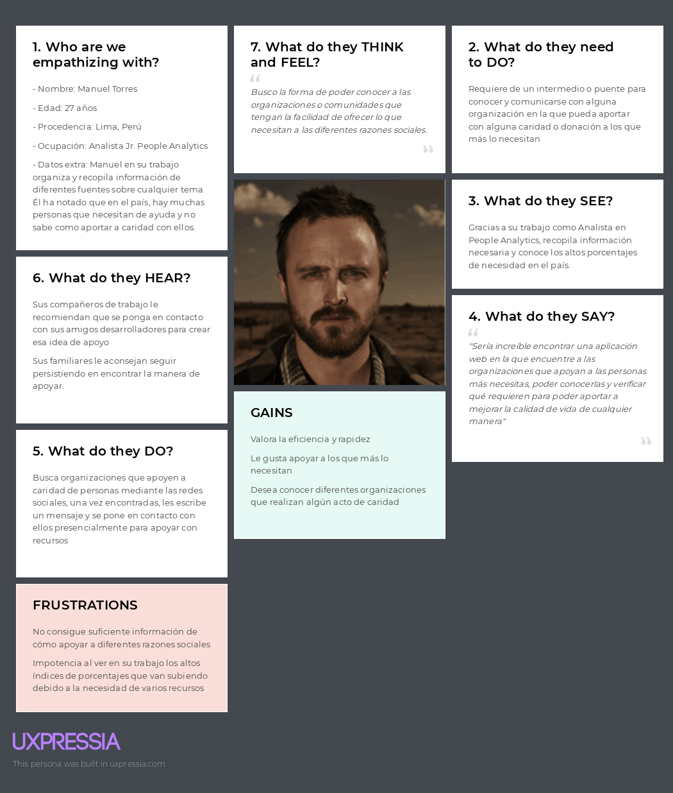
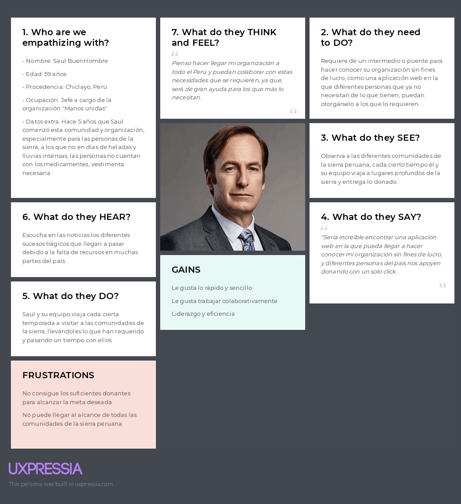
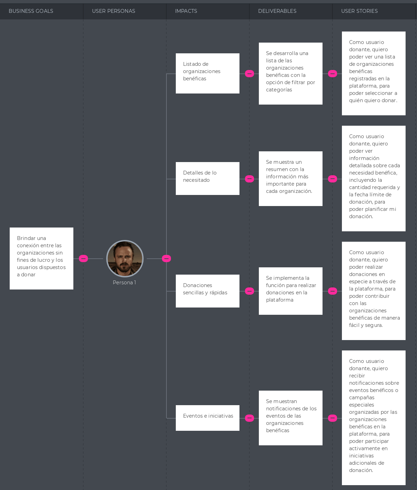
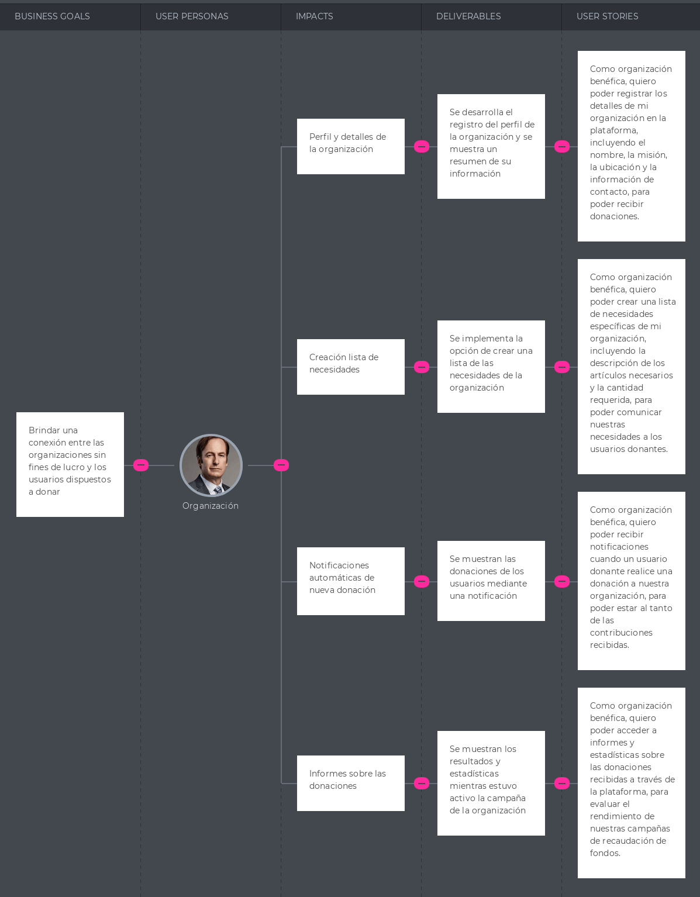

---

---
---
# UPC
# INGENIERÍA DE SISTEMAS DE SOFTWARE
## CURSO: SI730 Aplicaciones Web | SECCIÓN WX54 
 Profesor: Alex Humberto Sánchez Ponce
# Informe de TB1
Startup: **YESI (Yielding Efficient Software Implementations)**  
Producto: **AidManager**
### Integrantes:
- Peña Rivera, Manuel Sebastian - U202210138
- Ramírez Hoffmann, Sebastián - U202211894
- Rodriguez Vargas, Arian Martin - U202212096
- Esteban Garcia, Nicolas Sebastián - U202217485
- Herrera Aguirre, Fabia Alejandra - U202219422   

---
# Registro de Versiones del Informe
| Version | Fecha | Autor | Descripcion de Modificacion |
| ----------- | ----------- | ----------- | ----------- |
| 0.0 | 19/03/2024 |Grupo 1 |Se crea el documento |

# Project Report Collaboration Insights
[URL del repositorio](https://github.com/AplicacionesWeb-WX54/si730-WX54-Grupo1-Repository.git)

(Imagenes de los commits cada entrega)


# Student Outcome
|Criterio Especifico|Acciones Realizadas|Conclusiones|
|-|-|-|
|Participa en equipos multidisciplinarios con eficacia, eficiencia y objetividad, en el marco de un proyecto en soluciones de ingeniería de software.|<br> *TB1:* Manuel Sebastian Peña Rivera: Participe en secciones del capitulo 2, 3 y 4 que contienen entrevistas, product backlog, impact map, user task matrix, style guidelines *TB2:* texto etc.. |Realizar la investigación necesaria para el proyecto permite conocer la realidad de los desafíos que presentan y como nuestro programa puede solucionar el problema es nuestro objetivo en mente|
|Conoce al menos un sector empresarial o dominio de aplicación de soluciones de software.|Manuel Sebastian Peña Rivera: No solo la investigación realizada, sino que la entrevista que realice me permitió conocer sobre las dificultades y experiencia como voluntario en la ONG. <br> *TB2:* texto etc.. |Con la información reunida de la entrevista espero poder adaptar las necesidades al proyecto y que nuestro proyecto le sirva para mejorar la eficiencia de su trabajo|
# Capítulo I: Introducción
## 1.1. Startup Profile
### 1.1.1. Descripción de la Startup
Nuestra startup **AidManager** se basa en una herramienta enfocada en gestionar los proyectos de ONG, esto se hara al recibir informacion de los mismos asistentes asignados al evento y por medio de nosotros se hara un analisis intensivo en oportunidades de mejora, reportes de inventario, asistentes del eveto entre otros. Adicionalmente la herramienta servira para planificar futuros eventos usando la misma informacion previamente registrada. 

#### 1.1.2. Perfiles de integrantes del equipo
|Miembros del equipo | Codigo Estudiante | Carrera | Conocimientos / Habilidades |
|-|-|-|-| 
|Ramírez Hoffmann, Sebastián  |U20221894|Ingenieria de software|C++, Python, Js, Reactjs, NodeJs, expressjs, MongoDB, SQL.  Paciencia, Liderazgo, Logico|
|Rodriguez Vargas, Arian Martin |U202212096|Ingenieria de software|C++, Python, persistente y amigable|
|Esteban Garcia, Nicolas Sebastian |U202217485|Ingenieria de software|HTML, CSS Y JS. Sociable.|
|Herrera Aguirre, Fabia Alejandra 	|U202219422|Ingenieria de software|C++, Python. Creativa.|
|Peña Rivera, Manuel Sebastian	|U202210138|Ingenieria de software|C++, Python, MongoDB, SQL, Assembler. Responsabilidad y Buena Comunicación| 

## 1.2. Solution Profile
### 1.2.1 Antecedentes y problemática

Segun la Oficina de Naciones Unidas para la Coordinación de Asuntos Humanitarios (OCHA) en 2023 se reportaron 801,425 personas en necesidades de alimentacion, servicios de agua, saneamiento e higiene.
En el Peru existen 978 Organizaciones privadas sin fines de lucro de las cuales principalmente 428 se han categorizado como de salud, 19 de educacion y 35 de vivienda (SIGCTI, 2024), esto nos demuestra que existe un alto rango de organizaciones privadas sin fines de lucro. No obstante cuando buscamos organizaciones ONDG(Organizaciones No Gubernamentales de Desarollo) encontramos un total de 1835 (SIGCTI, 2024). Aun con muchas instituciones el alcance que se logra resulta ser preocupante, en la encuesta que se realizo por equillibrium CenDE en 2023 de entre casi 1,200 personas un 80% de estas reconocia que es una ONG no obstante 71% o no sabia o no conocia iniciativas realizadas por las ONGs en ese año, en esta misma encuesta solo un 7% no tenia interes alguno en participar en el abordamiento de problemas publicos ni socialmente es decir un 93% de las 1,200 estaban dispuestas a apoyar. Adicionalmente cuando estas mismas ONG reciben grandes cantidades de datos normalmente solo son para obtener una cifra que represente los asistentes a algun evento o cuanto se logro de un objetivo de donacion omitiendo lo enriquecedor de esta data recolectada, como se menciona en el articulo "Data Analytics for Nonprofits" (DigitalForNonprofits, 2023), en el mundo de hoy para realizar acciones estrategicas y maximisar recursos distintas empresas utilizan lo llamado analisis de datos, esta practica se puede aplicar a un modelo de negocios sin fines de lucro como las ONG donde se consiguen los mismos beneficios que brindan los analisis de datos.

Es aqui donde nosotros ideamos la propuesta de **AidManager**, es una aplicacion web que se basa en una herramienta de gestion utilizada por los encargados de gestionar el proyecto y los asistentes del proyecto haciendo uso de su informacion recopilada por medio de nosotros quienes por nuestro servicio de analisis de datos y gestion de proyectos le proporcionaremos oportunidades de mejora, graficas relevantes respecto a la data y recomendaciones en como pueden implementar una recolecion de datos mas efectiva para amplificar el impacto deseado, de misma manera de que se presentaran espacios donde el gestor pueda planificar su siguiente proyecto facilitando el seguimiento de este mismo y haciendo un registro mas efficiente. 

What (¿Que se está haciendo?): Se facilita el proceso de planeacion para actividades orientadas al apoyo social y donacion de bienes. Asimismo se proporciona un servicio de gestion avanzado para las ONG con el objetivo de aumentar el impacto de estas.

Why (¿Porque se está haciendo?): Se hace esta aplicacion web con el objetivo de darle una herramienta a las ONG para aumentar la eficiencia de sus proyectos de ayuda social proporcionando adicionalmente una plataforma donde sus mismos ayudantes puedan recopilar la informacion de manera efectiva.

When (¿Cuándo se usa?): Se usa cuando se tengan los datos recopilados del proyecto mas reciente y se busque ver las oportunidades de mejora e ideas para la eficacia de un siguiente proyecto en un formato visual que sea facil de entender. Asi como tambien se hara uso de la herramienta cuando este proyecto este en ejecucion donde los asistentes del mismo recopilaran los datos para que consecuentemente el supervisor asignado a gestionar del proyecto pueda observar las oportunidades de mejora.

Where (¿Dónde se usa?): El uso esta diseñado para Perú ya que se recompilara informacion de ONG's que esten actuando en este pais, de esta manera se podran hacer recomendaciones mas locales. Asimismo esta App Web se puede usar facilmente desde el telefono o escritorio.

Who (¿Quién lo usa?): El usuario principal para nosotros son los supervisores y ayudantes de las ONG ya que son estos los mismos que nos proporcionaran los datos recopilados para mejorar su impacto y requieren de una mejor organizacion, nuestro usuario principal entonces se divide en el segmento de supervisor / gerente y el ayudante / recolector de data.

How Much (¿Cuánto costaría?): La aplicacion web tendra sus funcionalidades core a medio de pago es decir el proceso de gestion recopilacion y refinamiento de datos junto con las mejores oportunidades de mejora para estas. Tanto el core de la app web como la subscripcion se tendran que renovar cada cierto tiempo donde las organizaciones se tendran que escoger un plan anual o mensual.

How (¿Cómo se lleva al cabo?)

Se hara un proceso de inscripcion y seguidamente se les presentara con la oportunidad de crear o importar un proyecto
seguidamente solicitara los datos recopilados de su proyecto mas reciente, de estos datos se mostraran graficos representando la demografica, gastos, junto con explicaciones, recomendaciones y oportunidades de mejora. Asimismo se proporcionara la herramienta para gestionar futuros proyectos la cual se podra usar de manera opcional para poder estructurar mejor los encargados, el presupuesto y objetivos del siguiente proyecto. Cuando se inicie un proyecto se dependera de los ayudantes de estos eventos a que recopilen la informacion de los usuarios por medio de nuestro aplicativo web, donde tendran que registrarse y coleccionar la data de los participantes a eventos.

### 1.2.2 Lean UX Process.
#### 1.2.2.1. Lean UX Problem Statements.
Se identifica una falta de organizacion por parte de las ONG donde existen distintas oportunidades para mejorar el alcance con una buena planificacion. No obstante, muchas organizaciones no tienen conocimiento del potencial que se puede obtener de esta informacion o no cuentan con un equipo dedicado al analisis de datos a niveles de Big Data o formas efectivas de recolectar esta misma informacion. Asimismo hemos identificado que existen diferentes factores los cuales llevan a un usuario interesado en una ONG a no tener motivos suficientes para participar de actividades sociales o de hacer donativos a estas mismas, una de estas siendo la falta de informacion y la carencia de visibilidad que estan tienen siendo que aun asi habiendo mas de 1000 ONG's en el Perú no se conocen muchas de estas ni de como poder ayudarlas. Frente a esta problematica nos planteamos la siguiente pregunta:
¿Como facilitamos el proceso de gestion de un proyecto de ayuda social para aumentar el flujo de participantes en las actividades que ofrecen las distintas ONG's a la poblacion de nuestro país de manera eficiente?
#### 1.2.2.2. Lean UX Assumptions.

Después de analizar la problemática y los factores que la ocasionan, podemos tener un panorama de cómo solucionar la necesidad del usuario declarando supuestos, lo cual corresponde al siguiente paso de la Lean UX. Por ello, es necesario tener un conocimiento previo de las empresas que tienen características similares a las nuestras y cómo estas se han desarrollado con el paso del tiempo. 

Se mencionan a tres potenciales competidores:

CauseVox:
Plataforma que facilita el crowdfunding no solo de bienes monetarios, sino también de recursos como víveres y vestimenta. Plataforma de recaudación de fondos que brinda herramientas necesarias para crear campañas llamativas para cumplir su meta de donación. su diversificacion de bienes junto con sus campañas muestran su capacidad para ser competidores.

Donadora:
Es una plataforma mexicana en la que se pueden financiar proyectos de caridad, así como proyectos de tipo artístico, científico, entre otros. Al entrar en la financiacion para diferentes proyectos fuera de la caridad presenta una aptidud para ser competidor.

Logalto:
Es un Programa web colaborativo para el monitoreo y la evaluación de proyectos de desarrollo internacional la cual proporciona una alta gama de herramientas de gestion de proyectos.

|Business Assumptions|User Assumptions|
|-|-|
|Creemos que nuestros usuarios tienen la necesidad de aumentar el flujo de personas a sus eventos y facilitar la creasion de estos gestionando sus datos y proyectos de manera efectiva. |Los usuarios de este producto son el personal encargado de gestion de proyecto y los ayudantes que participan de estos eventos de Organizaciones no gubernamentales. |
|Este problema se puede solucionar con una plataforma donde se pueda organizar y supervizar proyectos donde se pueda generar un analisis de datos con recomendaciones y oportunidedes de mejora con infromacion recoleccionada por los mismos ayudantes de estos eventos. Ademas de que se presente toda la informacion necesaria para un proceso de inscripcion o donacion |Nuestro producto encajaría en la vida cotidiana debido a que sera accesible, economicamente viable y facil de utilizar tanto para las personas que tengan que supervizar el proyecto como para los mismos ayudantes para la recoleccion de datos |
|Los usuarios iniciales Organizaciones no gubernamentales sin fines de lucro que deseen mejorar su impacto y alcance.  |Este producto resolverá la necesidad de gestionar proyectos mientras que se recopila y analiza informacion de manera efectiva, simple y facil de entender para tener mayores oportunidades de mejora. |
|El valor #1 de nuestro servicio es el analisis de datos comprensible, el registro de informacion relevante y la interfaz amigable y simple de usar. |El producto se utilizará al momento que se tenga que realizar un nuevo proyecto de ayuda social y se deba realizar un planeamiento.|
|El aplicativo adicionalmente contara con el sistema de registro de ayudantes y gerentes que tendran un limite segun los distintos planes que tenemos para las ONG de distintos tamaños |Las funciones mas importantes son, la capacidad de manejar y presentar los datos de manera que sean visualmente coherentes y poco abrumadores. La planificacion de proyectos haciendo un registrod de todo lo necesario para que se pueda ejecutar. Y finalmente, una interfaz facil de usar para tanto el ayudante como para el gestor del proyecto|
|Se conseguirán la mayoría de los usuarios por medio de marketing digital (como las redes sociales) y Noticieros. |Nuestro producto debe verse como una herramienta de gestion y analisis de datos. Asimismo siendo una herramienta que se usa para planificar proyectos de ayuda benefica de alta calidad y monitoreo |
|Conseguiremos ingresos de la aplicación por medio de la compra del servicio para las ONG y los distintos planes proporcionales al tamaño de las necesidades de la organizacion.||
|Nuestros competidores principales serán CauseVox, Donadora y Logalto. ||
|Los venceremos al tener una mejor interactividad y experiencia de usuario, una herramienta de gestion para proyectos futuros simple de entender y el proceso amigable y facil de utilizar para adquirir la informacion. ||
|El mayor riesgo del producto es la falta de alcance inicial, la capacidad de datos, la precicion de datos y la competencia. ||
|Solucionaremos esto por medio de campañas de publicidad, contactar a las ONG y dandoles a los recolectores las pautas a seguir para reducir el margen de error.||
|Pensamos que un assumption que si se prueba falso puede causar que el proyecto falle es la demanda actual de nuestro producto y la necesidad estimada.||

#### 1.2.2.3. Lean UX Hypothesis Statements.
- Creemos que, al brindar una interfaz poco compleja de usar para nuestros usuarios, podrán tener una mejor experiencia al gestionar sus datos y  proyectos de ayuda social.
  Sabremos que hemos tenido éxito cuando se incremente la cantidad de proyectos efectivos por parte de las ONG que usen nuestra herramienta. 

- Creemos que la aplicación facilitara la gestion y creacion de proyectos de ayuda social proporcionando mejores resultados y un mayor flujo de personas participando de estas actividades.  
  Sabremos que tuvimos exito cuando distintos proyectos de ONG reciban mas relevancia y participantes.

- Creemos que ayudar a las ONG a tener una mejor gestion y planeamiento en sus proyectos ayudara a mejorar la visibilidad y aumentar la cantidad de personas motivadas a participar.
  Sabremos que hemos tenido éxito, cuando a nivel nacional se empiece a notar un incremento en la ayuda social proporcionada. 

#### 1.2.2.4. Lean UX Canvas.
|-|-|-|
|-|-|-|
| Business Problem <br>¿Qué problema has identificado que necesitas resolver? Las ONG estan perdiendo conexion y requieren optimizar sus proyectos para mejorar su impacto. <br>Según CenDe de 1200 personas 72% de estas no han participado en alguna actividad de actividad de ayuda social.<br> Segun "Digital for non Profits" 78% de organizaciones nonprofit con capacidades analiticas tienen mejoras tales como mejora de reclutamiento, mejoras en el alcance y hacer seguimiento de presupuestos| Solution ideas <br>Herramienta de gestion de proyectos recopilando datos y recomendaciones de accion.<br><br>Ofrecer planes de pago a las para ONG cuyos proyectos tienen diferentes cantidades de personas.<br><br>Mejorar y optimizar los procesos de recoleccion de datos para un analisis mas exacto. | Business Outcomes <br>(Cambios en el comportamiento del usuario) <br>¿Qué cambios en el comportamiento del usuario indicarán que has solucionado un problema real de manera que añada valor a tus clientes? <br> El comportamiento que refleje que se ha solucionado un problema real sera cuando las actividades de ayuda social consigan ser mas efectivas y que los participantes de estas aumenten.|
| User & Customers <br>¿En qué tipo de usuarios y clientes tienes que centrarte primero? <br>Usuario: <br>Personas encargadas de la gestion y recoleccion de datos de un proyecto orientado a las ONG. <br>Cliente: la Organizacion sin fines de lucro que adquiere nuestra herramienta. <br> ONG que busquen una optimizacion en la cantidad de gastos y tiempo invertidos.  <br> |  UX Canvas| User benefits <br>¿Cuáles son los objetivos que los usuarios intentan obtener? <br> \- Se busca gestionar un proyecto de manera que se pueda entender las oportunidades de mejora, los datos registrados, las planificaciones del proyecto y como pueden llegar a mas con menos. <br> ¿Qué les motiva a buscar tu solución? <br> \- Los usuarios están motivados a buscar esta solución debido la interfaz intuitiva, las oportunidades de optimizacion economica y el seguimiento de las acciones, gastos y personal que participara. <br>Nuestra interfaz resulta intuitiva para el usuario en todo el proceso. <br> |
| Hyphotheses: <br>  \- Creemos que, al brindar una interfaz poco compleja de usar para nuestros usuarios, podrán tener una mejor experiencia al gestionar sus datos y  proyectos de ayuda social. <br><br>Sabremos que hemos tenido éxito cuando se incremente la cantidad de proyectos efectivos por parte de las ONG que usen nuestra herramienta. <br><br> \- Creemos que la aplicación facilitara la gestion y creacion de proyectos de ayuda social proporcionando mejores resultados y un mayor flujo de personas participando de estas actividades. <br><br> Sabremos que tuvimos exito cuando distintos proyectos de ONG reciban mas relevancia y participantes. <br><br> \- Creemos que ayudar a las ONG a tener una mejor gestion y planeamiento en sus proyectos ayudara a mejorar la visibilidad y aumentar la cantidad de personas motivadas a participar. <br><br> Sabremos que hemos tenido éxito, cuando a nivel nacional se empiece a notar un incremento en la ayuda social proporcionada. | ¿Qué es la cosa más importante que nosotros necesitamos aprender primero? <br> Lo principal que necesitamos aprender es generar un modelo de gestion el cual sea efectivo a nivel visual y de gestion, y adicionalmente, un repaso en lo que viene siendo la gestión del proyecto| <br> ¿Cuál es la mínima cantidad de trabajo que nosotros necesitamos hacer para aprender la siguiente cosa más importante? <br> Asistir a las clases y solicitar que se nos revise los avances del proyecto para poder hacer un seguimiento saludable del proyecto|


## 1.3. Segmentos objetivo.
| |Segmento 1 | Segmento 2  |
| - | - |-|
| Variables                 |  Gestor de proyectos de una ONG | Ayudante de eventos de ONG |
| Geográfica                | en el mundo de hoy para realizar acciones strategicas y maximisar recursos distintas empresas utilizan lo llamado analisis de datos, esta practica se puede aplicar a un modelo de negocios sin fines de lucro como las ONG (DigitalForNonprofits, 2023)| La recogida, división y análisis adecuados de datos recogidos por gobiernos, ONGs y otros puede mejorar las condiciones de vida y las oportunidades de desarrollo para aquellas personas en sociedades que a menudo son ignoradas a la hora de recopilar datos.( OHCHR,2022) |
| Demográfica               | Edades de entre 18 a 50+ años <br> Genero: Masculino y Femenino | Edades de entre 18 a 50+ años <br> Genero: Masculino y Femenino |
| Psicológica               | Piensa en el planeamiento y todas las variables que debe de analizar y registrar. | Piensan en las actividades programadas, en sus demas compañerls y el equipo del proyecto. |
| Función de comportamiento | Actitudes: Participa de la creacion de proyectos de ayuda social, organiza los equipos, presupuestos, objetivos y lugares donde llevar al cabo los eventos. <br> Conocimientos: Sabe los pasos de organizacion y conoce herramientas para apoyar su proceso, mas no encuentra muchas que se orienten a proyectos de ayuda social.| Actitudes: Participan de los eventos como staff para ayudar, animar y guiar a los participantes, recolecta la informacion de los participantes y debe dar un reporte a sus supervisores.<br> Conoce: Sabe como ayudar a los participantes y intenta de mantener el orden. |

---

# Capítulo II: Requirements Elicitation & Analysis
## 2.1. Competidores.
### 2.1.1. Análisis competitivo.

| Competitive Analysis Landscape                          |  |
| ------------------------------------------------------- | -|
| ¿Por qué llevar a cabo este análisis?                   | Realizamos este análisis a fin de poder conocer el mercado al que nos enfrentamos en un inicio, para de esta manera poder evaluar las estrategias adoptadas por plataformas ya existentes, y así aprender de sus aciertos y errores. |


| |  | (Nosotros)| CauseVox| Donadora | Logalto |
|-|-|-|-|-|-|
| PERFIL| Overview | Plataforma que facilita el proceso de gestionar proyectos asimismo, se hace uso de la plataforma para facilitar la busqueda de informacion de las ONG.  | Plataforma de recaudación de fondos que brinda herramientas necesarias para crear campañas llamativas para cumplir su meta de donación. | Es una plataforma mexicana en la que se pueden financiar proyectos de caridad, así como proyectos de tipo artístico, científico, entre otros. |Es un Programa web colaborativo para el monitoreo y la evaluación de proyectos de desarrollo internacional la cual proporciona una alta gama de herramientas de gestion de proyectos.|
|| Ventaja competitiva ¿Qué valor ofrece a los clientes? | Mientras que facilita el proceso de gestion de proyectos y ofrece oportunidades de mejora. Tambien solo facilita la búsqueda de oportunidades de ayuda social, sino que también educa y guía a los usuarios a través del proceso de participación y donación a ONGs. | Cuenta con herramientas que le permiten al usuario personalizar su propia campaña para recaudar fondos con su logo e imágenes con las que atraer potenciales donantes. |Permite categorizar los proyectos en 9 categorías, por lo que le facilita al usuario la búsqueda de iniciativas afines a este.| Cuenta con distintas herramientas de gestion, es de alcance global y tiene mas de una forma de apoyar a las ONG.
|| Mercado Objetivo                                        | Organizaciones peruanas, así como individuos interesados en apoyar. | Organizaciones sin fines de lucro, grupos comunitarios y empresas, e individuos que deseen financiar dichas iniciativas. | Personas de México que quieran apoyo para financiar un proyecto, organizaciones sin fines de lucro, e individuos que deseen financiar dichas iniciativas. | proyectos de desarrollo, ONG y fundaciones, ministerios, instituciones de gobierno y proveedores de fondos.|
| Perfil de marketing                                     | Estrategia de Marketing | Se hacen uso de redes sociales y de publicidad en línea | Publicidad por redes y publicidad en línea | Marketing por influencia, publicidad por redes |Publicidad por redes sociales.|
| Perfil del producto                                     | Productos y servicios | Aplicación web que oriantada a la gestion de proyectos de Organizaciones sin fines de lucro haciendo anlisis de datos y ofreciendo sugerencias y oportunidades de mejora, al mismo tiempo que facilita y agiliza el proceso de encontrar oportunidades de participación en actividades de ayuda social y donación de bienes en Perú.| CauseVox es una plataforma de recaudación de fondos que facilita la creación y gestión de campañas de recaudación de fondos en línea. | Donadora es una plataforma de crowdfunding que permite a los usuarios crear campañas para recaudar fondos en efectivo, así como donaciones de artículos físicos.| Loaglto es programa web colaborativo para el monitoreo y la evaluación de proyectos de desarrollo
 || Precios y costos                                        | Para el usuario interesado en saber de ONG es un servicio freemium con una subscripcion a un newsletter, mientras que para las ONG se presenta un modelo estrictamente de pago | De pago | Gratuito | De pago|
|| Canales de distribución (Web y/o Móvil)                 | Web y Móvil Web | Móvil Web | Web y móvil Web ||
### 2.1.2. Estrategias y tácticas frente a competidores.


|Competidores |  | Nosotros | CauseVox| Donadora|
|-|-|-|-|-|
| Análisis SWOT | Fortalezas |- La aplicación cuenta con una función educativa.<br>- Capacidad de personalizar recomendaciones según preferencias.<br>- Acceso rápido a información sobre ONGs.| - Permite la personalización completa del aspecto de las páginas de campaña.<br>- Herramientas para la promoción en redes sociales. | - Permite financiar una amplia gama de proyectos.<br>- La plataforma es accesible y fácil de usar para crear y gestionar campañas. |
|| Debilidades   | - Limitación de recursos para el financiamiento de la promoción de la aplicación.<br>- Competencia con plataformas similares. | - Limitaciones en su alcance de mercado. | - No cuenta disponibilidad en varios países latinoamericanos. | lorem | 
|| Oportunidades | - Crear alianzas con ONGs o empresas podría mejorar el alcance de la aplicación.<br>- El aumento de conciencia social y de la disposición para apoyar a ONGs.<br>- La expansión de la aplicación a regiones extranjeras. | Desarrollar nuevas funcionalidades para mejorar la experiencia de usuario. | La expansión de la aplicación a regiones extranjeras. | lorem | 
|| Amenazas      | - La existencia de competidores establecidos.<br>- Preocupaciones sobre la seguridad de datos y las transacciones de las donaciones. | - Al ser un servicio de pago, potenciales organizaciones podrían optar por opciones accesibles. | - La aparición de competencia emergente.<br>- La desconfianza hacia algunas organizaciones benéficas por la percepción del mal manejo de fondos. | lorem |

## 2.2. Entrevistas.
### 2.2.1. Diseño de entrevistas.
**Preguntas generales:**

1. ¿Cuál es su nombre? 
2. ¿Qué edad tiene? 
3. ¿A qué se dedica? 
4. ¿[Opinion de idea de propuesta]? 

**Entrevistas usuario segmento 2**
1. ¿Lorem?
2. ¿Lorem?
3. ¿Lorem?
4. ¿Lorem?  
   
**Entrevistas usuario segmento 2**
1. ¿Lorem? 
2. ¿Lorem?
3. ¿Lorem?
4. ¿Lorem? 
### 2.2.2. Registro de entrevistas.
**Segmento 1**  
Nombre: _____
Edad: _ años 
Ocupación: _____  
  
{texto mucho}

**Segmento 2**  
Nombre: _____
Edad: _ años 
Ocupación: _____  

{texto}

### 2.2.3. Análisis de entrevistas.
**Segmento 1:**
{texto}
**Segmento 2:**
{texto}
## 2.3. Needfinding.
### 2.3.1. User Personas.
**Segmento 1:**  


**Segmento 2:**


### 2.3.2. User Task Matrix.
| --- | ------ | Segmento 1  | ------/----- | Segmento 2  | ---------- |
| --- | ------ | ----------- | ------------ | ----------- | ---------- |
| ID  | Titulo | Importancia | Frecuencia   | Importancia | Frecuencia |
| U01X| {Texto}| Alta        | Alta         | Media       | Baja       |
### 2.3.3. User Journey Mapping.
**Registration:**
Why would they trust us?
- s
- s
- s
  
**Onboarding and first use:**
How can they feel successful?
- s
- s
- s  
  
**Sharing:**
Why would they invite others?
- s
- s
- s

### 2.3.4. Empathy Mapping.
**Segmento 1:**


**Segmento 2:**

### 2.3.5. As-is Scenario Mapping.

**Segmento 1**  
Escenario: Usuario desea realizar una donación como ropa o comida a alguna organización benéfica disponible

As Is:
| Fases| El usuario tiene productos como ropa o artefactos que ya no utiliza recientemente | El usuario desea donar sus bienes a una persona sin hogar que lo necesite | El usuario desconoce organizaciones a las cuales pueda donar sus bienes | El usuario requiere de una aplicación confiable donde pueda encontrar organizaciones a las que pueda donar sus bienes |
| -------- | --------- | --------- | ------- | --------- |
| Doing | El usuario decide buscar alguna persona a la cual donar aquellos productos. | El usuario investiga acerca de lugares donde hallan personas que necesiten alguna donación. | El usuario investiga acerca de las organizaciones a las cuales puedan donar productos. | El usuario indaga acerca de aplicaciones que puedan facilitar la búsqueda de alguna organización benéfica. |
| Thinking | El usuario piensa que buscar alguna persona que necesite una donación puede tardar demasiado | El usuario piensa que existen una gran cantidad de lugares que necesiten alguna donación. | El usuario piensa que muchas de estas organizaciones no pueden estar licenciadas o no brindan confianza. | El usuario piensa que no existe alguna aplicación que pueda resolver su necesidad, ya que no garantiza seguridad alguna. |
| Feeling  | El usuario se siente apenado al no encontrar personas que necesiten alguna donación. | El usuario se siente desconfiado ya que ningún lugar le brinda confianza alguna. | El usuario se siente abrumado debido a la cantidad de organizaciones que necesitan donación alguna | El usuario se siente agobiado ya que no hay una aplicación que cumpla con la necesidad que desea resolver. |

**Segmento 2**  
Escenario: Organización sin fines de lucro necesitan ciertos bienes en específico que puedan brindar los usuarios donantes.

As Is:
| Fases| La organización necesita una cantidad de productos en específico para brindar el servicio | La organización requiere de un producto en específico de los usuarios donantes | La organización desea llegar a un público en específico que desee donar el producto solicitado | La organización requiere de alguna aplicación en la cual pueda llegar a las personas donantes o abrir un evento solicitando dichos productos |
| -------- | --------- | --------- | ------- | --------- |
| Doing | La organización busca personas o empresas que puedan brindar los productos que necesitan. | La organización busca a través de eventos a personas que puedan donar aquellos productos. | La organización realiza eventos para reabastecer los productos faltantes que se solicitaron. | La organización investiga acerca de ciertos grupos de donación a los cuales pueda llegar su solicitud. |
| Thinking | La organización piensa que este es un proceso que puede ser tardado y deficiente a largo plazo. | La organización piensa que realizar estos eventos puede tomar tiempo y dinero. | La organización piensa que debería existir una mejor forma de llegar a un público en concreto. | La organización piensa que este tipo de aplicación podría facilitar la exhaustiva búsqueda de este grupo de personas. |
| Feeling  | La organización se siente limitada debido a la deficiencia que puede conllevar esta estrategia. | La organización se siente saturada debido a la cantidad de tiempo que sugiere realizar estos eventos. | La organización se siente desconcertada al no encontrar una forma mas optima de llegar a un público. | La organización se siente desmotivada al no encontrar una aplicación que satisfaga su necesidad. |

## 2.4. Ubiquitous Language.
```
Texto ubiquo: Se trata de un glosario de términos 
del dominio para mantenernos comunicados y actualizados, 
tanto el equipo como los stakeholders, relacionados al sector 
en el que se especializa la startup.
```

**1. Organización benéfica:** Una entidad sin fines de lucro que busca apoyar causas sociales, humanitarias o ambientales a través de donaciones.

**2. Necesidades benéficas:** Los artículos, suministros o recursos específicos que una organización benéfica requiere para llevar a cabo sus actividades o programas.

**3. Donante:** Una persona o entidad que contribuye con artículos, suministros o recursos a una organización benéfica.

**4. Lista de necesidades:** Una lista detallada de los artículos o suministros específicos que una organización benéfica necesita recibir como donación.

**5. Intermediario de donaciones:** Una plataforma o servicio que facilita la conexión entre organizaciones benéficas que necesitan donaciones y personas dispuestas a donar.

**6. Donación en especie:** La contribución de bienes tangibles, como alimentos, ropa, medicamentos, etc., en lugar de dinero.

**7. Usuario donante:** Un usuario de la plataforma que está interesado en donar artículos o suministros a organizaciones benéficas.

**8. Usuario receptor:** Una organización benéfica que está registrada en la plataforma y que busca recibir donaciones de artículos o suministros.

**9. Registro de donación:** Un registro de las donaciones realizadas por los usuarios, que puede incluir información sobre los artículos donados, la organización benéfica receptora, etc.

**10. Notificación de necesidad:** Una alerta o mensaje que se envía a los usuarios sobre las necesidades específicas de una organización benéfica en un momento dado.

---

# Capítulo III: Requirements Specification
## 3.1. To-Be Scenario Mapping.
 
Escenario 1: Usuario necesita una interfaz cómoda donde pueda visualizar el registro de los bienes que ha donado y eventos próximos realizados por organizaciones

| Fases    |  El usuario desea tener una sección donde pueda visualizar la cantidad de productos que dono de forma detallada | El usuario desea tener un registro de los productos que dono, así como las fechas de entrega en la que se realizó| El usuario desea tener un seguimiento acerca de los próximos eventos de caridad que ofrecen las organizaciones| El usuario desea tener un apartado donde se visualice la información de los eventos, además de la organización que lo brinda. |
| -------- | ---- | ------ | ----- | ------------- |
| Doing    | El usuario hace un registro manual de los productos y bienes donados a aquellas organizaciones. | El usuario anota con las fechas en su calendario para llevar un registro de las donaciones que realizo | El usuario anota las fechas de su calendario los eventos próximos de las organizaciones que ha donado. | El usuario registra la información para los eventos próximos que se realizarán, además de informarlo a la comunidad. |
| Thinking | El usuario piensa que seria ideal tener un apartado especial para tener un registro de los productos donados | El usuario piensa que la aplicación debería permitir registrar las fechas de entrega, así como su información. | El usuario piensa que se debería implementar un sistema de registro de fechas para los eventos próximos. | El usuario piensa que cada evento debería contar detalles de la misma dentro de la aplicación para facilitar la información. |
| Feeling  | El usuario siente que es trabajoso tener que registrar esta información manualmente. | El usuario se siente agobiado debido a que no se cuenta con un registro de fechas de entrega. | El usuario se siente esperanzado en que se implemente la funcionalidad. | El usuario se siente confundido al no encontrar las fechas o información a dichos eventos. |

Escenario 2: Organización sin fines de lucro desea realizar y programar un evento donde se solicite ciertos bienes en específico a los usuarios a través de la aplicación.

| Fases    | La organización tiene pensado organizar un evento en la que se solicite productos específicos. | La organización desea llegar al publico objetivo que desee donar dichos productos. | La organización desea programar un evento próximamente que será publicado en la aplicación | La organización desea mostrar la información acerca de dicho evento llegando a la mayor cantidad de usuarios donantes |
| -------- | ---- | ------ | ----- | ------------- |
| Doing    | La organización publica un comunicado para informar al usuario de la aplicación | La organización hace una encuesta a los usuarios donantes para tener más información | La organización programa una fecha por medio de la aplicación y es publicada. | La organización registra todos los datos del evento que se realizará a través de la aplicación.         |
| Thinking | La organización piensa que esta forma de comunicación es muy cómoda. | La organización piensa que la forma de llegar al público es muy eficaz. | La organización piensa que esta dinámica es bastante rápido y eficiente. | La organización piensa que registrar un evento dentro de la aplicación es bastante intuitiva y cómoda |
| Feeling  | La organización se siente cómoda ya que puede comunicarse rápidamente a sus usuarios. | La organización se siente satisfecho ya que conecta rápidamente con su público. | La organización se siente entusiasmado ya que la interfaz permite programar un evento fácilmente  | La organización se siente optimista ya que la interfaz de la aplicación permite registrar los datos del evento rápidamente. |

## 3.2. User Stories.
 
| HU0X | Historia Usuario | "Descripcion"  |
|-|-|-|
| HU01 | Listado de organizaciones benéficas | Como usuario donante, quiero poder ver una lista de organizaciones benéficas registradas en la plataforma, para poder seleccionar a quién quiero donar.  |
| HU02 | Lista de necesidades en recursos | Como usuario donante, quiero poder ver una lista de necesidades específicas de cada organización benéfica, para poder donar artículos que realmente necesitan.  |
| HU03 | Detalles de lo necesitado | Como usuario donante, quiero poder ver información detallada sobre cada necesidad benéfica, incluyendo la cantidad requerida y la fecha límite de donación, para poder planificar mi donación.  |
| HU04 | Donaciones sencillas y rápidas | Como usuario donante, quiero poder realizar donaciones en especie a través de la plataforma, para poder contribuir con las organizaciones benéficas de manera fácil y segura.  |
| HU05 | Confirmación y agradecimiento | Como usuario donante, quiero recibir una confirmación de mi donación, incluyendo detalles sobre los artículos donados y la organización benéfica receptora, para tener un registro de mis contribuciones.  |
| HU06 | Perfil y detalles de la organización | Como organización benéfica, quiero poder registrar los detalles de mi organización en la plataforma, incluyendo el nombre, la misión, la ubicación y la información de contacto, para poder recibir donaciones.  |
| HU07 | Creación lista de necesidades | Como organización benéfica, quiero poder crear una lista de necesidades específicas de mi organización, incluyendo la descripción de los artículos necesarios y la cantidad requerida, para poder comunicar nuestras necesidades a los usuarios donantes.  |
| HU08 | Notificaciones automáticas de nueva donación | Como organización benéfica, quiero poder recibir notificaciones cuando un usuario donante realice una donación a nuestra organización, para poder estar al tanto de las contribuciones recibidas. |
| HU09 | Gestión de la lista de necesidades | Como organización benéfica, quiero poder gestionar y actualizar nuestra lista de necesidades en la plataforma, para reflejar con precisión nuestras necesidades actuales.  |
| HU10 | Reseña y comentarios | Como usuario donante, quiero poder compartir información sobre las necesidades benéficas y las organizaciones registradas en la plataforma en mis redes sociales, para aumentar la visibilidad y las donaciones.  |
| HU11 | Historial de donaciones | Como usuario donante, quiero poder ver un historial de mis donaciones anteriores en la plataforma, incluyendo detalles como la fecha y los artículos donados, para poder realizar un seguimiento de mis contribuciones.  |
| HU12 | Recomendaciones y nuevos intereses  | Como usuario donante, quiero recibir recomendaciones personalizadas sobre organizaciones benéficas y necesidades específicas, basadas en mis intereses y patrones de donación anteriores, para facilitar el proceso de selección de donaciones.  |
| HU13 | Donaciones flexibles | Como usuario donante, quiero poder realizar donaciones monetarias a través de la plataforma, para apoyar a las organizaciones benéficas de manera flexible.  |
| HU14 | Eventos e iniciativas | Como usuario donante, quiero recibir notificaciones sobre eventos benéficos o campañas especiales organizadas por las organizaciones benéficas en la plataforma, para poder participar activamente en iniciativas adicionales de donación. |
| HU15 | Dashboard de estadísticas y reseñas | Como usuario donante, quiero poder ver el impacto de mis donaciones, incluyendo estadísticas y testimonios sobre cómo mis contribuciones han beneficiado a las organizaciones benéficas, para motivarme a seguir donando. |
| HU16 | Informes sobre las donaciones | Como organización benéfica, quiero poder acceder a informes y estadísticas sobre las donaciones recibidas a través de la plataforma, para evaluar el rendimiento de nuestras campañas de recaudación de fondos.  |
| HU17 | Mensajes de agradecimiento automáticos | Como organización benéfica, quiero poder enviar mensajes de agradecimiento automáticos a los usuarios donantes después de cada donación, para expresar nuestra gratitud de manera oportuna. |
| HU18 | Solicitud de apoyo | Como organización benéfica, quiero poder solicitar voluntarios a través de la plataforma, para apoyar nuestras operaciones y programas.  |
| HU19 | Publicaciones de agradecimiento y metas logradas | Como organización benéfica, quiero poder compartir historias de éxito y testimonios de beneficiarios de nuestros programas en la plataforma, para mostrar el impacto positivo de nuestras actividades.  |
| HU20 | Promoción y creación de eventos | Como organización benéfica, quiero poder crear y promocionar eventos benéficos en la plataforma, para recaudar fondos y aumentar la conciencia sobre nuestra causa. |

## 3.3. Impact Mapping.





## 3.4. Product Backlog.

| #Orden | User Story ID | Titulo| Descripción| Story Points (1/2/3/5/8) |
| ------ | ------------- | ----- | ---------- | ------------------------ |
| 1      | HU01          | Listado de organizaciones benéficas | Como usuario donante, quiero poder ver una lista de organizaciones benéficas registradas en la plataforma, para poder seleccionar a quién quiero donar. |     8    |
| 2      | HU02          | Lista de necesidades en recursos | Como usuario donante, quiero poder ver una lista de necesidades específicas de cada organización benéfica, para poder donar artículos que realmente necesitan. |         5         |
| 3      | HU03          | Detalles de lo necesitado | Como usuario donante, quiero poder ver información detallada sobre cada necesidad benéfica, incluyendo la cantidad requerida y la fecha límite de donación, para poder planificar mi donación. |         8         |
| 4      | HU04          | Donaciones sencillas y rápidas | Como usuario donante, quiero poder realizar donaciones en especie a través de la plataforma, para poder contribuir con las organizaciones benéficas de manera fácil y segura. |         5         |
| 5      | HU05          | Confirmación y agradecimiento | Como usuario donante, quiero recibir una confirmación de mi donación, incluyendo detalles sobre los artículos donados y la organización benéfica receptora, para tener un registro de mis contribuciones. |         5         |
| 6     | HU06 | Perfil y detalles de la organización | Como organización benéfica, quiero poder registrar los detalles de mi organización en la plataforma, incluyendo el nombre, la misión, la ubicación y la información de contacto, para poder recibir donaciones.  |     8    |
| 7     | HU07 | Creación lista de necesidades | Como organización benéfica, quiero poder crear una lista de necesidades específicas de mi organización, incluyendo la descripción de los artículos necesarios y la cantidad requerida, para poder comunicar nuestras necesidades a los usuarios donantes.  |     8    |
| 8     | HU08 | Notificaciones automáticas de nueva donación | Como organización benéfica, quiero poder recibir notificaciones cuando un usuario donante realice una donación a nuestra organización, para poder estar al tanto de las contribuciones recibidas. |     5    |
| 9     | HU09 | Gestión de la lista de necesidades | Como organización benéfica, quiero poder gestionar y actualizar nuestra lista de necesidades en la plataforma, para reflejar con precisión nuestras necesidades actuales.  |     5    |
| 10     | HU10 | Reseña y comentarios | Como usuario donante, quiero poder compartir información sobre las necesidades benéficas y las organizaciones registradas en la plataforma en mis redes sociales, para aumentar la visibilidad y las donaciones.  |     5    |
| 11     | HU11 | Historial de donaciones | Como usuario donante, quiero poder ver un historial de mis donaciones anteriores en la plataforma, incluyendo detalles como la fecha y los artículos donados, para poder realizar un seguimiento de mis contribuciones.  |     3    |
| 12     | HU12 | Recomendaciones y nuevos intereses  | Como usuario donante, quiero recibir recomendaciones personalizadas sobre organizaciones benéficas y necesidades específicas, basadas en mis intereses y patrones de donación anteriores, para facilitar el proceso de selección de donaciones.  |     5    |
| 13     | HU13 | Donaciones flexibles | Como usuario donante, quiero poder realizar donaciones monetarias a través de la plataforma, para apoyar a las organizaciones benéficas de manera flexible.  |     3    |
| 14     | HU14 | Eventos e iniciativas | Como usuario donante, quiero recibir notificaciones sobre eventos benéficos o campañas especiales organizadas por las organizaciones benéficas en la plataforma, para poder participar activamente en iniciativas adicionales de donación. |     5    |
| 15     | HU15 | Dashboard de estadísticas y reseñas | Como usuario donante, quiero poder ver el impacto de mis donaciones, incluyendo estadísticas y testimonios sobre cómo mis contribuciones han beneficiado a las organizaciones benéficas, para motivarme a seguir donando. |     2    |
| 16     | HU16 | Informes sobre las donaciones | Como organización benéfica, quiero poder acceder a informes y estadísticas sobre las donaciones recibidas a través de la plataforma, para evaluar el rendimiento de nuestras campañas de recaudación de fondos.  |     8    |
| 17     | HU17 | Mensajes de agradecimiento automáticos | Como organización benéfica, quiero poder enviar mensajes de agradecimiento automáticos a los usuarios donantes después de cada donación, para expresar nuestra gratitud de manera oportuna. |     3    |
| 18     | HU18 | Solicitud de apoyo | Como organización benéfica, quiero poder solicitar voluntarios a través de la plataforma, para apoyar nuestras operaciones y programas.  |     5    |
| 19     | HU19 | Publicaciones de agradecimiento y metas logradas | Como organización benéfica, quiero poder compartir historias de éxito y testimonios de beneficiarios de nuestros programas en la plataforma, para mostrar el impacto positivo de nuestras actividades.  |     3    |
| 20     | HU20 | Promoción y creación de eventos | Como organización benéfica, quiero poder crear y promocionar eventos benéficos en la plataforma, para recaudar fondos y aumentar la conciencia sobre nuestra causa. |     5    |

# Capítulo IV: Product Design
## 4.1. Style Guidelines.
### 4.1.1. General Style Guidelines.
Descripcion del porque estos elementos seran importantes

**Color:** (Descripcion de los colores escogidos y porque)  


**Tipografia:** (Descripcion de la tipografia escogida para el proyecto y porque)

**Branding** (Describir logotipo y porque)

### 4.1.2. Web Style Guidelines.
Descripcion de los elementos que se utilizaran en el web app

**Background:** (primary, secondary, terniary)  

**Text Styles:** (H1, H2, p, a,)  

**Button Styles:** (Button, dropdowns, Switches)

**Icons:** (Fondo blanco con los iconos que vamos a usar)

**Misc** (Cosas como nav var o slideshows que pensemos usar)

## 4.2. Information Architecture.
### 4.2.1. Organization Systems.
Descripcion corta respecto a los sistemas de organizacion que usaremos  (Escoger)
Sistemas de organización que usaremos para el proyecto.
Creación de perfiles de usuarios. – Se adaptará a la vista para personalizar la información de su perfil y el tipo de cuenta. (Visual Hierarchy)
Filtro de instituciones. – Por nombre se agruparía en una lista ordenada de manera alfabética, por temporada en una lista de campañas activas ordenada por la fecha límite y por ítems a donar en una lista de recursos ordenado por la fecha limite y el progreso de la meta de la institución.
"Hierarchical. This structures advices to present the content in a way to distinguish the level of importance by making use of physical differences, such as size, colour, contrast, alignment etc.

Sequential. Guide users to follow a specific path towards their goal and provide content step-by-step based on the current step. 

Matrix. You can always give the users the option to choose the type of navigation they prefer, i.e. Alphabetical, Chronological, by topic."
### 4.2.2. Labeling Systems.
The labeling system aims at uniting the data effectively and represent them in simple way and avoid confusing great amount of information. A widely adopted way to achieve this is by creating the labels which represent loads of data in few words. 

Como decir "home, about us, etc" basicamente lo que iria en un nav var y asi
### 4.2.3. SEO Tags and Meta Tags

**Meta & SEO (Search Engine Optimization) Tags:**  sirven para que la pagina web sea encontrada facilmente es lo que sale al encontrar la pagina en el buscador (se ponen en el <"head">)
* Titulo: ```<title> ___ </title> ```
* Descripcion: ```<meta name = "description" content = "texto descipcion"/> ```
* Palabras Clave: ```<meta name = "keyword" content = "keyword1, 2 3"/> ```

### 4.2.4. Searching Systems.
**Que se busca?:** Que buscara el usuario  
**Que resultados se mostraran?:** Que se mostrara  
**Interface de busqueda:** Descripcion de como ayuda a encontrar lo deseado 


### 4.2.5. Navigation Systems.
Basicamente aqui definimos como funciona la navegacion del web app
**Hierarchical Navigation System:** Main page a destination pages.
**Global Navigation Systems** (Complemento del Hierachical) Movimiento vertical (te mueves por la pagina)con nav(debe poder regresar a la principal)
**Local Navigation Systems** (vas a otras paginas) (complemento del global nav sistem sub-site) Usas otras paginas
## 4.3. Landing Page UI Design.
### 4.3.1. Landing Page Wireframe.
la pagina donde te registras y ves info del web app (te manda al web app)

Wireframe es todo lo funcional de la pagina

### 4.3.2. Landing Page Mock-up.
Mockup es todo lo relacionado al diseño de la pagina

## 4.4. Web Applications UX/UI Design.
### 4.4.1. Web Applications Wireframes.
lo funcional de cada aspecto del wireframe 

### 4.4.2. Web Applications Wireflow Diagrams.
Wireflow es como se va a navegar por la pagina (boton me lleva a esta pagina y este me regresa)

### 4.4.2. Web Applications Mock-ups.
Diseño en todo aspecto

### 4.4.3. Web Applications User Flow Diagrams.
un flow diagram de como el usuario utilizara la pagina **[PARA CADA USER GOAL]** 

## 4.5. Web Applications Prototyping.
[URL del Prototipo (Hecho en figma)](https://www.example.com)
## 4.6. Domain-Driven Software Architecture.
### 4.6.1. Software Architecture Context Diagram.
1. System Context Diagram: Diagrama que muestra la relacion del aplicativo con los usuarios
se incluyen servicios externos (si hay pocos bounded context se incluyen ahi)

2. Bounded Context Map: Muestra la relacion entre bounded contexts (los bounded context son como una burbuja que encapsula palabras clave en los procesos para poder diferenciarlos [Ej. Bounded context enfocado en las ventas(ventas), otro en revisar el stock(gestion) y otro enfocado en los proveedores (suministros)]) Se hace como un brainstorm y se ve en que pueden conectarse o comunicarse [se usa un circulo entre conexiones lineales (upstream o downstream) para definir comunicacion, algunos context se pueden integrar para representar por ejemplo un share model por database, tambien se mencionan los (third party context para definir los restful apis)]
   
### 4.6.2. Software Architecture Container Diagrams.
1. Bounded Context Deployable / Container Diagrams. Sirve para entender como funciona y el proceso, Se especifican DB's, indexers, Search engine, las Apis que usen los bounded context y se conectan por flechas, las cuales tienen como objetivo explicar la direcion y relacion junto a que se esta enviando/comunicando (TCP) 

### 4.6.3. Software Architecture Components Diagrams.
1. Component diagrams: Estos van a mostrar las ordenes, procesos, mensajes y componentes utilizados en el uso del aplicativo, claro se deben hacer diferentes de estos para cada bounded o USER GOALS
## 4.7. Software Object-Oriented Design.
### 4.7.1. Class Diagrams.
Esta yaselasaben (diagrama de clases)
Clases(name), objetos(nombre-objeto [como objeto]), metodos("Accion") y atributos(Correo, edad,nombre como valor, ID)
### 4.7.2. Class Dictionary.
Inherit (ave(superclase) -> (subclase)canario )
Polymorphism (Ej. funcion de persona hablar() -> Peruano hablar() , Gringo hablar() todos tienen una funcion que contiene persona y van cambiando sus formas)
Abstraction (Ej. Solo muestra el usuario, pero esta su edad, correo y veces usada que uso app en la base de datos (fuera de vista))
Encapsulation (cuando tienes tus variables y metodos en la misma clase las estas encapsulando, aun mas se encapsulan en Private y Public )
## 4.8. Database Design.
### 4.8.1. Database Diagram.
Diagrama de base de datos (la relacion entre clases PK FK el Normalizar tmbn, isiyisi 🕸)
# Capítulo V: Product Implementation, Validation & Deployment
## 5.1. Software Configuration Management.
### 5.1.1. Software Development Environment Configuration.
Especificaciones de donde vamos a hacer el proyecto (vscode supongo)
extensiones tmbn? nose bn q quieren aca
### 5.1.2. Source Code Management.
El gitjab donde tengamos el proyecto
### 5.1.3. Source Code Style Guide & Conventions.
Que usamos con css (en caso usemos software para SASS)
supongo q tmbn cositas de como hacemo el code capas algun tipo de codigo para comunicarse entre comments
### 5.1.4. Software Deployment Configuration.
Configuraciones de donde y como deployeamos el proyecto
## 5.2. Landing Page, Services & Applications Implementation.
### 5.2.X. Sprint n
#### 5.2.X.1. Sprint Planning n.
Explicar como vamos a plannear el sprint?
#### 5.2.X.2. Sprint Backlog n.
 Nica hago la tabla 
#### 5.2.X.3. Development Evidence for Sprint Review.

#### 5.2.X.4. Testing Suite Evidence for Sprint Review.

#### 5.2.X.5. Execution Evidence for Sprint Review.

#### 5.2.X.6. Services Documentation Evidence for Sprint Review.

#### 5.2.X.7. Software Deployment Evidence for Sprint Review.

#### 5.2.X.8. Team Collaboration Insights during Sprint.
 imagenes de colaboraciones github

## 5.3. Validation Interviews.
### 5.3.1. Diseño de Entrevistas.
**Preguntas generales:**

1. ¿Cuál es su nombre? 
2. ¿Qué edad tiene? 
3. ¿A qué se dedica? 
4. ¿[Opinion de idea de propuesta]? 

**Entrevistas usuario segmento 2**
1. ¿Lorem?
2. ¿Lorem?
3. ¿Lorem?
4. ¿Lorem?  
   
**Entrevistas usuario segmento 2**
1. ¿Lorem? 
2. ¿Lorem?
3. ¿Lorem?
4. ¿Lorem? 
### 5.3.2. Registro de Entrevistas.
**Segmento 1**  
Nombre: _____
Edad: _ años 
Ocupación: _____  
  
{texto mucho}

**Segmento 2**  
Nombre: _____
Edad: _ años 
Ocupación: _____  

{texto}
### 5.3.3. Evaluaciones según heurísticas.
| HEURÍSTICA   | EVALUACIÓN ✅❌ | NOTA      |
| --------------------------------------------- | ---------- | --------- |
| Visibilidad del estado del sistema            |            | {texto}   |
| Coincidencia entre el sistema y el mundo real |            | {texto}   |
| Control y libertad del usuario                |            | {texto}   |
| Consistencia y estándares                     |            | {texto}   |
| Prevención de errores                         |            | {texto}   |
| Mostrar antes que recordar                    |            | {texto}   |
| Flexibilidad y eficiencia de uso              |            | {texto}   |
| Diseño estético y minimalista                 |            | {texto}   |
| Comunicar errores con facilidad               |            | {texto}   |
| Ayuda y documentación                         |            | {texto}   |
## 5.4. Video About-the-Product.
[URL del video about the product](https://www.example.com)
# Conclusiones
{texto}
# Conclusiones y recomendaciones.
{texto}
# Video About-the-Team.
[URL del video about the team](https://www.example.com)
# Bibliografía
``` 
formato

"Apellido", Ini.Ciales. & "otroAutor", O.A. (año). titulo del articulo.
        "nombre del articulo o lo q sea, Volumen(si es que tiene), numero  de pagina"#-#. https//link.org/eeeseneko

```
https://www.linkedin.com/pulse/data-analytics-nonprofits-digitalfornonprofits/

https://www.linkedin.com/pulse/data-key-unlocking-nonprofit-success-everyone-thrives-4btnc/?trk=public_post_main-feed-card_feed-article-content

https://www.ohchr.org/es/stories/2022/02/better-data-collection-bolsters-human-rights-marginalised-people

# Anexos

datos, gráficos, imágenes, esquemas, mapas o referencias de otros autores


