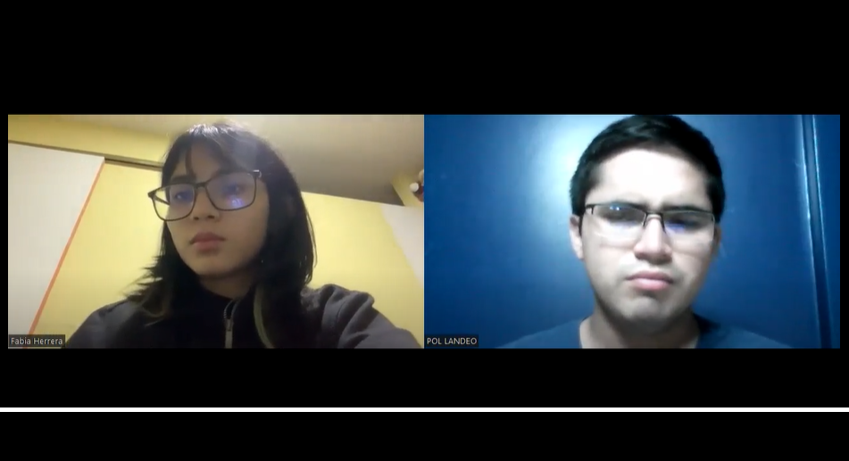

<p align="center">
    <strong>Universidad Peruana de Ciencias Aplicadas</strong><br>
    </img><br>
    <strong>INGENIERÍA DE SISTEMAS DE SOFTWARE</strong><br>
    <strong> SI720 Aplicaciones Web - WX54</strong><br>
    <strong>Profesor:  Alex Humberto Sánchez Ponce </strong><br>
    <br>INFORME <br>
    "Startup" | "Producto"
</p>


### Integrantes:
- Peña Rivera, Manuel Sebastian - U202210138
- Ramírez Hoffmann, Sebastián - U202211894
- Rodriguez Vargas, Arian Martin - U202212096
- Esteban Garcia, Nicolas Sebastián - U202217485
- Herrera Aguirre, Fabia Alejandra - U202219422   

---
# Registro de Versiones del Informe
| Version | Fecha | Autor | Descripcion de Modificacion |
| ----------- | ----------- | ----------- | ----------- |
| 0.0 | 19/03/2024 |Grupo 1 |Se crea el documento |

# Project Report Collaboration Insights
[URL del repositorio](https://github.com/AplicacionesWeb-WX54/si730-WX54-Grupo1-Repository.git)

(Imagenes de los commits cada entrega)


# Student Outcome
|Criterio Especifico|Acciones Realizadas|Conclusiones|
|-|-|-|
|Participa en equipos multidisciplinarios con eficacia, eficiencia y objetividad, en el marco de un proyecto en soluciones de ingeniería de software.|<br> *TB1:* Manuel Sebastian Peña Rivera: Participe en secciones del capitulo 2, 3 y 4 que contienen entrevistas, product backlog, impact map, user task matrix, style guidelines *TB2:* texto etc.. |Realizar la investigación necesaria para el proyecto permite conocer la realidad de los desafíos que presentan y como nuestro programa puede solucionar el problema es nuestro objetivo en mente|
|Conoce al menos un sector empresarial o dominio de aplicación de soluciones de software.|Manuel Sebastian Peña Rivera: No solo la investigación realizada, sino que la entrevista que realice me permitió conocer sobre las dificultades y experiencia como voluntario en la ONG. <br> *TB2:* texto etc.. |Con la información reunida de la entrevista espero poder adaptar las necesidades al proyecto y que nuestro proyecto le sirva para mejorar la eficiencia de su trabajo|
# Capítulo I: Introducción
## 1.1. Startup Profile
### 1.1.1. Descripción de la Startup
Nuestra startup **AidManager** se basa en una herramienta enfocada en gestionar los proyectos de ONG, esto se hara al recibir informacion de los mismos asistentes asignados al evento y por medio de nosotros se hara un analisis intensivo en oportunidades de mejora, reportes de inventario, asistentes del eveto entre otros. Adicionalmente la herramienta servira para planificar futuros eventos usando la misma informacion previamente registrada. 

#### 1.1.2. Perfiles de integrantes del equipo
|Miembros del equipo | Codigo Estudiante | Carrera | Conocimientos / Habilidades |
|-|-|-|-| 
|Ramírez Hoffmann, Sebastián  |U20221894|Ingenieria de software|C++, Python, Js, Reactjs, NodeJs, expressjs, MongoDB, SQL.  Paciencia, Liderazgo, Logico|
|Rodriguez Vargas, Arian Martin |U202212096|Ingenieria de software|C++, Python, persistente y amigable|
|Esteban Garcia, Nicolas Sebastian |U202217485|Ingenieria de software|HTML, CSS Y JS. Sociable.|
|Herrera Aguirre, Fabia Alejandra 	|U202219422|Ingenieria de software|C++, Python. Creativa.|
|Peña Rivera, Manuel Sebastian	|U202210138|Ingenieria de software|C++, Python, MongoDB, SQL, Assembler. Responsabilidad y Buena Comunicación| 

## 1.2. Solution Profile
### 1.2.1 Antecedentes y problemática

Segun la Oficina de Naciones Unidas para la Coordinación de Asuntos Humanitarios (OCHA) en 2023 se reportaron 801,425 personas en necesidades de alimentacion, servicios de agua, saneamiento e higiene.
En el Peru existen 978 Organizaciones privadas sin fines de lucro de las cuales principalmente 428 se han categorizado como de salud, 19 de educacion y 35 de vivienda (SIGCTI, 2024), esto nos demuestra que existe un alto rango de organizaciones privadas sin fines de lucro. No obstante cuando buscamos organizaciones ONDG(Organizaciones No Gubernamentales de Desarollo) encontramos un total de 1835 (SIGCTI, 2024). Aun con muchas instituciones el alcance que se logra resulta ser preocupante, en la encuesta que se realizo por equillibrium CenDE en 2023 de entre casi 1,200 personas un 80% de estas reconocia que es una ONG no obstante 71% o no sabia o no conocia iniciativas realizadas por las ONGs en ese año, en esta misma encuesta solo un 7% no tenia interes alguno en participar en el abordamiento de problemas publicos ni socialmente es decir un 93% de las 1,200 estaban dispuestas a apoyar. Adicionalmente cuando estas mismas ONG reciben grandes cantidades de datos normalmente solo son para obtener una cifra que represente los asistentes a algun evento o cuanto se logro de un objetivo de donacion omitiendo lo enriquecedor de esta data recolectada, como se menciona en el articulo "Data Analytics for Nonprofits" (DigitalForNonprofits, 2023), en el mundo de hoy para realizar acciones estrategicas y maximisar recursos distintas empresas utilizan lo llamado analisis de datos, esta practica se puede aplicar a un modelo de negocios sin fines de lucro como las ONG donde se consiguen los mismos beneficios que brindan los analisis de datos.

Es aqui donde nosotros ideamos la propuesta de **AidManager**, es una aplicacion web que se basa en una herramienta de gestion utilizada por los encargados de gestionar el proyecto y los asistentes del proyecto haciendo uso de su informacion recopilada por medio de nosotros quienes por nuestro servicio de analisis de datos y gestion de proyectos le proporcionaremos oportunidades de mejora, graficas relevantes respecto a la data y recomendaciones en como pueden implementar una recolecion de datos mas efectiva para amplificar el impacto deseado, de misma manera de que se presentaran espacios donde el gestor pueda planificar su siguiente proyecto facilitando el seguimiento de este mismo y haciendo un registro mas efficiente. 

What (¿Que se está haciendo?): Se facilita el proceso de planeacion para actividades orientadas al apoyo social y donacion de bienes. Asimismo se proporciona un servicio de gestion avanzado para las ONG con el objetivo de aumentar el impacto de estas.

Why (¿Porque se está haciendo?): Se hace esta aplicacion web con el objetivo de darle una herramienta a las ONG para aumentar la eficiencia de sus proyectos de ayuda social proporcionando adicionalmente una plataforma donde sus mismos ayudantes puedan recopilar la informacion de manera efectiva.

When (¿Cuándo se usa?): Se usa cuando se tengan los datos recopilados del proyecto mas reciente y se busque ver las oportunidades de mejora e ideas para la eficacia de un siguiente proyecto en un formato visual que sea facil de entender. Asi como tambien se hara uso de la herramienta cuando este proyecto este en ejecucion donde los asistentes del mismo recopilaran los datos para que consecuentemente el supervisor asignado a gestionar del proyecto pueda observar las oportunidades de mejora.

Where (¿Dónde se usa?): El uso esta diseñado para Perú ya que se recompilara informacion de ONG's que esten actuando en este pais, de esta manera se podran hacer recomendaciones mas locales. Asimismo esta App Web se puede usar facilmente desde el telefono o escritorio.

Who (¿Quién lo usa?): El usuario principal para nosotros son los supervisores y ayudantes de las ONG ya que son estos los mismos que nos proporcionaran los datos recopilados para mejorar su impacto y requieren de una mejor organizacion, nuestro usuario principal entonces se divide en el segmento de supervisor / gerente y el ayudante / recolector de data.

How Much (¿Cuánto costaría?): La aplicacion web tendra sus funcionalidades core a medio de pago es decir el proceso de gestion recopilacion y refinamiento de datos junto con las mejores oportunidades de mejora para estas. Tanto el core de la app web como la subscripcion se tendran que renovar cada cierto tiempo donde las organizaciones se tendran que escoger un plan anual o mensual.

How (¿Cómo se lleva al cabo?)

Se hara un proceso de inscripcion y seguidamente se les presentara con la oportunidad de crear o importar un proyecto
seguidamente solicitara los datos recopilados de su proyecto mas reciente, de estos datos se mostraran graficos representando la demografica, gastos, junto con explicaciones, recomendaciones y oportunidades de mejora. Asimismo se proporcionara la herramienta para gestionar futuros proyectos la cual se podra usar de manera opcional para poder estructurar mejor los encargados, el presupuesto y objetivos del siguiente proyecto. Cuando se inicie un proyecto se dependera de los ayudantes de estos eventos a que recopilen la informacion de los usuarios por medio de nuestro aplicativo web, donde tendran que registrarse y coleccionar la data de los participantes a eventos.

### 1.2.2 Lean UX Process.
#### 1.2.2.1. Lean UX Problem Statements.
Se identifica una falta de organizacion por parte de las ONG donde existen distintas oportunidades para mejorar el alcance con una buena planificacion. No obstante, muchas organizaciones no tienen conocimiento del potencial que se puede obtener de esta informacion o no cuentan con un equipo dedicado al analisis de datos a niveles de Big Data o formas efectivas de recolectar esta misma informacion. Asimismo hemos identificado que existen diferentes factores los cuales llevan a un usuario interesado en una ONG a no tener motivos suficientes para participar de actividades sociales o de hacer donativos a estas mismas, una de estas siendo la falta de informacion y la carencia de visibilidad que estan tienen siendo que aun asi habiendo mas de 1000 ONG's en el Perú no se conocen muchas de estas ni de como poder ayudarlas. Frente a esta problematica nos planteamos la siguiente pregunta:
¿Como facilitamos el proceso de gestion de un proyecto de ayuda social para aumentar el flujo de participantes en las actividades que ofrecen las distintas ONG's a la poblacion de nuestro país de manera eficiente?
#### 1.2.2.2. Lean UX Assumptions.

Después de analizar la problemática y los factores que la ocasionan, podemos tener un panorama de cómo solucionar la necesidad del usuario declarando supuestos, lo cual corresponde al siguiente paso de la Lean UX. Por ello, es necesario tener un conocimiento previo de las empresas que tienen características similares a las nuestras y cómo estas se han desarrollado con el paso del tiempo. 

Se mencionan a tres potenciales competidores:

CauseVox:
Plataforma que facilita el crowdfunding no solo de bienes monetarios, sino también de recursos como víveres y vestimenta. Plataforma de recaudación de fondos que brinda herramientas necesarias para crear campañas llamativas para cumplir su meta de donación. su diversificacion de bienes junto con sus campañas muestran su capacidad para ser competidores.

Donadora:
Es una plataforma mexicana en la que se pueden financiar proyectos de caridad, así como proyectos de tipo artístico, científico, entre otros. Al entrar en la financiacion para diferentes proyectos fuera de la caridad presenta una aptidud para ser competidor.

Logalto:
Es un Programa web colaborativo para el monitoreo y la evaluación de proyectos de desarrollo internacional la cual proporciona una alta gama de herramientas de gestion de proyectos.

|Business Assumptions|User Assumptions|
|-|-|
|Creemos que nuestros usuarios tienen la necesidad de aumentar el flujo de personas a sus eventos y facilitar la creasion de estos gestionando sus datos y proyectos de manera efectiva. |Los usuarios de este producto son el personal encargado de gestion de proyecto y los ayudantes que participan de estos eventos de Organizaciones no gubernamentales. |
|Este problema se puede solucionar con una plataforma donde se pueda organizar y supervizar proyectos donde se pueda generar un analisis de datos con recomendaciones y oportunidedes de mejora con infromacion recoleccionada por los mismos ayudantes de estos eventos. Ademas de que se presente toda la informacion necesaria para un proceso de inscripcion o donacion |Nuestro producto encajaría en la vida cotidiana debido a que sera accesible, economicamente viable y facil de utilizar tanto para las personas que tengan que supervizar el proyecto como para los mismos ayudantes para la recoleccion de datos |
|Los usuarios iniciales Organizaciones no gubernamentales sin fines de lucro que deseen mejorar su impacto y alcance.  |Este producto resolverá la necesidad de gestionar proyectos mientras que se recopila y analiza informacion de manera efectiva, simple y facil de entender para tener mayores oportunidades de mejora. |
|El valor #1 de nuestro servicio es el analisis de datos comprensible, el registro de informacion relevante y la interfaz amigable y simple de usar. |El producto se utilizará al momento que se tenga que realizar un nuevo proyecto de ayuda social y se deba realizar un planeamiento.|
|El aplicativo adicionalmente contara con el sistema de registro de ayudantes y gerentes que tendran un limite segun los distintos planes que tenemos para las ONG de distintos tamaños |Las funciones mas importantes son, la capacidad de manejar y presentar los datos de manera que sean visualmente coherentes y poco abrumadores. La planificacion de proyectos haciendo un registrod de todo lo necesario para que se pueda ejecutar. Y finalmente, una interfaz facil de usar para tanto el ayudante como para el gestor del proyecto|
|Se conseguirán la mayoría de los usuarios por medio de marketing digital (como las redes sociales) y Noticieros. |Nuestro producto debe verse como una herramienta de gestion y analisis de datos. Asimismo siendo una herramienta que se usa para planificar proyectos de ayuda benefica de alta calidad y monitoreo |
|Conseguiremos ingresos de la aplicación por medio de la compra del servicio para las ONG y los distintos planes proporcionales al tamaño de las necesidades de la organizacion.||
|Nuestros competidores principales serán CauseVox, Donadora y Logalto. ||
|Los venceremos al tener una mejor interactividad y experiencia de usuario, una herramienta de gestion para proyectos futuros simple de entender y el proceso amigable y facil de utilizar para adquirir la informacion. ||
|El mayor riesgo del producto es la falta de alcance inicial, la capacidad de datos, la precicion de datos y la competencia. ||
|Solucionaremos esto por medio de campañas de publicidad, contactar a las ONG y dandoles a los recolectores las pautas a seguir para reducir el margen de error.||
|Pensamos que un assumption que si se prueba falso puede causar que el proyecto falle es la demanda actual de nuestro producto y la necesidad estimada.||

#### 1.2.2.3. Lean UX Hypothesis Statements.
- Creemos que, al brindar una interfaz poco compleja de usar para nuestros usuarios, podrán tener una mejor experiencia al gestionar sus datos y  proyectos de ayuda social.
  Sabremos que hemos tenido éxito cuando se incremente la cantidad de proyectos efectivos por parte de las ONG que usen nuestra herramienta. 

- Creemos que la aplicación facilitara la gestion y creacion de proyectos de ayuda social proporcionando mejores resultados y un mayor flujo de personas participando de estas actividades.  
  Sabremos que tuvimos exito cuando distintos proyectos de ONG reciban mas relevancia y participantes.

- Creemos que ayudar a las ONG a tener una mejor gestion y planeamiento en sus proyectos ayudara a mejorar la visibilidad y aumentar la cantidad de personas motivadas a participar.
  Sabremos que hemos tenido éxito, cuando a nivel nacional se empiece a notar un incremento en la ayuda social proporcionada. 

#### 1.2.2.4. Lean UX Canvas.
|-|-|-|
|-|-|-|
| Business Problem <br>¿Qué problema has identificado que necesitas resolver? Las ONG estan perdiendo conexion y requieren optimizar sus proyectos para mejorar su impacto. <br>Según CenDe de 1200 personas 72% de estas no han participado en alguna actividad de actividad de ayuda social.<br> Segun "Digital for non Profits" 78% de organizaciones nonprofit con capacidades analiticas tienen mejoras tales como mejora de reclutamiento, mejoras en el alcance y hacer seguimiento de presupuestos| Solution ideas <br>Herramienta de gestion de proyectos recopilando datos y recomendaciones de accion.<br><br>Ofrecer planes de pago a las para ONG cuyos proyectos tienen diferentes cantidades de personas.<br><br>Mejorar y optimizar los procesos de recoleccion de datos para un analisis mas exacto. | Business Outcomes <br>(Cambios en el comportamiento del usuario) <br>¿Qué cambios en el comportamiento del usuario indicarán que has solucionado un problema real de manera que añada valor a tus clientes? <br> El comportamiento que refleje que se ha solucionado un problema real sera cuando las actividades de ayuda social consigan ser mas efectivas y que los participantes de estas aumenten.|
| User & Customers <br>¿En qué tipo de usuarios y clientes tienes que centrarte primero? <br>Usuario: <br>Personas encargadas de la gestion y recoleccion de datos de un proyecto orientado a las ONG. <br>Cliente: la Organizacion sin fines de lucro que adquiere nuestra herramienta. <br> ONG que busquen una optimizacion en la cantidad de gastos y tiempo invertidos.  <br> |  UX Canvas| User benefits <br>¿Cuáles son los objetivos que los usuarios intentan obtener? <br> \- Se busca gestionar un proyecto de manera que se pueda entender las oportunidades de mejora, los datos registrados, las planificaciones del proyecto y como pueden llegar a mas con menos. <br> ¿Qué les motiva a buscar tu solución? <br> \- Los usuarios están motivados a buscar esta solución debido la interfaz intuitiva, las oportunidades de optimizacion economica y el seguimiento de las acciones, gastos y personal que participara. <br>Nuestra interfaz resulta intuitiva para el usuario en todo el proceso. <br> |
| Hyphotheses: <br>  \- Creemos que, al brindar una interfaz poco compleja de usar para nuestros usuarios, podrán tener una mejor experiencia al gestionar sus datos y  proyectos de ayuda social. <br><br>Sabremos que hemos tenido éxito cuando se incremente la cantidad de proyectos efectivos por parte de las ONG que usen nuestra herramienta. <br><br> \- Creemos que la aplicación facilitara la gestion y creacion de proyectos de ayuda social proporcionando mejores resultados y un mayor flujo de personas participando de estas actividades. <br><br> Sabremos que tuvimos exito cuando distintos proyectos de ONG reciban mas relevancia y participantes. <br><br> \- Creemos que ayudar a las ONG a tener una mejor gestion y planeamiento en sus proyectos ayudara a mejorar la visibilidad y aumentar la cantidad de personas motivadas a participar. <br><br> Sabremos que hemos tenido éxito, cuando a nivel nacional se empiece a notar un incremento en la ayuda social proporcionada. | ¿Qué es la cosa más importante que nosotros necesitamos aprender primero? <br> Lo principal que necesitamos aprender es generar un modelo de gestion el cual sea efectivo a nivel visual y de gestion, y adicionalmente, un repaso en lo que viene siendo la gestión del proyecto| <br> ¿Cuál es la mínima cantidad de trabajo que nosotros necesitamos hacer para aprender la siguiente cosa más importante? <br> Asistir a las clases y solicitar que se nos revise los avances del proyecto para poder hacer un seguimiento saludable del proyecto|


## 1.3. Segmentos objetivo.
| |Segmento 1 | Segmento 2  |
| - | - |-|
| Variables                 |  Usuarios interesados en participar de actividades de ayuda social o en donar | ONG |
| Geográfica                | En el Perú, de entre 1,200 personas el 93% de estas estan interesadas en participar en actividades de ayuda social (CenDE, 2023) | Existen más de 1000 ONG en el Perú (SIGCTI,2024), no obstante solo se reconocen de 10 principalmente (CenDE ,2023) |
| Demográfica               | Edades de entre 17 a 50+ años <br> Genero: Masculino y Femenino | Organizaciones registradas como ONG |
| Psicológica               | Piensa en participar de actividades sociales o de donaciones en algun momento mas las limitaciones como el tiempo, la disponibilidad economica, la fiabilidad de las ONG que busca o el proceso de inscripcion terminan desanimandolo | Estas Organizaciones requieren de mas donaciones o participantes para sus campañas u eventos y buscan formas de aumentar el impacto general de estos mismos. |
| Función de comportamiento | Actitudes: Tiene una idea de que es una ONG pero en su mayoria no sabe como puede participar o no sabe de los eventos actuales en los cuales puede formar parte, algunos no conocen otras ONG y otros tienen la motivacion pero no saben si las ONG que encuentren haran correcto uso de lo donado <br> Conocimientos: Sabe que es una ONG, tiene entendido que existen organizaciones fraudulentas que se hacen pasar por ONG, normalmente no sabe si se cumplio el objetivo despues de participar| Actitudes: Hacen todo lo posible para que las donaciones lleguen en su mayor porcentaje a los más necesitados, hacen proyectos de ayuda social sin hacer mucho uso de data analitics<br> Conoce: Saben quienes requieren de ayuda, un estimado de cuanto se necesita o que se necesita para considerar donaciones, organizan eventos para concientizar y poder apoyar. |

---

# Capítulo II: Requirements Elicitation & Analysis
## 2.1. Competidores.
### 2.1.1. Análisis competitivo.

| Competitive Analysis Landscape                          |  |
| ------------------------------------------------------- | -|
| ¿Por qué llevar a cabo este análisis?                   | Realizamos este análisis a fin de poder conocer el mercado al que nos enfrentamos en un inicio, para de esta manera poder evaluar las estrategias adoptadas por plataformas ya existentes, y así aprender de sus aciertos y errores. |


| |  | (Nosotros)| CauseVox|  Bloomerang | Logalto |
|-|-|-|-|-|-|
| PERFIL| Overview | Plataforma que facilita el proceso de gestionar proyectos y recolectar datos de estos mismos proporcionando asi una herramienta versatil para un objetivo concreto.  | Plataforma de recaudación de fondos que brinda herramientas necesarias para crear campañas llamativas para cumplir su meta de donación. | Cuenta con distintas herramientas de gestion, es de alcance global y tiene mas de una forma de apoyar a las ONG. |Es un Programa web colaborativo para el monitoreo y la evaluación de proyectos de desarrollo internacional la cual proporciona una alta gama de herramientas de gestion de proyectos.|
|| Ventaja competitiva ¿Qué valor ofrece a los clientes? | Mientras que facilita el proceso de gestion de proyectos y ofrece oportunidades de mejora. Tambien facilita y optimiza la recolecion de datos. | Cuenta con herramientas que le permiten al usuario personalizar su propia campaña para recaudar fondos con su logo e imágenes con las que atraer potenciales donantes. |Permite categorizar los proyectos en 9 categorías, por lo que le facilita al usuario la búsqueda de iniciativas afines a este.| Cuenta con distintas herramientas de gestion, es de alcance global y tiene mas de una forma de apoyar a las ONG.
|| Mercado Objetivo                                        | ONG peruanas, de estas mismas mas especificamente sus gestores y ayudantes del proyecto. | Organizaciones sin fines de lucro, grupos comunitarios y empresas, e individuos que deseen financiar dichas iniciativas. | Personas de México que quieran apoyo para financiar un proyecto, organizaciones sin fines de lucro, e individuos que deseen financiar dichas iniciativas. | proyectos de desarrollo, ONG y fundaciones, ministerios, instituciones de gobierno y proveedores de fondos.|
| Perfil de marketing                                     | Estrategia de Marketing | Se hacen uso de redes sociales y de publicidad en línea | Publicidad por redes y publicidad en línea | Marketing por influencia, publicidad por redes |Publicidad por redes sociales.|
| Perfil del producto                                    | Productos y servicios | Aplicación web orientada a la gestion de proyectos de Organizaciones sin fines de lucro haciendo anlisis de datos, ofreciendo sugerencias y oportunidades de mejora, al mismo tiempo que facilita y agiliza el proceso de recoleccion de datos.| CauseVox es una plataforma de recaudación de fondos que facilita la creación y gestión de campañas de recaudación de fondos en línea. | Bloomerang ayuda a organizaciones sin fines de lucro a mejorar la experiencia de donación, ahorrar tiempo y a recaudar más fondos.| Loaglto es programa web colaborativo para el monitoreo y la evaluación de proyectos de desarrollo
 || Precios y costos                                        | Para las ONG se implementa un modelo estrictamente de pago el cual debe variar segun la cantidad de participantes en el proyecto o por el tamaño de la ONG | De pago | Gratuito | De pago|
|| Canales de distribución (Web y/o Móvil)                 | Web y Móvil Web | Móvil Web | Web y móvil Web ||
### 2.1.2. Estrategias y tácticas frente a competidores.


|Competidores |  | Nosotros | CauseVox| Bloomerang | Logalto |
|-|-|-|-|-| - |
| Análisis SWOT | Fortalezas |- La aplicación cuenta con una función de gestion efectiva.<br>- Se presenta un modelo de organizacion facil de entender.<br>- Facil recolecion de datos y analisis.| - Permite la personalización completa del aspecto de las páginas de campaña.<br>- Herramientas para la promoción en redes sociales. | - Cuenta con servicio al cliente en tiempo real.<br>- La plataforma es accesible y fácil de usar para crear y gestionar campañas, y realizar estrategias de marketing por correo. | - Diferentes Funcionalidades para gestion de proyectos <br> -Multiples herramientas de seguimiento y planificacion <br> -Mas tiempo en el mercado. |
|| Debilidades   | - Limitación de recursos para el financiamiento de la promoción de la aplicación.<br>- Competencia con plataformas similares. | - Limitaciones en su alcance de mercado. | - Los precios de su servicio es elevado. | - Saturacion de herramientas. <br> - Proceso agobiante <br> - No es muy intuitivo. | 
|| Oportunidades | - Crear alianzas con ONGs o empresas podría mejorar el alcance de la aplicación.<br>- El aumento de conciencia social y de la disposición para apoyar a ONGs.<br>- La expansión de la aplicación a regiones extranjeras. | Desarrollar nuevas funcionalidades para mejorar la experiencia de usuario. |  La expansión de la aplicación a un público más amplio al ofrecer tipos de suscripción alternos y a menor precio.| - Separar las herramientas por paquetes que necesite el usuario. | 
|| Amenazas      | - La existencia de competidores establecidos.<br>- Preocupaciones sobre la seguridad de datos y las transacciones de las donaciones. | - Al ser un servicio de pago, potenciales organizaciones podrían optar por opciones accesibles. | - La aparición de competencia emergente.<br>- La desconfianza hacia algunas organizaciones benéficas por la percepción del mal manejo de fondos. | - La necesidad de una herramienta facil de usar que no requiera gran cantidad de funciones para lograr un solo objetivo. |

## 2.2. Entrevistas.
### 2.2.1. Diseño de entrevistas.
**Preguntas generales:**

1. ¿Cuál es su nombre? 
2. ¿Qué edad tiene? 
3. ¿A qué se dedica? 
4. ¿Que navegadores y dispositivos usa? 

**Entrevistas usuario segmento 1**
1. ¿Cuando piensa en gestionar un proyecto en que piensa principalmente?
2. ¿Que metodos utiliza para organizar a sus ayudantes y como les asigna tareas?
3. ¿Que herramientas usa para gestionar o planificar proyectos?
4. ¿Como analiza sus datos, que herramientas/metodos usa?  
   
**Entrevistas usuario segmento 2**
1. ¿Que actividades son las principales en los eventos y como se las asignan? 
2. ¿Como recolectan informacion de los participantes, que herramientas?
3. ¿Como hacen llegar esta informacion a los gestores de proyecto?
4. ¿Si sucede un inconveniente el cual se debe de notificar al gestor del proyecto como se comunica con este, cree que la comunicacion con el gestor de proyecto es efectiva? 
### 2.2.2. Registro de entrevistas.
**Segmento 1**  
Nombre: Maria Jose Melendez
Edad: 53 años 
Ocupación: Directora de Hogar (CAEF)
  
[Seg1 - Entrevista - 1](https://upcedupe-my.sharepoint.com/:v:/g/personal/u202211894_upc_edu_pe/ERgJ0_AWCqVErNukgws7eiIBIgGIeuzeYyiSeb76MeGP9w?e=f7I1Pt&nav=eyJyZWZlcnJhbEluZm8iOnsicmVmZXJyYWxBcHAiOiJTdHJlYW1XZWJBcHAiLCJyZWZlcnJhbFZpZXciOiJTaGFyZURpYWxvZy1MaW5rIiwicmVmZXJyYWxBcHBQbGF0Zm9ybSI6IldlYiIsInJlZmVycmFsTW9kZSI6InZpZXcifX0%3D)

En la entrevista Maria nos cuenta de como su ONG no tiene una herramienta de gestion determinada y como normalmente usan Excel para los analisis de sus datos, tambien relata que para la planificacion se hacen reuniones anuales y mensuales.

Nombre: Cesar Alva Posada
Edad: 57 años 
Ocupación: Sociologo encargado de Gestion de Proyectos  
  
[Seg1 -Entrevista - 2](https://upcedupe-my.sharepoint.com/:v:/g/personal/u202211894_upc_edu_pe/ESDqRfzRGHFMsuxKkO5AzPgB5n2DN_YAREAKth0-NdKi-A?e=2FxzuN&nav=eyJyZWZlcnJhbEluZm8iOnsicmVmZXJyYWxBcHAiOiJTdHJlYW1XZWJBcHAiLCJyZWZlcnJhbFZpZXciOiJTaGFyZURpYWxvZy1MaW5rIiwicmVmZXJyYWxBcHBQbGF0Zm9ybSI6IldlYiIsInJlZmVycmFsTW9kZSI6InZpZXcifX0%3D)

En esta entrevista Cesar explica como la metodologia que se usa es importante a la hora de organizarse asimismo nos comento de otras herramientas que se implementan para la gestion, no obstante tambien menciona que todos estos procesos se hacen de manera separada. Asimismo para la gestion de datos utiliza excel.

Nombre: Guilder Quiñones Aldean
Edad: 54 años 
Ocupación: Jefe de Proyectos  
  
[Seg1 - Entrevista - 3](https://upcedupe-my.sharepoint.com/:v:/g/personal/u202211894_upc_edu_pe/ESDqRfzRGHFMsuxKkO5AzPgB5n2DN_YAREAKth0-NdKi-A?e=2FxzuN&nav=eyJyZWZlcnJhbEluZm8iOnsicmVmZXJyYWxBcHAiOiJTdHJlYW1XZWJBcHAiLCJyZWZlcnJhbFZpZXciOiJTaGFyZURpYWxvZy1MaW5rIiwicmVmZXJyYWxBcHBQbGF0Zm9ybSI6IldlYiIsInJlZmVycmFsTW9kZSI6InZpZXcifX0%3D)

El Jefe de Proyecto Guilder comparte su vision respecto a las herramientas usadas, de manera parecida a la entrevista anterior el usa excel para manejar sus datos mas tambien hace uso de programas de gestion como trello.

**Segmento 2**  
Nombre: Luis Herrera Gonzales
Edad: 19 años 
Ocupación: Estudiante - Ayudante 
  
[Seg2 - Entrevista - 1](https://upcedupe-my.sharepoint.com/:v:/g/personal/u202211894_upc_edu_pe/ESesnqbIKNBIj2P7j6CMxpsBuPL5ecH8TMAAxZh29afhHw?e=pCWved&nav=eyJyZWZlcnJhbEluZm8iOnsicmVmZXJyYWxBcHAiOiJTdHJlYW1XZWJBcHAiLCJyZWZlcnJhbFZpZXciOiJTaGFyZURpYWxvZy1MaW5rIiwicmVmZXJyYWxBcHBQbGF0Zm9ybSI6IldlYiIsInJlZmVycmFsTW9kZSI6InZpZXcifX0%3D)

Luis nos cuenta de como participa de estas actividades usando whatsapp como su principal fuente de recoleccion de datos y comunicacion con su gerente, menciona que tanto el uso del correo electronico y uso de whatsapp son obsoletos, toman mucho tiempo y no demuestran el nivel de formalidad deseado.

Nombre: Alvaro Jimenez
Edad: 19 años
Ocupación: Estudiante - Ayudante 
  
[Seg2 - Entrevista - 2](https://upcedupe-my.sharepoint.com/:v:/g/personal/u202211894_upc_edu_pe/ESskiDGzwCZLrHJVscTBOOoBK0Bx2Q6u2aFn2dDAv0RB8w?nav=eyJyZWZlcnJhbEluZm8iOnsicmVmZXJyYWxBcHAiOiJPbmVEcml2ZUZvckJ1c2luZXNzIiwicmVmZXJyYWxBcHBQbGF0Zm9ybSI6IldlYiIsInJlZmVycmFsTW9kZSI6InZpZXciLCJyZWZlcnJhbFZpZXciOiJNeUZpbGVzTGlua0NvcHkifX0&e=smRneZ)

Alvaro comenta sobre su experiencia como voluntario ayudante en una ONG. Se menciona como es la distribucion de tareas y la comunicacion entre los ayudantes y el gestor del proyecto. Tambien menciona que no es eficiente ni rapida la gestion de la organizacion y que el espera se pueda mejorar en algun futuro.

Nombre: Pol Landeo
Edad: 27 años 
Ocupación: Ayudante en una ONG
  
[Seg2 - Entrevista - 3](https://upcedupe-my.sharepoint.com/:v:/g/personal/u202211894_upc_edu_pe/EVTCV3Z3klZEunW6DHRtpU4BIwJk7OE6UEs4NEG5tWiMpQ?e=l3SrWz&nav=eyJyZWZlcnJhbEluZm8iOnsicmVmZXJyYWxBcHAiOiJTdHJlYW1XZWJBcHAiLCJyZWZlcnJhbFZpZXciOiJTaGFyZURpYWxvZy1MaW5rIiwicmVmZXJyYWxBcHBQbGF0Zm9ybSI6IldlYiIsInJlZmVycmFsTW9kZSI6InZpZXcifX0%3D)

Pol nos cuenta que en su día a día hace uso de las herramientas de google para la administración de tareas y la comunicación con el gestor del proyecto, menciona que la comunicación con el gestor del proyecto es efectiva pero que la gestión de tareas no es tan eficiente. En cuanto a la recolección de datos, menciona que se hace de manera manual, por lo que sería de gran ayuda contar con una herramienta que facilite este proceso.


### 2.2.3. Análisis de entrevistas.
**Segmento 1:**

En el segmento 1 existe una preferencia en usar excel para el analisis de datos recibidos, las multiples herramientas para un proyecto y en base a que entregan sus tareas a sus colaboradores. Se puede observar que la mayoria no utiliza tecnologia y que a escala de necesidad sienten que puede resultar util. Mas no tienen mucho conocimiento de la tecnologia implementada.

**Segmento 2:**
Respecto al segmento 2 se nota una tendencia respecto a la necesidad de una herramienta la cual pueda obtener la informacion y mandarla al proyecto de manera efectiva y rapida, Asimismo de como se requiere de una plataforma para poder comunicarse con el supervisor.

## 2.3. Needfinding.
### 2.3.1. User Personas.
**Segmento 1:**  

**Segmento 2:**


### 2.3.2. User Task Matrix.
| ‎ | ‎  | Segmento 1  | Saul BuenHombre | Segmento 2  | Manuel Torres |
| --- | ------ | ----------- | ------------ | ----------- | ---------- |
| ID  | Titulo | Importancia | Frecuencia   | Importancia | Frecuencia |
| HU01 | Listado de proyectos a realizar | Alta | Alta | Media | Baja |
| HU02 | Actualizaciones de nuevos proyectos | Media | Media | Alta | Media |
| HU03 | Asignación de tareas del proyecto | Alta | Alta | Alta | Alta |
| HU04 | Calendario con fechas importantes | Media | Media | Alta | Alta |
| HU05 | Dashboard estadístico simple | Alta | Media | Media | Baja |
| HU06 | Lista de tareas completadas | Alta | Media | Alta | Media |
| HU07 | Generación de resúmenes | Alta | Alta | Media | Baja |
| HU08 | Status automático del proyecto | Media | Baja | Media | Media |
| HU09 | Registro de detalles en el proyecto | Alta | Baja | Alta | Media |
| HU10 | Solicitud de recursos | Alta | Media | Media | Media |
| HU11 | Fechas a expirar | Baja | Baja | Media | Baja |
| HU12 | Estimación de gastos  | Alta | Alta | Alta | Media |
| HU13 | Límite máximo de presupuesto | Alta | Media | Alta | Media |
| HU14 | Registro de gastos | Alta | Alta | Alta | Media |
| HU15 | Directorio de contactos | Media | Alta | Media | Alta |
| HU16 | Recomendaciones sobre el buen manejo de proyectos | Alta | Media | Alta | Alta |
| HU17 | Picos de riesgo | Alta | Alta | Alta | Media |
| HU18 | Documentos legales | Alta | Media | Media | Baja |
| HU19 | Gestión de donaciones | Alta | Media | Alta | Media |
| HU20 | Promoción y seguimiento | Media | Media | Baja | Baja |
### 2.3.3. User Journey Mapping.
**Registration:**
Why would they trust us?

Good

- Herramienta multi usos
- Devuelve un analisis completo
- Mantiene Comunicacion entre segmentos
  
Bad

- Concepto de codigo probablemente complicado la primera vez
- Acostrumbrarse al workflow
- Innovacion

**Onboarding and first use:**

Good

How can they feel successful?
- Se reduce el tiempo de planificacion
- Se asignan tareas facilmente
- Se pueden gestionar multiples proyectos

Bad  

- Multiples proyectos al mismo tiempo
- Falta de conocimiento en la gestion del software

**Sharing:**

Good

Why would they invite others?
- Organizacion con mejores resultados.
- Resultados que se pueden demostrar por estadisticas.
- Servicio economicamente accesible.

Bad

- Nuevo para las ONG mas antiguas
- Requerimiento de data para funcionar al 100%

### 2.3.4. Empathy Mapping.
**Segmento 1:**


**Segmento 2:**


### 2.3.5. As-is Scenario Mapping.

**Segmento 1**  
Escenario: Gestor de proyecto realiza su labor sin una herramienta que lo beneficie

As Is:
| Fases|        |       |      |     |
|----------|---------------|----------|--------------|-------------|
| Doing          | Realizando tareas de gestión de proyectos manualmente | Investigando posibles beneficiarios de donaciones | Contactando a los ayudantes que van a participar | Realizando seguimiento de datos en hojas de cálculo o documentos físicos |
| Thinking       | Considerando la eficacia de los procesos manuales actuales | Evaluando la credibilidad de las fuentes de información sobre beneficiarios | Reflexionando sobre la necesidad de una conexion mas profesional y continua con sus compañeros | Pensando en la necesidad de herramientas digitales para mejorar la gestión de proyectos |
| Feeling        | Preocupado por la eficiencia y precisión de los métodos manuales | Inquieto por la falta de garantías en la calidad de la información recopilada | Preocupado por la posibilidad de que suceda algo y no pueda contactarse | Frustrado por la falta de herramientas digitales que agilicen y optimicen el proceso de gestión de proyectos |


**Segmento 2**  
Escenario: Ayudante del proyecto es enviado a manejar el proyecto de manera presencial

As Is:
| Fases     |       |       |        |    |
|----------|----------------|------|---------|-----|
| Doing          | Realizando entrevistas en persona con posibles beneficiarios de donaciones | Implementando métodos manuales para la recolección de datos en el terreno | Colaborando activamente con el segmento objetivo 1 para entender las necesidades de información específicas | Explorando opciones de recolección de datos |
| Thinking       | Reflexionando sobre la relevancia de los datos recopilados en el contexto local | Evaluando la eficacia de los métodos manuales utilizados en el terreno | Considerando estrategias para mejorar la comunicación y colaboración con el segmento objetivo 1 de manera presencial | Evaluando la utilidad y seguridad de las herramientas de recolección de datos |
| Feeling        | Comprometido con la precisión y relevancia de los datos recopilados de manera presencial | Optimista sobre la efectividad de los métodos de recolección de datos en terreno | Satisfecho al contribuir de manera activa al proceso de gestión de proyectos en el lugar | Esperanzado por encontrar herramientas eficaces para la recolección de datos en entornos presenciales |


## 2.4. Ubiquitous Language.
```
Texto ubiquo: Se trata de un glosario de términos 
del dominio para mantenernos comunicados y actualizados, 
tanto el equipo como los stakeholders, relacionados al sector 
en el que se especializa la startup.
```

**1. Organización benéfica:** Una entidad sin fines de lucro que busca apoyar causas sociales, humanitarias o ambientales a través de donaciones.

**2. Necesidades benéficas:** Los artículos, suministros o recursos específicos que una organización benéfica requiere para llevar a cabo sus actividades o programas.

**3. Gestor de Proyecto:** Segmento Objetivo que representa a los gestores o supervisores del proyecto los cuales son encargados por las ONG en realizar un proyecto estos pueden trabajar solos o en grupos dependiendo de los objetivos de la ONG, finitamente estos son los que deberan revisar y analisar los datos recolectados.

**4. Lista de necesidades:** Una lista detallada de los artículos o suministros específicos que una organización benéfica necesita recibir como donación.

**5. Intermediario de donaciones:** Una plataforma o servicio que facilita la conexión entre organizaciones benéficas que necesitan donaciones y personas dispuestas a donar.

**6. ONG:** Entidad formada por personas que comparten un interés común en promover una causa social, política o ambiental.

**7. Usuario donante:** Un usuario de la plataforma que está interesado en donar artículos o suministros a organizaciones benéficas.

**8. Usuario receptor:** Una organización benéfica que está registrada en la plataforma y que busca recibir donaciones de artículos o suministros.

**9. Registro de donación:** Un registro de las donaciones realizadas por los usuarios, que puede incluir información sobre los artículos donados, la organización benéfica receptora, etc.

**10. Notificación de necesidad:** Una alerta o mensaje que se envía a los usuarios sobre las necesidades específicas de una organización benéfica en un momento dado.

---

# Capítulo III: Requirements Specification
## 3.1. To-Be Scenario Mapping.
 
Escenario 1: Gestor de proyecto realiza su labor con AidManager para que lo beneficie.
To-Be:
| Fases|        |   |    |   |
|----------|--------------|--------|----------|--------|
| Doing          | Utilizando la herramienta web para planificar proyectos | Accediendo a la información recolectada por los ayudantes | Manteniendo comunicación directa con los ayudantes a través de la plataforma | Analizando oportunidades de mejora proporcionadas por la herramienta |
| Thinking       | Considerando cómo optimizar la planificación de proyectos con la información obtenida | Evaluando la calidad y relevancia de la información recolectada | Reflexionando sobre la efectividad de la comunicación directa con los ayudantes | Identificando oportunidades de mejora sugeridas por la plataforma |
| Feeling        | Satisfecho con la eficiencia y precisión en la planificación de proyectos | Valorando la contribución de los ayudantes a través de la información recolectada | Confianza en la comunicación fluida con los ayudantes | Motivado por las oportunidades de mejora identificadas por la herramienta |


Escenario 2: Ayudante del proyecto es enviado a manejar el proyecto de manera presencial con AidManager.

TO-BE:
| Fases          |      |       |       |       |
|---------|--------|--------|------------------|---------|
| Doing          | Utilizando la herramienta web para recolectar información demográfica, geográfica y psicológica relevante | Comunicando la información recolectada de manera directa al gestor de proyectos | Colaborando con el gestor en la planificación y ejecución del proyecto utilizando la información recolectada | Manteniendo actualizado el inventario y presupuesto del proyecto en la plataforma |
| Thinking       | Reflexionando sobre la importancia y relevancia de la información recolectada para el proyecto | Evaluando la eficacia de la comunicación directa con el gestor a través de la plataforma | Considerando cómo mejorar la colaboración con el gestor utilizando la información recolectada | Identificando oportunidades de mejora en la gestión del inventario y presupuesto del proyecto |
| Feeling        | Comprometido con la precisión y relevancia de la información recolectada | Satisfecho al contribuir de manera significativa al proyecto a través de la información recolectada | Motivado por la colaboración directa con el gestor y el impacto positivo en el proyecto | Esperanzado por la mejora continua en la gestión del inventario y presupuesto del proyecto |


## 3.2. User Stories.
 
| HU0X | Historia Usuario | "Descripcion"  | Criterios de Aceptación |
|-|-|-|-|
| HU01 | Listado de proyectos a realizar | Como project manager encargado del proceso, quiero planificar lo que haré en un listado de tareas, para tener en cuenta lo proyectado.  | Given que soy un project manager,<br>When accedo al sistema de gestión de proyectos,<br>Then debo poder ver un listado de proyectos a realizar. |
| HU02 | Actualizaciones de nuevos proyectos | Como miembro del equipo y parte del proyecto, quiero mantenerme informado sobre los nuevos procesos o cambios que se hayan realizado en una lista de status, para no perderme de ningún detalle.  |Given que soy un miembro del equipo,<br>When accedo al sistema de gestión de proyectos,<br>Then debo poder ver las actualizaciones de nuevos proyectos en la lista de status. |
| HU03 | Asignación de tareas del proyecto | Como project manager encargado de un proyecto, quiero asignar a mis miembros del equipo algunas tareas y establecer fechas límites, para mantener un orden.  |Given que soy un project manager,<br>When asigno tareas a los miembros del equipo en el sistema de gestión de proyectos,<br>Then las tareas se asignan correctamente y se establecen fechas límites. |
| HU04 | Calendario con fechas importantes | Como miembro del parte del proyecto, quiero ver en un calendario las fechas y eventos relacionados al proyecto para no perderme ningún detalle.  |Given que soy un miembro del proyecto,<br>When accedo al calendario en el sistema de gestión de proyectos,<br>Then puedo ver todas las fechas importantes relacionadas al proyecto. |
| HU05 | Dashboard estadístico simple | Como project manager a cargo de un proyecto, quiero ver un resumen visual del progreso del proyecto en forma de gráficos, para tener una mejor visión de lo planificado.  |Given que soy un project manager,<br>When accedo al dashboard en el sistema de gestión de proyectos,<br>Then debo poder ver un resumen visual del progreso del proyecto en forma de gráficos. |
| HU06 | Lista de tareas completadas | Como miembro del proyecto, quiero ver mis tareas asignadas, organizadas y completadas en una lista, para tener mejor detalle de lo realizado. |Given que soy un miembro del proyecto,<br>When accedo a la lista de tareas en el sistema de gestión de proyectos,<br>Then puedo ver mis tareas asignadas, organizadas y completadas. |
| HU07 | Generación de resúmenes | Como project manager a cargo de un proyecto benéfico, quiero generar resúmen estadístico sobre lo planificado a gastar con un solo click, para optimizar tiempos. |Given que soy un project manager,<br>When genero un resumen estadístico en el sistema de gestión de proyectos,<br>Then debo poder hacerlo con un solo click para optimizar tiempos. |
| HU08 | Status automático del proyecto | Como miembro del proyecto, quiero ver un resumen ejecutivo del proyecto que incluya el estado actual, los hitos, riesgos identificados, para reconocer rápidamente lo planificado. |Given que soy un miembro del proyecto,<br>When accedo al resumen ejecutivo del proyecto en el sistema de gestión,<br>Then debo poder ver el estado actual, los hitos y riesgos identificados. |
| HU09 | Registro de detalles en el proyecto | Como miembro del proyecto, quiero registrar horas de trabajo y gastos relacionados con el proyecto para llevar un control preciso de los recursos utilizados  |Given que soy un miembro del proyecto,<br>When registro horas de trabajo y gastos en el sistema de gestión de proyectos,<br>Then debo poder llevar un control preciso de los recursos utilizados. |
| HU10 | Solicitud de recursos | Como miembro del proyecto, quiero solicitar, mandar análisis de nuevos recursos que se requieren al project manager, para que este al tanto de nuevos requerimientos.   |Given que soy un miembro del proyecto,<br>When solicito nuevos recursos en el sistema de gestión de proyectos,<br>Then debo poder enviar análisis de los recursos requeridos al project manager. |
| HU11 | Fechas a expirar | Como miembro del proyecto, quiero ver cuando una fecha límite está por llegar, para diferenciarlos de los que aun existe un rango de tiempo. |Given que soy un miembro del proyecto,<br>When accedo al sistema de gestión de proyectos,<br>Then debo poder ver las fechas límite por expirar y diferenciarlas claramente. |
| HU12 | Estimación de gastos  | Como project manager, quiero poder establecer y gestionar un presupuesto para el proyecto, incluyendo seguimiento de gastos y comparación con la estimación inicial. |Given que soy un project manager,<br>When establezco un presupuesto en el sistema de gestión de proyectos,<br>Then debo poder hacer seguimiento de gastos y compararlo con la estimación inicial. |
| HU13 | Límite máximo de presupuesto | Como project manager quiero que me alerte cuando vayamos gastando más de lo presupuestado de manera visual, para tener una diferencia y estar pendiente de ello.  |Given que soy un project manager,<br>When gasto más de lo presupuestado,<br>Then debo recibir una alerta visual en el sistema de gestión de proyectos. |
| HU14 | Registro de gastos | Como miembro del proyecto, quiero registrar los recursos que se han ido adquiriendo para que se vaya teniendo un alcance de lo que se va gastando. |Given que soy un miembro del proyecto,<br>When registro los recursos adquiridos en el sistema de gestión de proyectos,<br>Then debo tener un alcance de lo que se va gastando. |
| HU15 | Directorio de contactos | Como miembro del proyecto, quiero tener un listado de todos los demás miembros para poder ponerme en contacto con ellos. | Given que soy un miembro del proyecto,<br>When accedo al directorio de contactos en el sistema de gestión de proyectos,<br>Then debo poder ver el listado de todos los demás miembros. |
| HU16 | Recomendaciones sobre el buen manejo de proyectos | Como miembro del equipo quiero tener un repositorio en el que tenga diferentes fuentes recomendadas por la aplicación para el buen manejo de proyectos y campañas.  | Given que soy un miembro del equipo,<br>When accedo al repositorio de recomendaciones en el sistema de gestión de proyectos,<br>Then debo poder ver diferentes fuentes recomendadas para el buen manejo de proyectos. |
| HU17 | Picos de riesgo | Como project manager, quiero visualizar en el dashboard cuando algún ajuste de la campaña no está cuadrando, para mantenerme alerta del buen manejo del proyecto | Given que soy un project manager,<br>When accedo al dashboard en el sistema de gestión de proyectos,<br>Then debo poder visualizar picos de riesgo para mantenerme alerta. |
| HU18 | Documentos legales | Como project manager quiero subir los documentos legalizados sobre la organización benéfica para que sea compartido con los miembros del proyecto | Given que soy un project manager,<br>When subo documentos legales en el sistema de gestión de proyectos,<br>Then debo poder compartirlos con los miembros del proyecto. |
| HU19 | Gestión de donaciones | Como miembro del proyecto, quiero poder acceder a un sistema de gestión de donaciones para hacer un seguimiento de las contribuciones recibidas y su impacto en el proyecto. | Given que soy un miembro del proyecto,<br>When accedo al sistema de gestión de donaciones en el sistema de gestión de proyectos,<br>Then debo poder hacer un seguimiento de las contribuciones recibidas y su impacto en el proyecto. |
| HU20 | Promoción y seguimiento | Quiero poder acceder a un sistema de seguimiento de objetivos y resultados para evaluar el progreso del proyecto y realizar ajustes si es necesario. | Given que soy un usuario,<br>When accedo al sistema de seguimiento de objetivos y resultados en el sistema de gestión de proyectos,<br>Then debo poder evaluar el progreso del proyecto y realizar ajustes si es necesario. |


## 3.3. Impact Mapping.


## 3.4. Product Backlog.

| #Orden | User Story ID | Titulo| Descripción| Story Points (1/2/3/5/8) |
| ------ | ------------- | ----- | ---------- | ------------------------ |
| 1      | HU01          |Listado de proyectos a realizar | Como project manager encargado del proceso, quiero planificar lo que haré en un listado de tareas, para tener en cuenta lo proyectado.  |     8    |
| 2      | HU02         | Actualizaciones de nuevos proyectos | Como miembro del equipo y parte del proyecto, quiero mantenerme informado sobre los nuevos procesos o cambios que se hayan realizado en una lista de status, para no perderme de ningún detalle.  |     8    |
| 3      | HU03         | Asignación de tareas del proyecto | Como project manager encargado de un proyecto, quiero asignar a mis miembros del equipo algunas tareas y establecer fechas límites, para mantener un orden.  |     8    | 
| 4      | HU04         | Calendario con fechas importantes | Como miembro del parte del proyecto, quiero ver en un calendario las fechas y eventos relacionados al proyecto para no perderme ningún detalle.  |     5    |
| 5      | HU05         | Dashboard estadístico simple | Como project manager a cargo de un proyecto, quiero ver un resumen visual del progreso del proyecto en forma de gráficos, para tener una mejor visión de lo planificado.  |     8    |
| 6      | HU06         | Lista de tareas completadas | Como miembro del proyecto, quiero ver mis tareas asignadas, organizadas y completadas en una lista, para tener mejor detalle de lo realizado. |     5    |
| 7      | HU07         | Generación de resúmenes | Como project manager a cargo de un proyecto benéfico, quiero generar resúmen estadístico sobre lo planificado a gastar con un solo click, para optimizar tiempos. |     8    |
| 8      | HU08 | Status automático del proyecto | Como miembro del proyecto, quiero ver un resumen ejecutivo del proyecto que incluya el estado actual, los hitos, riesgos identificados, para reconocer rápidamente lo planificado. |     5    |
| 9      | HU09 | Registro de detalles en el proyecto | Como miembro del proyecto, quiero registrar horas de trabajo y gastos relacionados con el proyecto para llevar un control preciso de los recursos utilizados  |     5    |
| 10     | HU10 | Solicitud de recursos | Como miembro del proyecto, quiero solicitar, mandar análisis de nuevos recursos que se requieren al project manager, para que este al tanto de nuevos requerimientos.   |     3    |
| 11     | HU11 | Fechas a expirar | Como miembro del proyecto, quiero ver cuando una fecha límite está por llegar, para diferenciarlos de los que aun existe un rango de tiempo. |     2    |
| 12     | HU12 | Estimación de gastos  | Como project manager, quiero poder establecer y gestionar un presupuesto para el proyecto, incluyendo seguimiento de gastos y comparación con la estimación inicial. |     8    |
| 13     | HU13 | Límite máximo de presupuesto | Como project manager quiero que me alerte cuando vayamos gastando más de lo presupuestado de manera visual, para tener una diferencia y estar pendiente de ello.  |     5    |
| 14     | HU14 | Registro de gastos | Como miembro del proyecto, quiero registrar los recursos que se han ido adquiriendo para que se vaya teniendo un alcance de lo que se va gastando. |     8    |
| 15     | HU15 | Directorio de contactos | Como miembro del proyecto, quiero tener un listado de todos los demás miembros para poder ponerme en contacto con ellos. |     3    |
| 16     | HU16 | Recomendaciones sobre el buen manejo de proyectos | Como miembro del equipo quiero tener un repositorio en el que tenga diferentes fuentes recomendadas por la aplicación para el buen manejo de proyectos y campañas.  |     8    |
| 17     | HU17 | Picos de riesgo | Como project manager, quiero visualizar en el dashboard cuando algún ajuste de la campaña no está cuadrando, para mantenerme alerta del buen manejo del proyecto |     5    |
| 18     | HU18 | Documentos legales | Como project manager quiero subir los documentos legalizados sobre la organización benéfica para que sea compartido con los miembros del proyecto |     5    |
| 19     | HU19 | Gestión de donaciones | Como miembro del proyecto, quiero poder acceder a un sistema de gestión de donaciones para hacer un seguimiento de las contribuciones recibidas y su impacto en el proyecto. |     5    |
| 20     | HU20 | Promoción y seguimiento | quiero poder acceder a un sistema de seguimiento de objetivos y resultados para evaluar el progreso del proyecto y realizar ajustes si es necesario. |     5    |

# Capítulo IV: Product Design
## 4.1. Style Guidelines.
### 4.1.1. General Style Guidelines.
Descripcion del porque estos elementos seran importantes

**Color:** (Descripcion de los colores escogidos y porque)  


**Tipografia:** (Descripcion de la tipografia escogida para el proyecto y porque)

**Branding** (Describir logotipo y porque)

### 4.1.2. Web Style Guidelines.
Descripcion de los elementos que se utilizaran en el web app

**Background:** (primary, secondary, terniary)  

**Text Styles:** (H1, H2, p, a,)  

**Button Styles:** (Button, dropdowns, Switches)

**Icons:** (Fondo blanco con los iconos que vamos a usar)

**Misc** (Cosas como nav var o slideshows que pensemos usar)

## 4.2. Information Architecture.
### 4.2.1. Organization Systems.
Descripcion corta respecto a los sistemas de organizacion que usaremos  (Escoger)
Sistemas de organización que usaremos para el proyecto.
Creación de perfiles de usuarios. – Se adaptará a la vista para personalizar la información de su perfil y el tipo de cuenta. (Visual Hierarchy)
Filtro de instituciones. – Por nombre se agruparía en una lista ordenada de manera alfabética, por temporada en una lista de campañas activas ordenada por la fecha límite y por ítems a donar en una lista de recursos ordenado por la fecha limite y el progreso de la meta de la institución.
"Hierarchical. This structures advices to present the content in a way to distinguish the level of importance by making use of physical differences, such as size, colour, contrast, alignment etc.

Sequential. Guide users to follow a specific path towards their goal and provide content step-by-step based on the current step. 

Matrix. You can always give the users the option to choose the type of navigation they prefer, i.e. Alphabetical, Chronological, by topic."
### 4.2.2. Labeling Systems.
The labeling system aims at uniting the data effectively and represent them in simple way and avoid confusing great amount of information. A widely adopted way to achieve this is by creating the labels which represent loads of data in few words. 

Como decir "home, about us, etc" basicamente lo que iria en un nav var y asi
### 4.2.3. SEO Tags and Meta Tags

**Meta & SEO (Search Engine Optimization) Tags:**  sirven para que la pagina web sea encontrada facilmente es lo que sale al encontrar la pagina en el buscador (se ponen en el <"head">)
* Titulo: ```<title> ___ </title> ```
* Descripcion: ```<meta name = "description" content = "texto descipcion"/> ```
* Palabras Clave: ```<meta name = "keyword" content = "keyword1, 2 3"/> ```

### 4.2.4. Searching Systems.
**Que se busca?:** Que buscara el usuario  
**Que resultados se mostraran?:** Que se mostrara  
**Interface de busqueda:** Descripcion de como ayuda a encontrar lo deseado 


### 4.2.5. Navigation Systems.
Basicamente aqui definimos como funciona la navegacion del web app
**Hierarchical Navigation System:** Main page a destination pages.
**Global Navigation Systems** (Complemento del Hierachical) Movimiento vertical (te mueves por la pagina)con nav(debe poder regresar a la principal)
**Local Navigation Systems** (vas a otras paginas) (complemento del global nav sistem sub-site) Usas otras paginas
## 4.3. Landing Page UI Design.
### 4.3.1. Landing Page Wireframe.
la pagina donde te registras y ves info del web app (te manda al web app)

Wireframe es todo lo funcional de la pagina

### 4.3.2. Landing Page Mock-up.
Mockup es todo lo relacionado al diseño de la pagina

## 4.4. Web Applications UX/UI Design.
### 4.4.1. Web Applications Wireframes.
lo funcional de cada aspecto del wireframe 

### 4.4.2. Web Applications Wireflow Diagrams.
Wireflow es como se va a navegar por la pagina (boton me lleva a esta pagina y este me regresa)

### 4.4.2. Web Applications Mock-ups.
Diseño en todo aspecto

### 4.4.3. Web Applications User Flow Diagrams.
un flow diagram de como el usuario utilizara la pagina **[PARA CADA USER GOAL]** 

## 4.5. Web Applications Prototyping.
[URL del Prototipo (Hecho en figma)](https://www.example.com)
## 4.6. Domain-Driven Software Architecture.
### 4.6.1. Software Architecture Context Diagram.
1. System Context Diagram: Diagrama que muestra la relacion del aplicativo con los usuarios
se incluyen servicios externos (si hay pocos bounded context se incluyen ahi)

2. Bounded Context Map: Muestra la relacion entre bounded contexts (los bounded context son como una burbuja que encapsula palabras clave en los procesos para poder diferenciarlos [Ej. Bounded context enfocado en las ventas(ventas), otro en revisar el stock(gestion) y otro enfocado en los proveedores (suministros)]) Se hace como un brainstorm y se ve en que pueden conectarse o comunicarse [se usa un circulo entre conexiones lineales (upstream o downstream) para definir comunicacion, algunos context se pueden integrar para representar por ejemplo un share model por database, tambien se mencionan los (third party context para definir los restful apis)]
   
### 4.6.2. Software Architecture Container Diagrams.
1. Bounded Context Deployable / Container Diagrams. Sirve para entender como funciona y el proceso, Se especifican DB's, indexers, Search engine, las Apis que usen los bounded context y se conectan por flechas, las cuales tienen como objetivo explicar la direcion y relacion junto a que se esta enviando/comunicando (TCP) 

### 4.6.3. Software Architecture Components Diagrams.
1. Component diagrams: Estos van a mostrar las ordenes, procesos, mensajes y componentes utilizados en el uso del aplicativo, claro se deben hacer diferentes de estos para cada bounded o USER GOALS
## 4.7. Software Object-Oriented Design.
### 4.7.1. Class Diagrams.

### 4.7.2. Class Dictionary.
Inherit (ave(superclase) -> (subclase)canario )
Polymorphism (Ej. funcion de persona hablar() -> Peruano hablar() , Gringo hablar() todos tienen una funcion que contiene persona y van cambiando sus formas)
Abstraction (Ej. Solo muestra el usuario, pero esta su edad, correo y veces usada que uso app en la base de datos (fuera de vista))
Encapsulation (cuando tienes tus variables y metodos en la misma clase las estas encapsulando, aun mas se encapsulan en Private y Public )
## 4.8. Database Design.
### 4.8.1. Database Diagram.

# Capítulo V: Product Implementation, Validation & Deployment
## 5.1. Software Configuration Management.
### 5.1.1. Software Development Environment Configuration.
Especificaciones de donde vamos a hacer el proyecto (vscode supongo)
extensiones tmbn? nose bn q quieren aca
### 5.1.2. Source Code Management.
El gitjab donde tengamos el proyecto
### 5.1.3. Source Code Style Guide & Conventions.
Que usamos con css (en caso usemos software para SASS)
supongo q tmbn cositas de como hacemo el code capas algun tipo de codigo para comunicarse entre comments
### 5.1.4. Software Deployment Configuration.
Configuraciones de donde y como deployeamos el proyecto
## 5.2. Landing Page, Services & Applications Implementation.
### 5.2.X. Sprint n
#### 5.2.X.1. Sprint Planning n.
Explicar como vamos a plannear el sprint?
#### 5.2.X.2. Sprint Backlog n.
 Nica hago la tabla 
#### 5.2.X.3. Development Evidence for Sprint Review.

#### 5.2.X.4. Testing Suite Evidence for Sprint Review.

#### 5.2.X.5. Execution Evidence for Sprint Review.

#### 5.2.X.6. Services Documentation Evidence for Sprint Review.

#### 5.2.X.7. Software Deployment Evidence for Sprint Review.

#### 5.2.X.8. Team Collaboration Insights during Sprint.
 imagenes de colaboraciones github

## 5.3. Validation Interviews.
### 5.3.1. Diseño de Entrevistas.
**Preguntas generales:**

1. ¿Cuál es su nombre? 
2. ¿Qué edad tiene? 
3. ¿A qué se dedica? 
4. ¿[Opinion de idea de propuesta]? 

**Entrevistas usuario segmento 2**
1. ¿Lorem?
2. ¿Lorem?
3. ¿Lorem?
4. ¿Lorem?  
   
**Entrevistas usuario segmento 2**
1. ¿Lorem? 
2. ¿Lorem?
3. ¿Lorem?
4. ¿Lorem? 
### 5.3.2. Registro de Entrevistas.
**Segmento 1**  
Nombre: _____
Edad: _ años 
Ocupación: _____  
  
{texto mucho}

**Segmento 2**  
Nombre: _____
Edad: _ años 
Ocupación: _____  

{texto}
### 5.3.3. Evaluaciones según heurísticas.
| HEURÍSTICA   | EVALUACIÓN ✅❌ | NOTA      |
| --------------------------------------------- | ---------- | --------- |
| Visibilidad del estado del sistema            |            | {texto}   |
| Coincidencia entre el sistema y el mundo real |            | {texto}   |
| Control y libertad del usuario                |            | {texto}   |
| Consistencia y estándares                     |            | {texto}   |
| Prevención de errores                         |            | {texto}   |
| Mostrar antes que recordar                    |            | {texto}   |
| Flexibilidad y eficiencia de uso              |            | {texto}   |
| Diseño estético y minimalista                 |            | {texto}   |
| Comunicar errores con facilidad               |            | {texto}   |
| Ayuda y documentación                         |            | {texto}   |
## 5.4. Video About-the-Product.
[URL del video about the product](https://www.example.com)
# Conclusiones
{texto}
# Conclusiones y recomendaciones.
{texto}
# Video About-the-Team.
[URL del video about the team](https://www.example.com)
# Bibliografía
``` 
formato

"Apellido", Ini.Ciales. & "otroAutor", O.A. (año). titulo del articulo.
        "nombre del articulo o lo q sea, Volumen(si es que tiene), numero  de pagina"#-#. https//link.org/eeeseneko

```
# Anexos

datos, gráficos, imágenes, esquemas, mapas o referencias de otros autores


