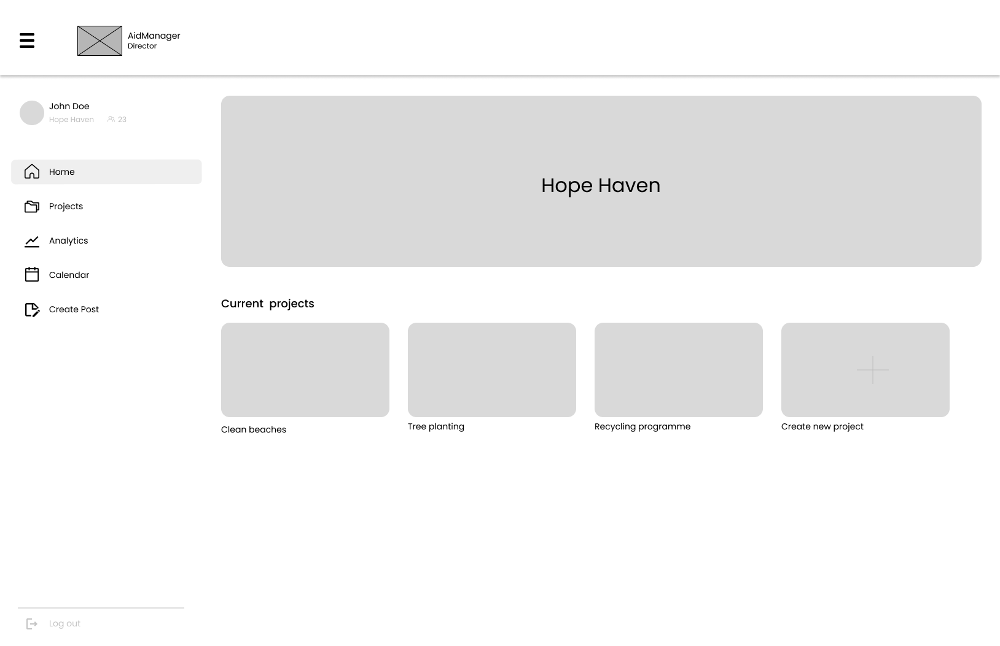
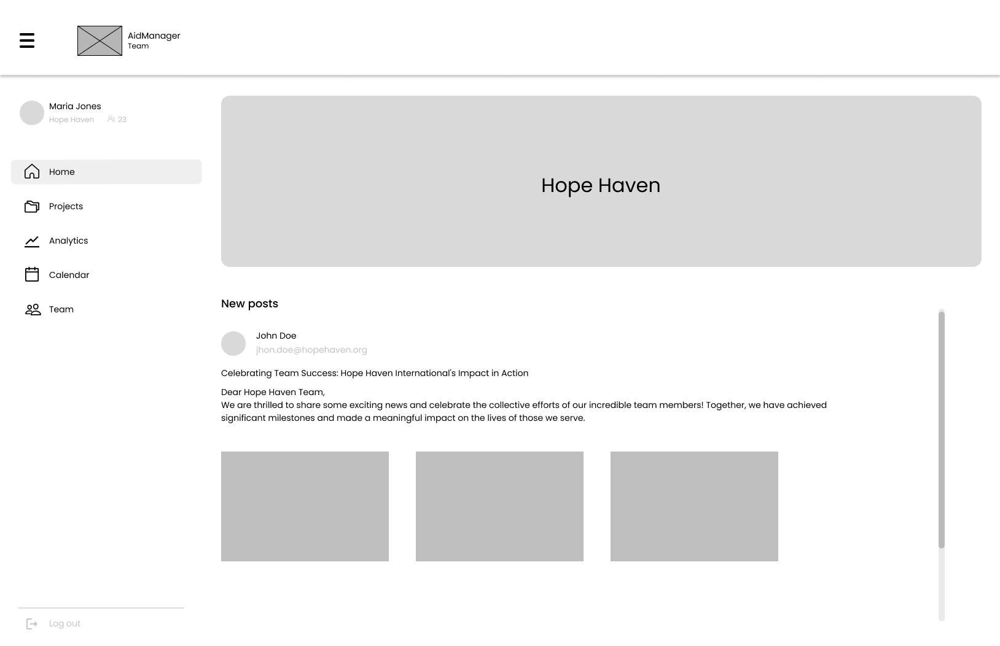
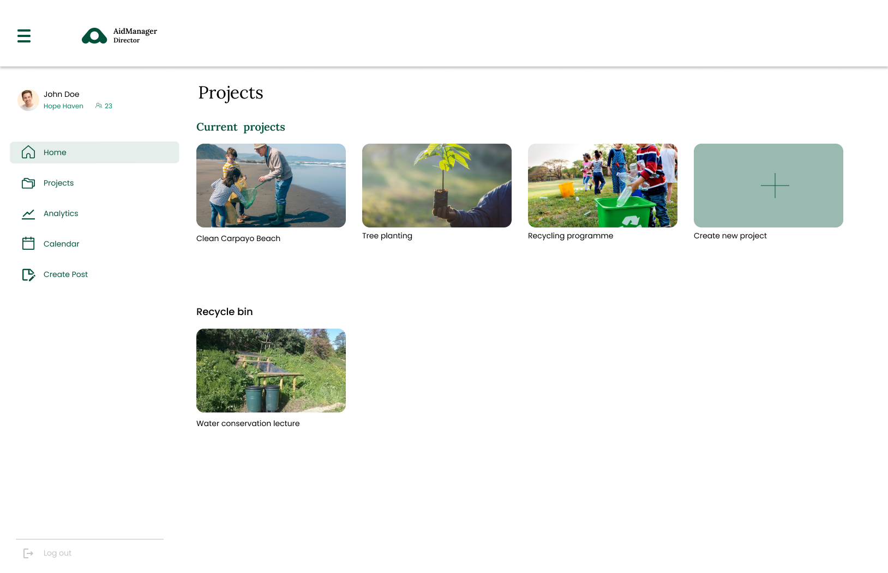
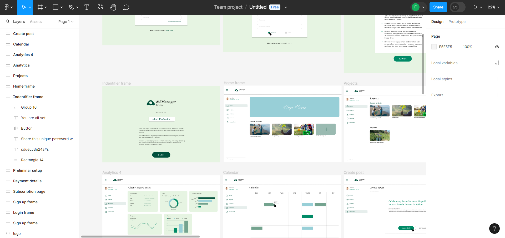

<p align="center">
    <strong>Universidad Peruana de Ciencias Aplicadas</strong><br>
    </img><br>
    <strong>INGENIERÍA DE SISTEMAS DE SOFTWARE</strong><br>
    <strong> SI720 Aplicaciones Web - WX54</strong><br>
    <strong>Profesor:  Alex Humberto Sánchez Ponce </strong><br>
    <br>INFORME <br>
    "Startup" | "Producto"
</p>


### Integrantes:
- Peña Rivera, Manuel Sebastian - U202210138
- Ramírez Hoffmann, Sebastián - U202211894
- Rodriguez Vargas, Arian Martin - U202212096
- Esteban Garcia, Nicolas Sebastián - U202217485
- Herrera Aguirre, Fabia Alejandra - U202219422   

---
# Registro de Versiones del Informe
| Version | Fecha | Autor | Descripcion de Modificacion |
| ----------- | ----------- | ----------- | ----------- |
| 0.0 | 19/03/2024 |Grupo 1 |Se crea el documento |

# Project Report Collaboration Insights
[URL del repositorio](https://github.com/AplicacionesWeb-WX54/si730-WX54-Grupo1-Repository.git)

(Imagenes de los commits cada entrega)


# Student Outcome
|Criterio Especifico|Acciones Realizadas|Conclusiones|
|-|-|-|
|Participa en equipos multidisciplinarios con eficacia, eficiencia y objetividad, en el marco de un proyecto en soluciones de ingeniería de software.|Compañero1:<br> *TB1:*  Su texto *TB2:* texto etc.. |Su texto de conclusion|
|Conoce al menos un sector empresarial o dominio de aplicación de soluciones de software.|Compañero1:<br> *TB1:*  Su texto<br> *TB2:* texto etc.. |Su texto de conclusion|
# Capítulo I: Introducción
## 1.1. Startup Profile
### 1.1.1. Descripción de la Startup
Nuestra startup [nombre] se basa en un sistema el cual se encarga de conectar a diferentes organizaciones las cuales necesitan donaciones para los mas necesitados con usuarios dispuestos a donar una diferente variedad de objetos como ropa, libros, viveres o algun objeto es especial que la misma organizacion puede especificar. Esto se hace con el objetivo de poder aumentar la ayuda que reciben estas organizaciones en especial en las temporadas donde requieren de más ayuda y concientizar a las personas de la importancia de las organizaciones que se dedican.
#### 1.1.2. Perfiles de integrantes del equipo
|Miembros del equipo | Codigo Estudiante | Carrera | Conocimientos / Habilidades |
|-|-|-|-| 
|Ramírez Hoffmann, Sebastián  |U20221894|Ingenieria de software|C++, Python, Js, Reactjs, NodeJs, expressjs, MongoDB, SQL.  Paciencia, Liderazgo, Logico|
|Rodriguez Vargas, Arian Martin |U202212096|Ingenieria de software|C++, Python, persistente y amigable|
|Esteban Garcia, Nicolas Sebastian |U202217485|Ingenieria de software|HTML, CSS Y JS. Sociable.|
|Herrera Aguirre, Fabia Alejandra 	|U202219422|Ingenieria de software|C++, Python. Creativa.|
|Peña Rivera, Manuel Sebastian	|U202210138|Ingenieria de software|C++, Python, MongoDB, SQL, Assembler. Responsabilidad y Buena Comunicación| 

## 1.2. Solution Profile
### 1.2.1 Antecedentes y problemática
Segun la Oficina de Naciones Unidas para la Coordinación de Asuntos Humanitarios (OCHA) en 2023 se reportaron 801,425 personas en necesidades de alimentacion, servicios de agua, saneamiento e higiene.
En el Peru existen 978 Organizaciones privadas sin fines de lucro de las cuales principalmente 428 se han categorizado como de salud, 19 de educacion y 35 de vivienda (SIGCTI, 2024), esto nos demuestra que existe un alto rango de organizaciones privadas sin fines de lucro. No obstante cuando buscamos organizaciones ONDG(Organizaciones No Gubernamentales de Desarollo) encontramos un total de 1835 (SIGCTI, 2024). Aun con muchas instituciones el alcance que se logra resulta ser preocupante, en la encuesta que se realizo por equillibrium CenDE en 2023 de entre casi 1,200 personas un 80% de estas reconocia que es una ONG no obstante 71% o no sabia o no conocia iniciativas realizadas por las ONGs en ese año, en esta misma encuesta solo un 7% no tenia interes alguno en participar en el abordamiento de problemas publicos ni socialmente es decir un 93% de las 1,200 estaban dispuestas a apoyar sin embargo tambien se menciono que la principal causa que mencionan que limita esta participacion eran el tiempo, la desconfianza, limitaciones economicas y desconocimiento sobre como participar, siendo asi que un 72% de las personas encuestadas no han participado en estas actividades (CenDE, 2023).

Es aqui donde nosotros ideamos la propuesta de [NOMBRE], una aplicacion web que nos servira para reducir el tiempo que toma encontrar una ONG que requiera de ayuda para asimismo eseñandole al usuario la importancia de las ONG y tambien facilitarle a como participar de actividades sociales. El usuario tendra toda la libertad de buscar alguna ONG especifica o la que requiera el objeto el cual la persona este deseando donar.

What (¿Que se está haciendo?): Se facilita el proceso de accion para actividades orientadas al apoyo social y donacion de bienes. Asimismo se concientiza de la importancia de las ONG.

Why (¿Porque se está haciendo?): Se hace esta aplicacion web con el objetivo de que mas personas esten mejor informadas y sean persuadidas a tomar accion en actividades de ayuda sociales sin la necesidad de buscar mucha informacion de donde o como pueden participar.

When (¿Cuándo se usa?): Se usa cuando el usuario tenga la necesidad o curiosidad de saber como o donde puede asisitir a actividades de ayuda sociales ya sea un evento o saber donde puede entregar distintos donativos de manera simple y rapida.

Where (¿Dónde se usa?): El uso esta diseñado para Perú ya que se recompilara informacion de ONG's que esten actuando en este pais. Asimismo esta App Web se puede usar facilmente desde el telefono o escritorio.

Who (¿Quién lo usa?): Lo usan personas interesadas en realizar donaciones a organizaciones No Gubernamentales o en participar en sus actividades de ayuda social. No obstante tambien esta dirigido a las mismas organizaciones que desean ser mejor reconocidas o que tienen problema llegando a sus metas de donacion.

How Much (¿Cuánto costaría?): La aplicacion web tendra sus funcionalidades core de manera gratuita es decir el buscar organizaciones que tengan algun evento de ayuda social o que necesiten donativos. No obstante, tambien tendra una subscripcion de pago para el usuario para que este reciba notificaciones de los eventos mas recientes con la informacion necesaria que el necesite para inscribirse, asimismo como para las organizaciones que quieran usar la plataforma web como metodo para publicar eventos y objetivos de donacion para que aparezcan en la parte mas visible de la pagina, esta subscripcion se tendra que renovar cada cierto tiempo con un proceso de cola para darle una oportunidad a distintas organizaciones a que tengan más visibilidad en la front page.

How (¿Cómo se lleva al cabo?)
La aplicacion web tendra un sistema de filtos para tener un display de opciones que se visualizaran segun quiera el usuario o este mismo puede buscarla por su nombre, una vez este seleccione que desea donar o si desea participar entonces se le proporcionara toda la informacion que este necesite para saber el proceso de donacion junto a una redireccion hacia la pagina oficial de la ONG junto con informacion general de la importancia de las ONG para informar al usuario.
En el proceso de subscripcion se le solicitara su correo para enviarle las notificaciones y datos personales como dni, nombre, apellidos y edad para poder hacer el proceso de inscripcion mas facil si es que este desea participar o hacer donativos y poder hacerle un seguimiento para poder recomendarle ONGs mas orientadas a su edad.
En el caso de las ONG se les hara un proceso de inscripcion y se tendra que tambien hacer un proceso de validacion mostrando evidencia de que sean una ong legitima, seguidamente se les permitirá crear un post o importarlo para subir en nuestra front page.

### 1.2.2 Lean UX Process.
#### 1.2.2.1. Lean UX Problem Statements.
Hemos identificado que existen diferentes factores los cuales llevan al usuario comun a no tener motivos suficientes para participar de actividades sociales o de hacer donativos a estas mismas, una de estas siendo la falta de informacion y la carencia de visibilidad que estan tienen siendo que aun asi habiendo mas de 1000 ONG's en el Perú no se conocen muchas de estas ni de como poder ayudarlas. Aparte de esto tambien identificamos que necesitan visibilidad con el publico general para poder fomentar la acción de estos. Frente a esta problematica nos planteamos la siguiente pregunta:
¿Como informamos a la poblacion y les facilitamos la participacion en las actividades que ofrecen las distintas ONG's de nuestro país de manera eficiente?
#### 1.2.2.2. Lean UX Assumptions.

Después de analizar la problemática y los factores que la ocasionan, podemos tener un panorama de cómo solucionar la necesidad del usuario declarando supuestos, lo cual corresponde al siguiente paso de la Lean UX. Por ello, es necesario tener un conocimiento previo de las empresas que tienen características similares a las nuestras y cómo estas se han desarrollado con el paso del tiempo. 

Se mencionan a dos potenciales competidores:

CauseVox
Plataforma que facilita el crowdfunding no solo de bienes monetarios, sino también de recursos como víveres y vestimenta.	Plataforma de recaudación de fondos que brinda herramientas necesarias para crear campañas llamativas para cumplir su meta de donación. su diversificacion de bienes junto con sus campañas muestran su capacidad para ser competidores.

Donadora
Es una plataforma mexicana en la que se pueden financiar proyectos de caridad, así como proyectos de tipo artístico, científico, entre otros. Al entrar en la financiacion para diferentes proyectos fuera de la caridad presenta una aptidud para ser competidor.

|Business Assumptions|User Assumptions|
|-|-|
|Creemos que nuestros usuarios tienen la necesidad de saber como realizar donaciones o participar en actividades de caridad.  |Los usuarios de este producto son personas de distintas edades las cuales tengan interes en participar, conocer mas de o realizar donaciones a una ONG |
|Este problema se puede solucionar con una plataforma donde se presente toda la informacion necesaria para el proceso de inscripcion o donacion |Nuestro producto encajaría en la vida cotidiana debido a que no sera dificil de acceder y sera facil de utilizar |
|Los usuarios iniciales serán individuos interesados en realizar donaciones o participar de actividades de ayuda social.  |Este producto resolverá la necesidad de saber los procesos de inscripcion o donacion de diferentes ONG mientras tambien los informa de su importancia |
|El valor #1 de nuestro servicio es el fácil acceso, filtracion de informacion relevante segun el usuario y la interfaz amigable y simple de usar. |El producto se utilizará en el momento que el usuario tenga la disponibilidad de realizar una donacion o desee participar de alguna actividad de ayuda social por medio de la web app este podra filtrar segun sus intereses o zona y finalmente sera proporcionado con la informacion necesaria.|
|El aplicativo adicionalmente presentara una subscripcion a un newsletter donde se notificara a este mismo de diferentes actividades u objetivos de donacion recientes segun sus datos. Para las ONG les dara la posibilidad de poder conseguir mejor visibilidad por medio del frontpage del web app donde se mostraran algunas ONG |Las funciones mas importantes son el mostrar las diferentes ONG segun los filtros selecionados o por nombre, ademas de concientizar la importancia de las ONG.|
|Se conseguirán la mayoría de los usuarios por medio de marketing digital (como las redes sociales) y Noticieros. |Nuestro producto debe verse como un intermediario entre el usuario y las ONG y debe funcionar como un filtro de preferencias elegidas por el mismo usuario mientras que en el proceso le informa y concientiza de la importancia de las ONG|
|Conseguiremos ingresos de la aplicación por medio de las suscripciones.||
|Nuestros competidores principales serán CauseVox y Donadora. ||
|Los venceremos al tener una mayor interactividad, la constancia por medio de subscripciones y la facil busqueda de ONGs a las cuales el usuario este interesado ||
|El mayor riesgo del producto es la falta de alcance inicial y los cambios en las ONG. ||
|Solucionaremos esto por medio de campañas de publicidad y manteniendo un seguimiento de las ONG vigentes.||
|Pensamos que un assumption que si se prueba falso puede causar que el proyecto falle es la demanda actual de nuestro producto y el alcance que podemos conseguir.||

#### 1.2.2.3. Lean UX Hypothesis Statements.
- Creemos que, al brindar una interfaz poco compleja de usar para nuestros usuarios, podrán tener una mejor experiencia de usuario al buscar la ONG que les interes y seran motivados a contarle a otras personas de la simple efectividad de nuestra aplicacion web.
Sabremos que hemos tenido éxito cuando se incremente el número de personas que esten dispuestas a apoyar a distintas ONG por medio de nuestra plataforma. 

- Creemos que la aplicación ayudará a las personas que quieren apoyar a las ONG pero no saben como y a las mismas ONG. 
Sabremos que hemos tenido éxito cuando veamos las ONG menos reconocidas empiezen a tener mas reconocimiento.  

Creemos que ayudar a las ONG a tener mas visibilidad en la frontpage por medio de una subscripcion poco costosa ayudara a mejorar la visibilidad y aumentar la cantidad de personas motivadas a ayudar.
Sabremos que hemos tenido éxito, cuando a nivel nacional se empiece a notar un incremento en la ayuda social proporcionada. 

#### 1.2.2.4. Lean UX Canvas.
|-|-|-|
|-|-|-|
| Business Problem <br>¿Qué problema has identificado que necesitas resolver? Existe una necesidad de participación en tiempos de emergencia y una falta de conocimiento en como ayudar. <br>Según CenDe de 1200 personas 72% de estas no han participado en alguna actividad de actividad de ayuda social.| Solution ideas <br>Conexión entre personas interesadas en donar y participar en actividades de ayuda social con las ONG que ofrecen este tipo de eventos.<br>Filtrar la gran cantidad de ONG que hay según la disponibilidad del usuario dándole diversas opciones.<br>Ofrecer suscripciones que proporcionan notificaciones de los eventos mas recientes y objetivos de donación.<br>Proveer de una plataforma a las ONG que no tienen mucha visibilidad. | Business Outcomes <br>(Cambios en el comportamiento del usuario) <br>¿Qué cambios en el comportamiento del usuario indicarán que has solucionado un problema real de manera que añada valor a tus clientes? <br> El comportamiento del usuario habrá cambiado cuando este tome la iniciativa de participar en ayuda social al tener menos motivos para no participar aumentando la cantidad de personas que toman parte de actividades de ayuda social.|
| User & Customers <br>¿En qué tipo de usuarios y clientes tienes que centrarte primero? <br>Usuario: <br>Personas interesadas en donar o participar en actividades de ayuda social de una ONG. <br>ONG que requieren de visibilidad. <br>Cliente: Personas con la necesidad de saber fechas de eventos de ayuda social. <br> ONG que deseen ser más percibidas.  <br> |  UX Canvas| User benefits <br>¿Cuáles son los objetivos que los usuarios intentan obtener? <br> \- Se busca saber como participar o realizar donaciones a ONG [NOMBRE] tiene como objetivo principal ayudar a los usuarios a tener a la mano una gran cantidad de opciones a elegir según sus especificaciones. <br> ¿Qué les motiva a buscar tu solución? <br> \- Los usuarios están motivados a buscar esta solución debido a que toma poco tiempo, ya tiene la información para el usuario y reduce la cantidad de limitaciones que el usuario tiene al pensar en participar en estas actividades. <br>La interfaz amigable resulta fácil de manejar y le facilita al usuario todo el proceso. <br> |
| Hyphotheses:<br> Creemos que, al brindar una interfaz poco compleja de usar para nuestros usuarios, podrán tener una mejor experiencia de usuario al buscar la ONG que les interes y seran motivados a contarle a otras personas de la simple efectividad de nuestra aplicacion web.Sabremos que hemos tenido éxito cuando se incremente el número de personas que esten dispuestas a apoyar a distintas ONG por medio de nuestra plataforma. <br>- Creemos que la aplicación ayudará a las personas que quieren apoyar a las ONG pero no saben como y a las mismas ONG. Sabremos que hemos tenido éxito cuando veamos las ONG menos reconocidas empiezen a tener mas reconocimiento. <br> Creemos que ayudar a las ONG a tener mas visibilidad en la frontpage por medio de una subscripcion poco costosa ayudara a mejorar la visibilidad y aumentar la cantidad de personas motivadas a ayudar.<br> Sabremos que hemos tenido éxito, cuando a nivel nacional se empiece a notar un incremento en la ayuda social proporcionada. <br>| ¿Qué es la cosa más importante que nosotros necesitamos aprender primero? <br> Lo principal que necesitamos aprender es conectar la base de datos con la pagina web y adicionalmente un repaso en lo que viene siendo la gestión del proyecto| <br> ¿Cuál es la mínima cantidad de trabajo que nosotros necesitamos hacer para aprender la siguiente cosa más importante? <br> Asistir a las clases y solicitar que se nos revise los avances del proyecto para poder hacer un seguimiento saludable del proyecto|


## 1.3. Segmentos objetivo.
| |Segmento 1 | Segmento 2  |
| - | - |-|
| Variables                 |  Usuarios interesados en participar de actividades de ayuda social o en donar | ONG |
| Geográfica                | En el Perú, de entre 1,200 personas el 93% de estas estan interesadas en participar en actividades de ayuda social (CenDE, 2023) | Existen más de 1000 ONG en el Perú (SIGCTI,2024), no obstante solo se reconocen un aproximado de 10 como las principales (CenDE ,2023) |
| Demográfica               | Edades de entre 17 a 50+ años <br> Genero: Masculino y Femenino | Organizaciones con almenos 1 año registradas como ONG |
| Psicológica               | Piensa en participar de actividades sociales o de donaciones en algun momento mas las limitaciones como el tiempo, la disponibilidad economica, la fiabilidad de las ONG que busca o el proceso de inscripcion terminan desanimandolo | Estas Organizaciones requieren de mas donaciones o participantes para sus campañas u eventos y buscan formas de hacerse más visibles en el caso de las menos reconocidas. |
| Función de comportamiento | Actitudes: Tiene una idea de que es una ONG pero en su mayoria no sabe como puede participar o no sabe de los eventos actuales en los cuales puede formar parte, algunos no conocen otras ONG y otros tienen la motivacion pero no saben si las ONG que encuentren haran correcto uso de lo donado <br> Conocimientos: Sabe que es una ONG, tiene entendido que existen organizaciones fraudulentas que se hacen pasar por ONG, normalmente no sabe si se cumplio el objetivo despues de participar| Actitudes: Hacen todo lo posible para que las donaciones lleguen en su mayor porcentaje a los más necesitados, la mayoria no puede compartir su mensaje más allá de campañas publicitarias de bajo alcance, existen ONG con mas presencia y fiabilidad. <br> Conoce: Saben quienes requieren de ayuda, un estimado de cuanto se necesita o que se necesita para considerar donaciones, organizan eventos para concientizar y poder ayudar. |

---

# Capítulo II: Requirements Elicitation & Analysis
## 2.1. Competidores.
### 2.1.1. Análisis competitivo.

| Competitive Analysis Landscape                          |  |
| ------------------------------------------------------- | -|
| ¿Por qué llevar a cabo este análisis?                   | Realizamos este análisis a fin de poder conocer el mercado al que nos enfrentamos en un inicio, para de esta manera poder evaluar las estrategias adoptadas por plataformas ya existentes, y así aprender de sus aciertos y errores. |


| |  | (Nosotros)| CauseVox| Donadora |
|-|-|-|-|-|
| PERFIL| Overview | Plataforma que facilita el crowdfunding no solo de bienes monetarios, sino también de recursos como víveres y vestimenta.  | Plataforma de recaudación de fondos que brinda herramientas necesarias para crear campañas llamativas para cumplir su meta de donación. | Es una plataforma mexicana en la que se pueden financiar proyectos de caridad, así como proyectos de tipo artístico, científico, entre otros. |
|| Ventaja competitiva ¿Qué valor ofrece a los clientes? | No solo facilita la búsqueda de oportunidades de ayuda social, sino que también educa y guía a los usuarios a través del proceso de participación y donación a ONGs. | Cuenta con herramientas que le permiten al usuario personalizar su propia campaña para recaudar fondos con su logo e imágenes con las que atraer potenciales donantes. |Permite categorizar los proyectos en 9 categorías, por lo que le facilita al usuario la búsqueda de iniciativas afines a este.
|| Mercado Objetivo                                        | Organizaciones peruanas, así como individuos interesados en apoyar. | Organizaciones sin fines de lucro, grupos comunitarios y empresas, e individuos que deseen financiar dichas iniciativas. | Personas de México que quieran apoyo para financiar un proyecto, organizaciones sin fines de lucro, e individuos que deseen financiar dichas iniciativas. |
| Perfil de marketing                                     | Estrategia de Marketing | Se hacen uso de redes sociales y de publicidad en línea | Publicidad por redes y publicidad en línea | Marketing por influencia, publicidad por redes |
| Perfil del producto                                     | Productos y servicios | Aplicación web que facilita y agiliza el proceso de encontrar oportunidades de participación en actividades de ayuda social y donación de bienes en Perú, al mismo tiempo que educa sobre la importancia de las ONGs y el impacto positivo que pueden tener en sus comunidades.| CauseVox es una plataforma de recaudación de fondos que facilita la creación y gestión de campañas de recaudación de fondos en línea. | Donadora es una plataforma de crowdfunding que permite a los usuarios crear campañas para recaudar fondos en efectivo, así como donaciones de artículos físicos.
 || Precios y costos                                        | Freemium (las cuentas premium cuentan con beneficios en cuanto a la jerarquía de su aparición en la plataforma)| De pago | Gratuito |
|| Canales de distribución (Web y/o Móvil)                 | Web y Móvil Web | Móvil Web | Web y móvil Web |
### 2.1.2. Estrategias y tácticas frente a competidores.


|Competidores |  | Nosotros | CauseVox| Donadora|
|-|-|-|-|-|
| Análisis SWOT | Fortalezas |- La aplicación cuenta con una función educativa.<br>- Capacidad de personalizar recomendaciones según preferencias.<br>- Acceso rápido a información sobre ONGs.| - Permite la personalización completa del aspecto de las páginas de campaña.<br>- Herramientas para la promoción en redes sociales. | - Permite financiar una amplia gama de proyectos.<br>- La plataforma es accesible y fácil de usar para crear y gestionar campañas. |
|| Debilidades   | - Limitación de recursos para el financiamiento de la promoción de la aplicación.<br>- Competencia con plataformas similares. | - Limitaciones en su alcance de mercado. | - No cuenta disponibilidad en varios países latinoamericanos. | lorem | 
|| Oportunidades | - Crear alianzas con ONGs o empresas podría mejorar el alcance de la aplicación.<br>- El aumento de conciencia social y de la disposición para apoyar a ONGs.<br>- La expansión de la aplicación a regiones extranjeras. | Desarrollar nuevas funcionalidades para mejorar la experiencia de usuario. | La expansión de la aplicación a regiones extranjeras. | lorem | 
|| Amenazas      | - La existencia de competidores establecidos.<br>- Preocupaciones sobre la seguridad de datos y las transacciones de las donaciones. | - Al ser un servicio de pago, potenciales organizaciones podrían optar por opciones accesibles. | - La aparición de competencia emergente.<br>- La desconfianza hacia algunas organizaciones benéficas por la percepción del mal manejo de fondos. | lorem |

## 2.2. Entrevistas.
### 2.2.1. Diseño de entrevistas.
**Preguntas generales:**

1. ¿Cuál es su nombre? 
2. ¿Qué edad tiene? 
3. ¿A qué se dedica? 
4. ¿[Opinion de idea de propuesta]? 

**Entrevistas usuario segmento 2**
1. ¿Lorem?
2. ¿Lorem?
3. ¿Lorem?
4. ¿Lorem?  
   
**Entrevistas usuario segmento 2**
1. ¿Lorem? 
2. ¿Lorem?
3. ¿Lorem?
4. ¿Lorem? 
### 2.2.2. Registro de entrevistas.
**Segmento 1**  
Nombre: _____
Edad: _ años 
Ocupación: _____  
  
{texto mucho}

**Segmento 2**  
Nombre: _____
Edad: _ años 
Ocupación: _____  

{texto}

### 2.2.3. Análisis de entrevistas.
**Segmento 1:**
{texto}
**Segmento 2:**
{texto}
## 2.3. Needfinding.
### 2.3.1. User Personas.
**Segmento 1:**  


**Segmento 2:**


### 2.3.2. User Task Matrix.
| --- | ------ | Segmento 1  | ------/----- | Segmento 2  | ---------- |
| --- | ------ | ----------- | ------------ | ----------- | ---------- |
| ID  | Titulo | Importancia | Frecuencia   | Importancia | Frecuencia |
| U01X| {Texto}| Alta        | Alta         | Media       | Baja       |
### 2.3.3. User Journey Mapping.
**Registration:**
Why would they trust us?
- Interface facil de entender
- Funciones bien definidas 
- Ofrecemos un servicio completo junto a recomendaciones
  
**Onboarding and first use:**
How can they feel successful?
- La interfaz es simple de entender
- Solicita poco y devuelve mucho
- Es eficiente para ambos segmentos
  
**Sharing:**
Why would they invite others?
- Facilidad de usar
- Resultados acertados
- Servicio accesible

### 2.3.4. Empathy Mapping.
**Segmento 1:**


**Segmento 2:**

### 2.3.5. As-is Scenario Mapping.

**Segmento 1**  
Escenario: Usuario desea realizar una donación como ropa o comida a alguna organización benéfica disponible

As Is:
| Fases| El usuario tiene productos como ropa o artefactos que ya no utiliza recientemente | El usuario desea donar sus bienes a una persona sin hogar que lo necesite | El usuario desconoce organizaciones a las cuales pueda donar sus bienes | El usuario requiere de una aplicación confiable donde pueda encontrar organizaciones a las que pueda donar sus bienes |
| -------- | --------- | --------- | ------- | --------- |
| Doing | El usuario decide buscar alguna persona a la cual donar aquellos productos. | El usuario investiga acerca de lugares donde hallan personas que necesiten alguna donación. | El usuario investiga acerca de las organizaciones a las cuales puedan donar productos. | El usuario indaga acerca de aplicaciones que puedan facilitar la búsqueda de alguna organización benéfica. |
| Thinking | El usuario piensa que buscar alguna persona que necesite una donación puede tardar demasiado | El usuario piensa que existen una gran cantidad de lugares que necesiten alguna donación. | El usuario piensa que muchas de estas organizaciones no pueden estar licenciadas o no brindan confianza. | El usuario piensa que no existe alguna aplicación que pueda resolver su necesidad, ya que no garantiza seguridad alguna. |
| Feeling  | El usuario se siente apenado al no encontrar personas que necesiten alguna donación. | El usuario se siente desconfiado ya que ningún lugar le brinda confianza alguna. | El usuario se siente abrumado debido a la cantidad de organizaciones que necesitan donación alguna | El usuario se siente agobiado ya que no hay una aplicación que cumpla con la necesidad que desea resolver. |

**Segmento 2**  
Escenario: Organización sin fines de lucro necesitan ciertos bienes en específico que puedan brindar los usuarios donantes.

As Is:
| Fases| La organización necesita una cantidad de productos en específico para brindar el servicio | La organización requiere de un producto en específico de los usuarios donantes | La organización desea llegar a un público en específico que desee donar el producto solicitado | La organización requiere de alguna aplicación en la cual pueda llegar a las personas donantes o abrir un evento solicitando dichos productos |
| -------- | --------- | --------- | ------- | --------- |
| Doing | La organización busca personas o empresas que puedan brindar los productos que necesitan. | La organización busca a través de eventos a personas que puedan donar aquellos productos. | La organización realiza eventos para reabastecer los productos faltantes que se solicitaron. | La organización investiga acerca de ciertos grupos de donación a los cuales pueda llegar su solicitud. |
| Thinking | La organización piensa que este es un proceso que puede ser tardado y deficiente a largo plazo. | La organización piensa que realizar estos eventos puede tomar tiempo y dinero. | La organización piensa que debería existir una mejor forma de llegar a un público en concreto. | La organización piensa que este tipo de aplicación podría facilitar la exhaustiva búsqueda de este grupo de personas. |
| Feeling  | La organización se siente limitada debido a la deficiencia que puede conllevar esta estrategia. | La organización se siente saturada debido a la cantidad de tiempo que sugiere realizar estos eventos. | La organización se siente desconcertada al no encontrar una forma mas optima de llegar a un público. | La organización se siente desmotivada al no encontrar una aplicación que satisfaga su necesidad. |

## 2.4. Ubiquitous Language.
```
Texto ubiquo: Se trata de un glosario de términos 
del dominio para mantenernos comunicados y actualizados, 
tanto el equipo como los stakeholders, relacionados al sector 
en el que se especializa la startup.
```

**1. Organización benéfica:** Una entidad sin fines de lucro que busca apoyar causas sociales, humanitarias o ambientales a través de donaciones.

**2. Necesidades benéficas:** Los artículos, suministros o recursos específicos que una organización benéfica requiere para llevar a cabo sus actividades o programas.

**3. Donante:** Una persona o entidad que contribuye con artículos, suministros o recursos a una organización benéfica.

**4. Lista de necesidades:** Una lista detallada de los artículos o suministros específicos que una organización benéfica necesita recibir como donación.

**5. Intermediario de donaciones:** Una plataforma o servicio que facilita la conexión entre organizaciones benéficas que necesitan donaciones y personas dispuestas a donar.

**6. Donación en especie:** La contribución de bienes tangibles, como alimentos, ropa, medicamentos, etc., en lugar de dinero.

**7. Usuario donante:** Un usuario de la plataforma que está interesado en donar artículos o suministros a organizaciones benéficas.

**8. Usuario receptor:** Una organización benéfica que está registrada en la plataforma y que busca recibir donaciones de artículos o suministros.

**9. Registro de donación:** Un registro de las donaciones realizadas por los usuarios, que puede incluir información sobre los artículos donados, la organización benéfica receptora, etc.

**10. Notificación de necesidad:** Una alerta o mensaje que se envía a los usuarios sobre las necesidades específicas de una organización benéfica en un momento dado.

---

# Capítulo III: Requirements Specification
## 3.1. To-Be Scenario Mapping.
 
Escenario 1: Usuario necesita una interfaz cómoda donde pueda visualizar el registro de los bienes que ha donado y eventos próximos realizados por organizaciones

| Fases    |  El usuario desea tener una sección donde pueda visualizar la cantidad de productos que dono de forma detallada | El usuario desea tener un registro de los productos que dono, así como las fechas de entrega en la que se realizó| El usuario desea tener un seguimiento acerca de los próximos eventos de caridad que ofrecen las organizaciones| El usuario desea tener un apartado donde se visualice la información de los eventos, además de la organización que lo brinda. |
| -------- | ---- | ------ | ----- | ------------- |
| Doing    | El usuario hace un registro manual de los productos y bienes donados a aquellas organizaciones. | El usuario anota con las fechas en su calendario para llevar un registro de las donaciones que realizo | El usuario anota las fechas de su calendario los eventos próximos de las organizaciones que ha donado. | El usuario registra la información para los eventos próximos que se realizarán, además de informarlo a la comunidad. |
| Thinking | El usuario piensa que seria ideal tener un apartado especial para tener un registro de los productos donados | El usuario piensa que la aplicación debería permitir registrar las fechas de entrega, así como su información. | El usuario piensa que se debería implementar un sistema de registro de fechas para los eventos próximos. | El usuario piensa que cada evento debería contar detalles de la misma dentro de la aplicación para facilitar la información. |
| Feeling  | El usuario siente que es trabajoso tener que registrar esta información manualmente. | El usuario se siente agobiado debido a que no se cuenta con un registro de fechas de entrega. | El usuario se siente esperanzado en que se implemente la funcionalidad. | El usuario se siente confundido al no encontrar las fechas o información a dichos eventos. |

Escenario 2: Organización sin fines de lucro desea realizar y programar un evento donde se solicite ciertos bienes en específico a los usuarios a través de la aplicación.

| Fases    | La organización tiene pensado organizar un evento en la que se solicite productos específicos. | La organización desea llegar al publico objetivo que desee donar dichos productos. | La organización desea programar un evento próximamente que será publicado en la aplicación | La organización desea mostrar la información acerca de dicho evento llegando a la mayor cantidad de usuarios donantes |
| -------- | ---- | ------ | ----- | ------------- |
| Doing    | La organización publica un comunicado para informar al usuario de la aplicación | La organización hace una encuesta a los usuarios donantes para tener más información | La organización programa una fecha por medio de la aplicación y es publicada. | La organización registra todos los datos del evento que se realizará a través de la aplicación.         |
| Thinking | La organización piensa que esta forma de comunicación es muy cómoda. | La organización piensa que la forma de llegar al público es muy eficaz. | La organización piensa que esta dinámica es bastante rápido y eficiente. | La organización piensa que registrar un evento dentro de la aplicación es bastante intuitiva y cómoda |
| Feeling  | La organización se siente cómoda ya que puede comunicarse rápidamente a sus usuarios. | La organización se siente satisfecho ya que conecta rápidamente con su público. | La organización se siente entusiasmado ya que la interfaz permite programar un evento fácilmente  | La organización se siente optimista ya que la interfaz de la aplicación permite registrar los datos del evento rápidamente. |

## 3.2. User Stories.
 
| HU0X | Historia Usuario | "Descripcion"  |
|-|-|-|
| HU01 | Listado de organizaciones benéficas | Como usuario donante, quiero poder ver una lista de organizaciones benéficas registradas en la plataforma, para poder seleccionar a quién quiero donar.  |
| HU02 | Lista de necesidades en recursos | Como usuario donante, quiero poder ver una lista de necesidades específicas de cada organización benéfica, para poder donar artículos que realmente necesitan.  |
| HU03 | Detalles de lo necesitado | Como usuario donante, quiero poder ver información detallada sobre cada necesidad benéfica, incluyendo la cantidad requerida y la fecha límite de donación, para poder planificar mi donación.  |
| HU04 | Donaciones sencillas y rápidas | Como usuario donante, quiero poder realizar donaciones en especie a través de la plataforma, para poder contribuir con las organizaciones benéficas de manera fácil y segura.  |
| HU05 | Confirmación y agradecimiento | Como usuario donante, quiero recibir una confirmación de mi donación, incluyendo detalles sobre los artículos donados y la organización benéfica receptora, para tener un registro de mis contribuciones.  |
| HU06 | Perfil y detalles de la organización | Como organización benéfica, quiero poder registrar los detalles de mi organización en la plataforma, incluyendo el nombre, la misión, la ubicación y la información de contacto, para poder recibir donaciones.  |
| HU07 | Creación lista de necesidades | Como organización benéfica, quiero poder crear una lista de necesidades específicas de mi organización, incluyendo la descripción de los artículos necesarios y la cantidad requerida, para poder comunicar nuestras necesidades a los usuarios donantes.  |
| HU08 | Notificaciones automáticas de nueva donación | Como organización benéfica, quiero poder recibir notificaciones cuando un usuario donante realice una donación a nuestra organización, para poder estar al tanto de las contribuciones recibidas. |
| HU09 | Gestión de la lista de necesidades | Como organización benéfica, quiero poder gestionar y actualizar nuestra lista de necesidades en la plataforma, para reflejar con precisión nuestras necesidades actuales.  |
| HU10 | Reseña y comentarios | Como usuario donante, quiero poder compartir información sobre las necesidades benéficas y las organizaciones registradas en la plataforma en mis redes sociales, para aumentar la visibilidad y las donaciones.  |
| HU11 | Historial de donaciones | Como usuario donante, quiero poder ver un historial de mis donaciones anteriores en la plataforma, incluyendo detalles como la fecha y los artículos donados, para poder realizar un seguimiento de mis contribuciones.  |
| HU12 | Recomendaciones y nuevos intereses  | Como usuario donante, quiero recibir recomendaciones personalizadas sobre organizaciones benéficas y necesidades específicas, basadas en mis intereses y patrones de donación anteriores, para facilitar el proceso de selección de donaciones.  |
| HU13 | Donaciones flexibles | Como usuario donante, quiero poder realizar donaciones monetarias a través de la plataforma, para apoyar a las organizaciones benéficas de manera flexible.  |
| HU14 | Eventos e iniciativas | Como usuario donante, quiero recibir notificaciones sobre eventos benéficos o campañas especiales organizadas por las organizaciones benéficas en la plataforma, para poder participar activamente en iniciativas adicionales de donación. |
| HU15 | Dashboard de estadísticas y reseñas | Como usuario donante, quiero poder ver el impacto de mis donaciones, incluyendo estadísticas y testimonios sobre cómo mis contribuciones han beneficiado a las organizaciones benéficas, para motivarme a seguir donando. |
| HU16 | Informes sobre las donaciones | Como organización benéfica, quiero poder acceder a informes y estadísticas sobre las donaciones recibidas a través de la plataforma, para evaluar el rendimiento de nuestras campañas de recaudación de fondos.  |
| HU17 | Mensajes de agradecimiento automáticos | Como organización benéfica, quiero poder enviar mensajes de agradecimiento automáticos a los usuarios donantes después de cada donación, para expresar nuestra gratitud de manera oportuna. |
| HU18 | Solicitud de apoyo | Como organización benéfica, quiero poder solicitar voluntarios a través de la plataforma, para apoyar nuestras operaciones y programas.  |
| HU19 | Publicaciones de agradecimiento y metas logradas | Como organización benéfica, quiero poder compartir historias de éxito y testimonios de beneficiarios de nuestros programas en la plataforma, para mostrar el impacto positivo de nuestras actividades.  |
| HU20 | Promoción y creación de eventos | Como organización benéfica, quiero poder crear y promocionar eventos benéficos en la plataforma, para recaudar fondos y aumentar la conciencia sobre nuestra causa. |

## 3.3. Impact Mapping.


## 3.4. Product Backlog.

| #Orden | User Story ID | Titulo| Descripción| Story Points (1/2/3/5/8) |
| ------ | ------------- | ----- | ---------- | ------------------------ |
| 1      | HU01          | Listado de organizaciones benéficas | Como usuario donante, quiero poder ver una lista de organizaciones benéficas registradas en la plataforma, para poder seleccionar a quién quiero donar. |     8    |
| 2      | HU02          | Lista de necesidades en recursos | Como usuario donante, quiero poder ver una lista de necesidades específicas de cada organización benéfica, para poder donar artículos que realmente necesitan. |         5         |
| 3      | HU03          | Detalles de lo necesitado | Como usuario donante, quiero poder ver información detallada sobre cada necesidad benéfica, incluyendo la cantidad requerida y la fecha límite de donación, para poder planificar mi donación. |         8         |
| 4      | HU04          | Donaciones sencillas y rápidas | Como usuario donante, quiero poder realizar donaciones en especie a través de la plataforma, para poder contribuir con las organizaciones benéficas de manera fácil y segura. |         5         |
| 5      | HU05          | Confirmación y agradecimiento | Como usuario donante, quiero recibir una confirmación de mi donación, incluyendo detalles sobre los artículos donados y la organización benéfica receptora, para tener un registro de mis contribuciones. |         5         |
| 6     | HU06 | Perfil y detalles de la organización | Como organización benéfica, quiero poder registrar los detalles de mi organización en la plataforma, incluyendo el nombre, la misión, la ubicación y la información de contacto, para poder recibir donaciones.  |     8    |
| 7     | HU07 | Creación lista de necesidades | Como organización benéfica, quiero poder crear una lista de necesidades específicas de mi organización, incluyendo la descripción de los artículos necesarios y la cantidad requerida, para poder comunicar nuestras necesidades a los usuarios donantes.  |     8    |
| 8     | HU08 | Notificaciones automáticas de nueva donación | Como organización benéfica, quiero poder recibir notificaciones cuando un usuario donante realice una donación a nuestra organización, para poder estar al tanto de las contribuciones recibidas. |     5    |
| 9     | HU09 | Gestión de la lista de necesidades | Como organización benéfica, quiero poder gestionar y actualizar nuestra lista de necesidades en la plataforma, para reflejar con precisión nuestras necesidades actuales.  |     5    |
| 10     | HU10 | Reseña y comentarios | Como usuario donante, quiero poder compartir información sobre las necesidades benéficas y las organizaciones registradas en la plataforma en mis redes sociales, para aumentar la visibilidad y las donaciones.  |     5    |
| 11     | HU11 | Historial de donaciones | Como usuario donante, quiero poder ver un historial de mis donaciones anteriores en la plataforma, incluyendo detalles como la fecha y los artículos donados, para poder realizar un seguimiento de mis contribuciones.  |     3    |
| 12     | HU12 | Recomendaciones y nuevos intereses  | Como usuario donante, quiero recibir recomendaciones personalizadas sobre organizaciones benéficas y necesidades específicas, basadas en mis intereses y patrones de donación anteriores, para facilitar el proceso de selección de donaciones.  |     5    |
| 13     | HU13 | Donaciones flexibles | Como usuario donante, quiero poder realizar donaciones monetarias a través de la plataforma, para apoyar a las organizaciones benéficas de manera flexible.  |     3    |
| 14     | HU14 | Eventos e iniciativas | Como usuario donante, quiero recibir notificaciones sobre eventos benéficos o campañas especiales organizadas por las organizaciones benéficas en la plataforma, para poder participar activamente en iniciativas adicionales de donación. |     5    |
| 15     | HU15 | Dashboard de estadísticas y reseñas | Como usuario donante, quiero poder ver el impacto de mis donaciones, incluyendo estadísticas y testimonios sobre cómo mis contribuciones han beneficiado a las organizaciones benéficas, para motivarme a seguir donando. |     2    |
| 16     | HU16 | Informes sobre las donaciones | Como organización benéfica, quiero poder acceder a informes y estadísticas sobre las donaciones recibidas a través de la plataforma, para evaluar el rendimiento de nuestras campañas de recaudación de fondos.  |     8    |
| 17     | HU17 | Mensajes de agradecimiento automáticos | Como organización benéfica, quiero poder enviar mensajes de agradecimiento automáticos a los usuarios donantes después de cada donación, para expresar nuestra gratitud de manera oportuna. |     3    |
| 18     | HU18 | Solicitud de apoyo | Como organización benéfica, quiero poder solicitar voluntarios a través de la plataforma, para apoyar nuestras operaciones y programas.  |     5    |
| 19     | HU19 | Publicaciones de agradecimiento y metas logradas | Como organización benéfica, quiero poder compartir historias de éxito y testimonios de beneficiarios de nuestros programas en la plataforma, para mostrar el impacto positivo de nuestras actividades.  |     3    |
| 20     | HU20 | Promoción y creación de eventos | Como organización benéfica, quiero poder crear y promocionar eventos benéficos en la plataforma, para recaudar fondos y aumentar la conciencia sobre nuestra causa. |     5    |

# Capítulo IV: Product Design
## 4.1. Style Guidelines.
### 4.1.1. General Style Guidelines.

Como startup, nos esforzamos por transmitir profesionalismo y eficiencia a través de nuestra aplicación web, AidManager. Hemos seleccionado una paleta de colores con tonos celestes y verdes para reflejar frescura y conexión con la naturaleza, mientras que las tipografías Poppins y Lora ofrecen una apariencia moderna, limpia y legible. Estas decisiones de diseño no solo buscan captar la atención de nuestros usuarios, sino también garantizar una experiencia agradable y efectiva, reforzando nuestro compromiso en la gestión eficiente de eventos benéficos y donaciones.

**Color:** (Descripcion de la paleta escogida para el proyecto y porque)

| Color | Descripción |
|-----------|-----------|
| Color primario    | Representa confianza, serenidad y estabilidad. Transmite la idea de fiabilidad y compromiso en la gestión de organizaciones benéficas, lo que inspira confianza en los donantes y en aquellos que buscan ayuda.<br><br> |
| Color Secundario  | Este color evoca calma, frescura y bienestar. Simboliza la esperanza y el apoyo que tu startup ofrece a las personas necesitadas, así como la naturaleza refrescante de las soluciones que proporciona. <br><br>    |
| Color de Acento | Este color combina la estabilidad del azul con la vitalidad del verde. Representa el crecimiento, la renovación y la prosperidad, en el cual se busca mejorar la vida de las personas necesitadas y fomentar un cambio positivo en la comunidad. <br><br>   |
| Color de Fondo  | Este tono de verde transmite equilibrio, armonía y seguridad. Esto refleja la solidez y la integridad de tu startup en su enfoque hacia la gestión eficiente de eventos benéficos y donaciones, asegurando que los recursos se utilicen de manera responsable y efectiva. <br><br>  |

Paleta de colores empleado:
<center>
  <br><br>
</center>

**Tipografia:** (Descripcion de la tipografia escogida para el proyecto y porque)

| Tipografia | Descripcion |
|-----------|-----------|
| Poppins Font | Esta tipografía se eligió por su apariencia moderna, limpia y versátil. Su estilo geométrico y su excelente legibilidad la hacen ideal para comunicar profesionalismo y eficiencia en la gestión de organizaciones benéficas.  |
| Lora Font | Se seleccionó Lora por su elegancia y legibilidad, que complementa perfectamente la apariencia contemporánea de Poppins. Su estilo serifado transmite una sensación de tradición y prestigio, lo que refuerza la credibilidad de tu startup en el sector de la beneficencia. |

<br><center></center>
<center><br><br></center>

**Branding** (Describir logotipo y porque)

El logo de nuestra startup, que muestra la vista superior de alguien abriendo los brazos en un color verde azulado, simboliza nuestra dedicación a la apertura, el apoyo y la generosidad hacia aquellos que más lo necesitan. Representa nuestra misión de ofrecer ayuda directa y tangible, fomentando la solidaridad, la esperanza y la renovación en la comunidad.

<br><center><br><br></center>

### 4.1.2. Web Style Guidelines.
Descripcion de los elementos que se utilizaran en el web app

**Background:** (primary, secondary, terniary)

Para el background se hace uso del color FFFFF para resaltar la pagina y para separar secciones D9ED8F


**Text Styles:** (H1, H2, p, a,)

Para el texto se escogieron colores que combinan con la tematica de la pagina y que facilitan la lectura del usuario
<center></center>

**Button Styles:** (Button, dropdowns, Switches)

Para los botones el color cambia segun el color del fondo
<center></center>

**Icons:** (Fondo blanco con los iconos que vamos a usar)
Tendremos iconografia de busqueda, lapiz, ropa, reciclaje, icono de grafico, foco, etc

<center></center>

**Misc** 
Se determina el color y posicion segun la seccion
<center></center>

## 4.2. Information Architecture.
### 4.2.1. Organization Systems.
Sistemas de organización que usaremos para el proyecto.

El sistema de Organizacion se basa en un sistema Sequencial donde el usuario debe seguir el workdlow de la herramienta para llegar a su objetivo, no obstante ofrecemos atajos en el sidebar.

Asimismo existira una herarquia visual dependiendo si quien se ha ingresado es un gestor o colaborador/ayudante.
### 4.2.2. Labeling Systems.
En esta sección, nos esforzamos por garantizar que la presentación de la información al usuario sea clara y fácil de entender, con el objetivo de proporcionar una experiencia agradable y sin complicaciones. Para ello, hemos incorporado en el vocabulario de nuestra página palabras comunes y familiares que la mayoría de las personas utilizan en su día a día, de manera que puedan asociar de manera intuitiva los conceptos que manejamos. Por ejemplo:
| Label | Concepto Asociado |
|-----------|-----------|
| <center></center>| Se refiere a la página principal de nuestra landing page, donde los usuarios comienzan su recorrido. |
|<center></center>|Una etiqueta que proporciona información sobre nuestra empresa, incluyendo su misión y visión.
|<center></center>| Segmento que muestra una recopilación de las organizaciones que colaboran con AidManager.
|<center></center>|Lista de reseñas que presenta experiencias y opiniones de clientes sobre AidManager.
|<center></center>|Call-to-action que invita a los usuarios a iniciar su experiencia concreta junto a AidManager.
### 4.2.3. SEO Tags and Meta Tags

**Meta & SEO (Search Engine Optimization) Tags:**  sirven para que la pagina web sea encontrada facilmente es lo que sale al encontrar la pagina en el buscador (se ponen en el <"head">)
* Titulo: ```<title> AidManager | La mejor opcion de ONG para la gestion de proyectos </title> ```
* Descripcion: ```<meta name = "description" content = "Gestiona, Recolecta, Analiza y Visualiza los datos y colaboradores de tus proyectos todo en un solo lugar."/> ```
* Palabras Clave: ```<meta name = "keyword" content = "ONG gestion, Gestionar Proyecto, ONG, dar Tareas, analisis de datos, Organizar, Orden "/> ```

### 4.2.4. Searching Systems.

Se hace un ejemplo respecto al segmento 1:

**Que se busca?:** 
El usuario busca su proyecto para gestionar.
**Que resultados se mostraran?:** Se debe de mostrar las cards con el proyecto que esta revisando.  
**Interface de busqueda:** el dashboard muestra en el sidebar la seccion home una vez se selecciona se mostraran las cards con sus proyectos, el usuario selecciona el proyecto especifico y se redirreciona a su proyecto para gestionar. 


Cabe mencionar que este metodo se usa en los demas features.

### 4.2.5. Navigation Systems.

La navegacion de la web app se estara basando en un Sistema de navegacion Global donde por medio de las cards en el dashboard o los labels en el side bar el usuario se redirija a la seccion selecionada.

No obstante tambien se incluye la navegacion local cuando se trata de la seccion de proyectos y analytics donde se va a navegar entre los distintos proyectos de la ONG.

## 4.3. Landing Page UI Design.
### 4.3.1. Landing Page Wireframe.
la pagina donde te registras y ves info del web app (te manda al web app)

Wireframe es todo lo funcional de la pagina

### 4.3.2. Landing Page Mock-up.


## 4.4. Web Applications UX/UI Design.
### 4.4.1. Web Applications Wireframes.
</br>

[URL del Wireframe hecho en Figma](https://www.figma.com/file/u8S0RHE4Kbl69EwQSVf7jb/AidManager-app-web-Wireframe?type=design&node-id=0%3A1&mode=design&t=FQRKS9G6nW0lMIRj-1)

**Segmento 1: Manager de ONG**
<center></center>
<center></center>
<center></center>
<center></center>
<center></center>
<center></center>
<center></center>
<center></center>
<center></center>
<center></center>
<center></center>
<center></center>
<center></center>

**Segmento 2: Equipo de ONG**
<center></center>
<center></center>
<center></center>
<center></center>
<center></center>
<center></center>
<center></center>
<center></center>
<center></center>
<center></center>
<center></center>


### 4.4.2. Web Applications Wireflow Diagrams.
Wireflow es como se va a navegar por la pagina (boton me lleva a esta pagina y este me regresa)

### 4.4.2. Web Applications Mock-ups.

</br>

[URL del Mock-up de la Aplicación hecho en Figma](https://www.figma.com/file/n5BSEAK3X9lFN2M1eqnmQX/AidManager-Prototype?type=design&node-id=0%3A1&mode=design&t=dhyNolXNOfDSlBEG-1)

**Segmento 1: Manager de ONG**
<center></center>
<center></center>
<center></center>
<center></center>
<center></center>
<center></center>
<center></center>
<center></center>
<center></center>
<center></center>
<center></center>
<center></center>
<center></center>

**Segmento 2: Equipo de ONG**
<center></center>
<center></center>
<center></center>
<center></center>
<center></center>
<center></center>
<center></center>
<center></center>
<center></center>
<center></center>
<center></center>


### 4.4.3. Web Applications User Flow Diagrams.
un flow diagram de como el usuario utilizara la pagina **[PARA CADA USER GOAL]** 


## 4.5. Web Applications Prototyping.
Se utilizó la herramienta Figma para realizar el primer prototipo de la aplicación web. 
<center></center>

[URL del Prototipo hecho en Figma](https://www.figma.com/file/n5BSEAK3X9lFN2M1eqnmQX/Untitled?type=design&node-id=0%3A1&mode=design&t=dhyNolXNOfDSlBEG-1)
## 4.6. Domain-Driven Software Architecture.
### 4.6.1. Software Architecture Context Diagram.
 
   
### 4.6.2. Software Architecture Container Diagrams.


### 4.6.3. Software Architecture Components Diagrams.

**Payment Context**: Permite visualizar cómo se relacionan los componentes de la aplicación con el sistema de pagos. Se observa la interacción entre el cliente, la aplicación y el proveedor de pagos.


**Collaborate Context**: Muestra la interacción entre los componentes de la aplicación y el sistema de colaboración. Se evidencia la comunicación entre el usuario, la aplicación y el sistema de colaboración.


**Costs Manager Context**: Representa la relación entre los componentes de la aplicación y el sistema de gestión de costos. Se visualiza la interacción entre el usuario, la aplicación y el sistema de gestión de costos.


**Task Manager Context**: Muestra cómo se relacionan los componentes de la aplicación con el sistema de gestión de tareas. Se evidencia la interacción entre el usuario, la aplicación y el sistema de gestión de tareas.


**User Profile Context**: Permite visualizar la relación entre los componentes de la aplicación y el sistema de perfiles de usuario. Se observa la interacción entre el usuario, la aplicación y el sistema de perfiles de usuario.

## 4.7. Software Object-Oriented Design.
### 4.7.1. Class Diagrams.

### 4.7.2. Class Dictionary.

Se muestran las clases que son relevantes.

User - La clase user representa la cuenta de la Organizacion y los metodos mas importantes de estos.

| Atributo | Descripcion |
| - | - |
| last name | El nombre del usuario |
| dateBirth | Fecha de nacimiento del usuario |
| interests |  Intereses del usuario |


Project Manager - La clase representa los project managers

| Atributo | Descripcion |
| - | - |
| members | los User que son parte de la clase de Project Manager |
| projects | Los Projectos gestionados por el Projects Managers |
| events |  Los eventos gestionados por el Project Managers |
| mission |  Descripcion corta de la mision del Project Manager |
| vision |  Descripcion corta de la vision del Project Manager |
| siteWeb |  sitioWeb relacionado al Project Manager |
| appreciationMssg |  Mensaje de appreciacion por parte del Project Manager |

Assistant - la clase representa a los asistentes de eventos y proyectos

| Atributo | Descripcion |
| - | - |
| tasks | tareas dadas al estudiante |
| projects | proyectos asignados al ayudante |


Project - la clase Projecto representa 
| Atributo | Descripcion |
| - | - | 
| processes | proceso de ejecucion del proyecto |
| title | titulo del projecto |
| description | descripcion del proyecto |
| members | los miembros que seran asignados al proyecto |

| Metodo | Descripcion |
| - | - | 
| addMember | se agregan miembros al proyecto |
| removeMember | se remueven miembros al proyecto |


## 4.8. Database Design.
### 4.8.1. Database Diagram.

# Capítulo V: Product Implementation, Validation & Deployment
## 5.1. Software Configuration Management.
### 5.1.1. Software Development Environment Configuration.
Especificaciones de donde vamos a hacer el proyecto (vscode supongo)
extensiones tmbn? nose bn q quieren aca
### 5.1.2. Source Code Management.
El gitjab donde tengamos el proyecto
### 5.1.3. Source Code Style Guide & Conventions.
Que usamos con css (en caso usemos software para SASS)
supongo q tmbn cositas de como hacemo el code capas algun tipo de codigo para comunicarse entre comments
### 5.1.4. Software Deployment Configuration.
Configuraciones de donde y como deployeamos el proyecto
## 5.2. Landing Page, Services & Applications Implementation.
### 5.2.X. Sprint n
#### 5.2.X.1. Sprint Planning n.
Explicar como vamos a plannear el sprint?
#### 5.2.X.2. Sprint Backlog n.
 Nica hago la tabla 
#### 5.2.X.3. Development Evidence for Sprint Review.

#### 5.2.X.4. Testing Suite Evidence for Sprint Review.

#### 5.2.X.5. Execution Evidence for Sprint Review.

#### 5.2.X.6. Services Documentation Evidence for Sprint Review.

#### 5.2.X.7. Software Deployment Evidence for Sprint Review.

#### 5.2.X.8. Team Collaboration Insights during Sprint.
 imagenes de colaboraciones github

## 5.3. Validation Interviews.
### 5.3.1. Diseño de Entrevistas.
**Preguntas generales:**

1. ¿Cuál es su nombre? 
2. ¿Qué edad tiene? 
3. ¿A qué se dedica? 
4. ¿[Opinion de idea de propuesta]? 

**Entrevistas usuario segmento 2**
1. ¿Lorem?
2. ¿Lorem?
3. ¿Lorem?
4. ¿Lorem?  
   
**Entrevistas usuario segmento 2**
1. ¿Lorem? 
2. ¿Lorem?
3. ¿Lorem?
4. ¿Lorem? 
### 5.3.2. Registro de Entrevistas.
**Segmento 1**  
Nombre: _____
Edad: _ años 
Ocupación: _____  
  
{texto mucho}

**Segmento 2**  
Nombre: _____
Edad: _ años 
Ocupación: _____  

{texto}
### 5.3.3. Evaluaciones según heurísticas.
| HEURÍSTICA   | EVALUACIÓN ✅❌ | NOTA      |
| --------------------------------------------- | ---------- | --------- |
| Visibilidad del estado del sistema            |            | {texto}   |
| Coincidencia entre el sistema y el mundo real |            | {texto}   |
| Control y libertad del usuario                |            | {texto}   |
| Consistencia y estándares                     |            | {texto}   |
| Prevención de errores                         |            | {texto}   |
| Mostrar antes que recordar                    |            | {texto}   |
| Flexibilidad y eficiencia de uso              |            | {texto}   |
| Diseño estético y minimalista                 |            | {texto}   |
| Comunicar errores con facilidad               |            | {texto}   |
| Ayuda y documentación                         |            | {texto}   |
## 5.4. Video About-the-Product.
[URL del video about the product](https://www.example.com)
# Conclusiones
{texto}
# Conclusiones y recomendaciones.
{texto}
# Video About-the-Team.
[URL del video about the team](https://www.example.com)
# Bibliografía
``` 
formato

"Apellido", Ini.Ciales. & "otroAutor", O.A. (año). titulo del articulo.
        "nombre del articulo o lo q sea, Volumen(si es que tiene), numero  de pagina"#-#. https//link.org/eeeseneko

```
# Anexos

datos, gráficos, imágenes, esquemas, mapas o referencias de otros autores


