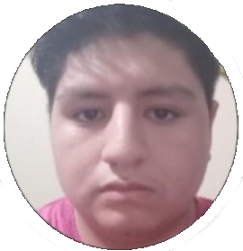

---

---
---
# UPC
# INGENIERÍA DE SISTEMAS DE SOFTWARE
## CURSO: SI730 Aplicaciones Web | SECCIÓN WX54 
 Profesor: Alex Humberto Sánchez Ponce
# Informe de TB1
Startup: **YESI (Yielding Efficient Software Implementations)**  
Producto: **AidManager**
### Integrantes:
- Peña Rivera, Manuel Sebastian - U202210138
- Ramírez Hoffmann, Sebastián - U202211894
- Rodriguez Vargas, Arian Martin - U202212096
- Esteban Garcia, Nicolas Sebastián - U202217485
- Herrera Aguirre, Fabia Alejandra - U202219422   

---
# Registro de Versiones del Informe
| Version | Fecha | Autor | Descripcion de Modificacion |
| ----------- | ----------- | ----------- | ----------- |
| 0.0 | 19/03/2024 |Grupo 1 |Se crea el documento |

# Project Report Collaboration Insights
[URL del repositorio](https://github.com/AplicacionesWeb-WX54/si730-WX54-Grupo1-Repository.git)

(Imagenes de los commits cada entrega)

# Student Outcome
|Criterio Especifico|Acciones Realizadas|Conclusiones|
|-|-|-|
|Participa en equipos multidisciplinarios con eficacia, eficiencia y objetividad, en el marco de un proyecto en soluciones de ingeniería de software.|  *TB1:* Manuel Sebastian Peña Rivera: Participe en secciones del capitulo 2, 3 y 4 que contienen entrevistas, product backlog, impact map, user task matrix, style guidelines *TB2:* texto etc.. |Realizar la investigación necesaria para el proyecto permite conocer la realidad de los desafíos que presentan y como nuestro programa puede solucionar el problema es nuestro objetivo en mente|
|Conoce al menos un sector empresarial o dominio de aplicación de soluciones de software.|Manuel Sebastian Peña Rivera: No solo la investigación realizada, sino que la entrevista que realice me permitió conocer sobre las dificultades y experiencia como voluntario en la ONG.   *TB2:* texto etc.. |Con la información reunida de la entrevista espero poder adaptar las necesidades al proyecto y que nuestro proyecto le sirva para mejorar la eficiencia de su trabajo|
# Capítulo I: Introducción
## 1.1. Startup Profile
### 1.1.1. Descripción de la Startup
Nuestra startup **AidManager** se basa en una herramienta enfocada en gestionar los proyectos de ONG, esto se hara al recibir informacion de los mismos asistentes asignados al evento y por medio de nosotros se hara un analisis intensivo en oportunidades de mejora, reportes de inventario, asistentes del eveto entre otros. Adicionalmente la herramienta servira para planificar futuros eventos usando la misma informacion previamente registrada. 

#### 1.1.2. Perfiles de integrantes del equipo
|Miembros del equipo | Codigo Estudiante | Carrera | Conocimientos / Habilidades |
|-|-|-|-| 
|Ramírez Hoffmann, Sebastián  |U20221894|Ingenieria de software|C++, Python, Js, Reactjs, NodeJs, expressjs, MongoDB, SQL.  Paciencia, Liderazgo, Logico|
|Rodriguez Vargas, Arian Martin |U202212096|Ingenieria de software|C++, Python, persistente y amigable|
|Esteban Garcia, Nicolas Sebastian |U202217485|Ingenieria de software|HTML, CSS Y JS. Sociable.|
|Herrera Aguirre, Fabia Alejandra 	|U202219422|Ingenieria de software|C++, Python. Creativa.|
|Peña Rivera, Manuel Sebastian	|U202210138|Ingenieria de software|C++, Python, MongoDB, SQL, Assembler. Responsabilidad y Buena Comunicación| 

## 1.2. Solution Profile
### 1.2.1 Antecedentes y problemática

Segun la Oficina de Naciones Unidas para la Coordinación de Asuntos Humanitarios (OCHA) en 2023 se reportaron 801,425 personas en necesidades de alimentacion, servicios de agua, saneamiento e higiene.
En el Peru existen 978 Organizaciones privadas sin fines de lucro de las cuales principalmente 428 se han categorizado como de salud, 19 de educacion y 35 de vivienda (SIGCTI, 2024), esto nos demuestra que existe un alto rango de organizaciones privadas sin fines de lucro. No obstante cuando buscamos organizaciones ONDG(Organizaciones No Gubernamentales de Desarollo) encontramos un total de 1835 (SIGCTI, 2024). Aun con muchas instituciones el alcance que se logra resulta ser preocupante, en la encuesta que se realizo por equillibrium CenDE en 2023 de entre casi 1,200 personas un 80% de estas reconocia que es una ONG no obstante 71% o no sabia o no conocia iniciativas realizadas por las ONGs en ese año, en esta misma encuesta solo un 7% no tenia interes alguno en participar en el abordamiento de problemas publicos ni socialmente es decir un 93% de las 1,200 estaban dispuestas a apoyar. Adicionalmente cuando estas mismas ONG reciben grandes cantidades de datos normalmente solo son para obtener una cifra que represente los asistentes a algun evento o cuanto se logro de un objetivo de donacion omitiendo lo enriquecedor de esta data recolectada, como se menciona en el articulo "Data Analytics for Nonprofits" (DigitalForNonprofits, 2023), en el mundo de hoy para realizar acciones estrategicas y maximisar recursos distintas empresas utilizan lo llamado analisis de datos, esta practica se puede aplicar a un modelo de negocios sin fines de lucro como las ONG donde se consiguen los mismos beneficios que brindan los analisis de datos.

Es aqui donde nosotros ideamos la propuesta de **AidManager**, es una aplicacion web que se basa en una herramienta de gestion utilizada por los encargados de gestionar el proyecto y los asistentes del proyecto haciendo uso de su informacion recopilada por medio de nosotros quienes por nuestro servicio de analisis de datos y gestion de proyectos le proporcionaremos oportunidades de mejora, graficas relevantes respecto a la data y recomendaciones en como pueden implementar una recolecion de datos mas efectiva para amplificar el impacto deseado, de misma manera de que se presentaran espacios donde el gestor pueda planificar su siguiente proyecto facilitando el seguimiento de este mismo y haciendo un registro mas efficiente. 

What (¿Que se está haciendo?): Se facilita el proceso de planeacion para actividades orientadas al apoyo social y donacion de bienes. Asimismo se proporciona un servicio de gestion avanzado para las ONG con el objetivo de aumentar el impacto de estas.

Why (¿Porque se está haciendo?): Se hace esta aplicacion web con el objetivo de darle una herramienta a las ONG para aumentar la eficiencia de sus proyectos de ayuda social proporcionando adicionalmente una plataforma donde sus mismos ayudantes puedan recopilar la informacion de manera efectiva.

When (¿Cuándo se usa?): Se usa cuando se tengan los datos recopilados del proyecto mas reciente y se busque ver las oportunidades de mejora e ideas para la eficacia de un siguiente proyecto en un formato visual que sea facil de entender. Asi como tambien se hara uso de la herramienta cuando este proyecto este en ejecucion donde los asistentes del mismo recopilaran los datos para que consecuentemente el supervisor asignado a gestionar del proyecto pueda observar las oportunidades de mejora.

Where (¿Dónde se usa?): El uso esta diseñado para Perú ya que se recompilara informacion de ONG's que esten actuando en este pais, de esta manera se podran hacer recomendaciones mas locales. Asimismo esta App Web se puede usar facilmente desde el telefono o escritorio.

Who (¿Quién lo usa?): El usuario principal para nosotros son los supervisores y ayudantes de las ONG ya que son estos los mismos que nos proporcionaran los datos recopilados para mejorar su impacto y requieren de una mejor organizacion, nuestro usuario principal entonces se divide en el segmento de supervisor / gerente y el ayudante / recolector de data.

How Much (¿Cuánto costaría?): La aplicacion web tendra sus funcionalidades core a medio de pago es decir el proceso de gestion recopilacion y refinamiento de datos junto con las mejores oportunidades de mejora para estas. Tanto el core de la app web como la subscripcion se tendran que renovar cada cierto tiempo donde las organizaciones se tendran que escoger un plan anual o mensual.

How (¿Cómo se lleva al cabo?)

Se hara un proceso de inscripcion y seguidamente se les presentara con la oportunidad de crear o importar un proyecto
seguidamente solicitara los datos recopilados de su proyecto mas reciente, de estos datos se mostraran graficos representando la demografica, gastos, junto con explicaciones, recomendaciones y oportunidades de mejora. Asimismo se proporcionara la herramienta para gestionar futuros proyectos la cual se podra usar de manera opcional para poder estructurar mejor los encargados, el presupuesto y objetivos del siguiente proyecto. Cuando se inicie un proyecto se dependera de los ayudantes de estos eventos a que recopilen la informacion de los usuarios por medio de nuestro aplicativo web, donde tendran que registrarse y coleccionar la data de los participantes a eventos.

### 1.2.2 Lean UX Process.
#### 1.2.2.1. Lean UX Problem Statements.
Se identifica una falta de organizacion por parte de las ONG donde existen distintas oportunidades para mejorar el alcance con una buena planificacion. No obstante, muchas organizaciones no tienen conocimiento del potencial que se puede obtener de esta informacion o no cuentan con un equipo dedicado al analisis de datos a niveles de Big Data o formas efectivas de recolectar esta misma informacion. Asimismo hemos identificado que existen diferentes factores los cuales llevan a un usuario interesado en una ONG a no tener motivos suficientes para participar de actividades sociales o de hacer donativos a estas mismas, una de estas siendo la falta de informacion y la carencia de visibilidad que estan tienen siendo que aun asi habiendo mas de 1000 ONG's en el Perú no se conocen muchas de estas ni de como poder ayudarlas. Frente a esta problematica nos planteamos la siguiente pregunta:
¿Como facilitamos el proceso de gestion de un proyecto de ayuda social para aumentar el flujo de participantes en las actividades que ofrecen las distintas ONG's a la poblacion de nuestro país de manera eficiente?
#### 1.2.2.2. Lean UX Assumptions.

Después de analizar la problemática y los factores que la ocasionan, podemos tener un panorama de cómo solucionar la necesidad del usuario declarando supuestos, lo cual corresponde al siguiente paso de la Lean UX. Por ello, es necesario tener un conocimiento previo de las empresas que tienen características similares a las nuestras y cómo estas se han desarrollado con el paso del tiempo. 

Se mencionan a tres potenciales competidores:

CauseVox:
Plataforma que facilita el crowdfunding no solo de bienes monetarios, sino también de recursos como víveres y vestimenta. Plataforma de recaudación de fondos que brinda herramientas necesarias para crear campañas llamativas para cumplir su meta de donación. su diversificacion de bienes junto con sus campañas muestran su capacidad para ser competidores.

Donadora:
Es una plataforma mexicana en la que se pueden financiar proyectos de caridad, así como proyectos de tipo artístico, científico, entre otros. Al entrar en la financiacion para diferentes proyectos fuera de la caridad presenta una aptidud para ser competidor.

Logalto:
Es un Programa web colaborativo para el monitoreo y la evaluación de proyectos de desarrollo internacional la cual proporciona una alta gama de herramientas de gestion de proyectos.

|Business Assumptions|User Assumptions|
|-|-|
|Creemos que nuestros usuarios tienen la necesidad de aumentar el flujo de personas a sus eventos y facilitar la creasion de estos gestionando sus datos y proyectos de manera efectiva. |Los usuarios de este producto son el personal encargado de gestion de proyecto y los ayudantes que participan de estos eventos de Organizaciones no gubernamentales. |
|Este problema se puede solucionar con una plataforma donde se pueda organizar y supervizar proyectos donde se pueda generar un analisis de datos con recomendaciones y oportunidedes de mejora con infromacion recoleccionada por los mismos ayudantes de estos eventos. Ademas de que se presente toda la informacion necesaria para un proceso de inscripcion o donacion |Nuestro producto encajaría en la vida cotidiana debido a que sera accesible, economicamente viable y facil de utilizar tanto para las personas que tengan que supervizar el proyecto como para los mismos ayudantes para la recoleccion de datos |
|Los usuarios iniciales Organizaciones no gubernamentales sin fines de lucro que deseen mejorar su impacto y alcance.  |Este producto resolverá la necesidad de gestionar proyectos mientras que se recopila y analiza informacion de manera efectiva, simple y facil de entender para tener mayores oportunidades de mejora. |
|El valor #1 de nuestro servicio es el analisis de datos comprensible, el registro de informacion relevante y la interfaz amigable y simple de usar. |El producto se utilizará al momento que se tenga que realizar un nuevo proyecto de ayuda social y se deba realizar un planeamiento.|
|El aplicativo adicionalmente contara con el sistema de registro de ayudantes y gerentes que tendran un limite segun los distintos planes que tenemos para las ONG de distintos tamaños |Las funciones mas importantes son, la capacidad de manejar y presentar los datos de manera que sean visualmente coherentes y poco abrumadores. La planificacion de proyectos haciendo un registrod de todo lo necesario para que se pueda ejecutar. Y finalmente, una interfaz facil de usar para tanto el ayudante como para el gestor del proyecto|
|Se conseguirán la mayoría de los usuarios por medio de marketing digital (como las redes sociales) y Noticieros. |Nuestro producto debe verse como una herramienta de gestion y analisis de datos. Asimismo siendo una herramienta que se usa para planificar proyectos de ayuda benefica de alta calidad y monitoreo |
|Conseguiremos ingresos de la aplicación por medio de la compra del servicio para las ONG y los distintos planes proporcionales al tamaño de las necesidades de la organizacion.||
|Nuestros competidores principales serán CauseVox, Donadora y Logalto. ||
|Los venceremos al tener una mejor interactividad y experiencia de usuario, una herramienta de gestion para proyectos futuros simple de entender y el proceso amigable y facil de utilizar para adquirir la informacion. ||
|El mayor riesgo del producto es la falta de alcance inicial, la capacidad de datos, la precicion de datos y la competencia. ||
|Solucionaremos esto por medio de campañas de publicidad, contactar a las ONG y dandoles a los recolectores las pautas a seguir para reducir el margen de error.||
|Pensamos que un assumption que si se prueba falso puede causar que el proyecto falle es la demanda actual de nuestro producto y la necesidad estimada.||

#### 1.2.2.3. Lean UX Hypothesis Statements.
- Creemos que, al brindar una interfaz poco compleja de usar para nuestros usuarios, podrán tener una mejor experiencia al gestionar sus datos y  proyectos de ayuda social.
  Sabremos que hemos tenido éxito cuando se incremente la cantidad de proyectos efectivos por parte de las ONG que usen nuestra herramienta. 

- Creemos que la aplicación facilitara la gestion y creacion de proyectos de ayuda social proporcionando mejores resultados y un mayor flujo de personas participando de estas actividades.  
  Sabremos que tuvimos exito cuando distintos proyectos de ONG reciban mas relevancia y participantes.

- Creemos que ayudar a las ONG a tener una mejor gestion y planeamiento en sus proyectos ayudara a mejorar la visibilidad y aumentar la cantidad de personas motivadas a participar.
  Sabremos que hemos tenido éxito, cuando a nivel nacional se empiece a notar un incremento en la ayuda social proporcionada. 

#### 1.2.2.4. Lean UX Canvas.
|-|-|-|
|-|-|-|
| Business Problem  ¿Qué problema has identificado que necesitas resolver? Las ONG estan perdiendo conexion y requieren optimizar sus proyectos para mejorar su impacto.  Según CenDe de 1200 personas 72% de estas no han participado en alguna actividad de actividad de ayuda social.  Segun "Digital for non Profits" 78% de organizaciones nonprofit con capacidades analiticas tienen mejoras tales como mejora de reclutamiento, mejoras en el alcance y hacer seguimiento de presupuestos| Solution ideas  Herramienta de gestion de proyectos recopilando datos y recomendaciones de accion.  Ofrecer planes de pago a las para ONG cuyos proyectos tienen diferentes cantidades de personas.  Mejorar y optimizar los procesos de recoleccion de datos para un analisis mas exacto. | Business Outcomes  (Cambios en el comportamiento del usuario)  ¿Qué cambios en el comportamiento del usuario indicarán que has solucionado un problema real de manera que añada valor a tus clientes?   El comportamiento que refleje que se ha solucionado un problema real sera cuando las actividades de ayuda social consigan ser mas efectivas y que los participantes de estas aumenten.|
| User & Customers  ¿En qué tipo de usuarios y clientes tienes que centrarte primero?  Usuario:  Personas encargadas de la gestion y recoleccion de datos de un proyecto orientado a las ONG.  Cliente: la Organizacion sin fines de lucro que adquiere nuestra herramienta.   ONG que busquen una optimizacion en la cantidad de gastos y tiempo invertidos.    |  UX Canvas| User benefits  ¿Cuáles son los objetivos que los usuarios intentan obtener?   \- Se busca gestionar un proyecto de manera que se pueda entender las oportunidades de mejora, los datos registrados, las planificaciones del proyecto y como pueden llegar a mas con menos.   ¿Qué les motiva a buscar tu solución?   \- Los usuarios están motivados a buscar esta solución debido la interfaz intuitiva, las oportunidades de optimizacion economica y el seguimiento de las acciones, gastos y personal que participara.  Nuestra interfaz resulta intuitiva para el usuario en todo el proceso.   |
| Hyphotheses:    \- Creemos que, al brindar una interfaz poco compleja de usar para nuestros usuarios, podrán tener una mejor experiencia al gestionar sus datos y  proyectos de ayuda social.   Sabremos que hemos tenido éxito cuando se incremente la cantidad de proyectos efectivos por parte de las ONG que usen nuestra herramienta.    \- Creemos que la aplicación facilitara la gestion y creacion de proyectos de ayuda social proporcionando mejores resultados y un mayor flujo de personas participando de estas actividades.    Sabremos que tuvimos exito cuando distintos proyectos de ONG reciban mas relevancia y participantes.    \- Creemos que ayudar a las ONG a tener una mejor gestion y planeamiento en sus proyectos ayudara a mejorar la visibilidad y aumentar la cantidad de personas motivadas a participar.    Sabremos que hemos tenido éxito, cuando a nivel nacional se empiece a notar un incremento en la ayuda social proporcionada. | ¿Qué es la cosa más importante que nosotros necesitamos aprender primero?   Lo principal que necesitamos aprender es generar un modelo de gestion el cual sea efectivo a nivel visual y de gestion, y adicionalmente, un repaso en lo que viene siendo la gestión del proyecto|   ¿Cuál es la mínima cantidad de trabajo que nosotros necesitamos hacer para aprender la siguiente cosa más importante?   Asistir a las clases y solicitar que se nos revise los avances del proyecto para poder hacer un seguimiento saludable del proyecto|

## 1.3. Segmentos objetivo.
| |Segmento 1 | Segmento 2  |
| - | - |-|
| Variables                 |  Gestor de proyectos de una ONG | Ayudante de eventos de ONG |
| Geográfica                | en el mundo de hoy para realizar acciones strategicas y maximisar recursos distintas empresas utilizan lo llamado analisis de datos, esta practica se puede aplicar a un modelo de negocios sin fines de lucro como las ONG (DigitalForNonprofits, 2023)| La recogida, división y análisis adecuados de datos recogidos por gobiernos, ONGs y otros puede mejorar las condiciones de vida y las oportunidades de desarrollo para aquellas personas en sociedades que a menudo son ignoradas a la hora de recopilar datos.( OHCHR,2022) |
| Demográfica               | Edades de entre 18 a 50+ años   Genero: Masculino y Femenino | Edades de entre 18 a 50+ años   Genero: Masculino y Femenino |
| Psicológica               | Piensa en el planeamiento y todas las variables que debe de analizar y registrar. | Piensan en las actividades programadas, en sus demas compañerls y el equipo del proyecto. |
| Función de comportamiento | Actitudes: Participa de la creacion de proyectos de ayuda social, organiza los equipos, presupuestos, objetivos y lugares donde llevar al cabo los eventos.   Conocimientos: Sabe los pasos de organizacion y conoce herramientas para apoyar su proceso, mas no encuentra muchas que se orienten a proyectos de ayuda social.| Actitudes: Participan de los eventos como staff para ayudar, animar y guiar a los participantes, recolecta la informacion de los participantes y debe dar un reporte a sus supervisores.  Conoce: Sabe como ayudar a los participantes y intenta de mantener el orden. |

---